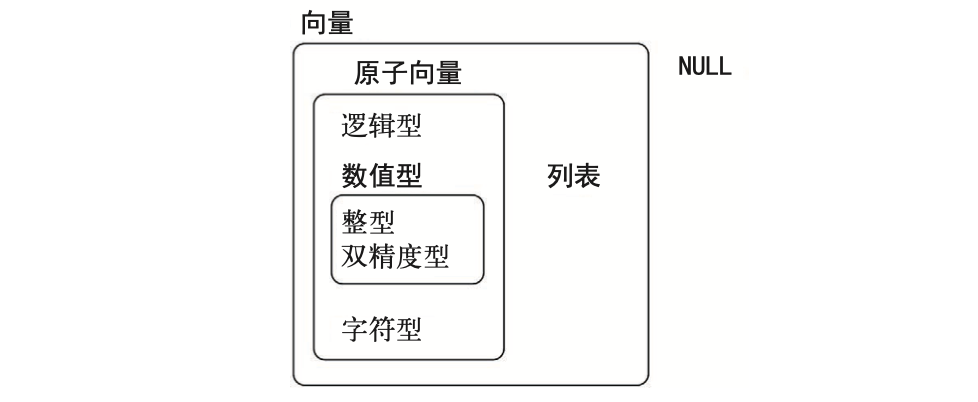

```{r default, include=FALSE}
knitr::opts_chunk$set(echo = TRUE)
knitr::opts_chunk$set(out.width= "50%")
knitr::opts_chunk$set(fig.align='center') 
knitr::opts_chunk$set(warning = FALSE) 
```


# 准备工作

R安装：<https://www.r-project.org/>\
R studio 安装：<https://posit.co/downloads/> tidyverse包安装

```{r eval=FALSE}
install.packages("tidyverse")
update.packages("tidyverse")
```

```{r}
library(tidyverse)
```


# 基础工作流

**代码基础** 对象名称必须以字母开头，并且只能包含字母、数字、_ 和 .\
如果想让对象名称具有描述性，那么就应该在使用多个单词时遵循某种命名惯例\
**snake_case 命名法**:使用小写单词，并用 _ 分隔：\
i_use_snake_case\
otherPeopleUseCamelCase\
some.people.use.periods\
And_aFew.People_RENOUNCEconvention\
\
引号""和括号()必须一直成对出现。如果出现不匹配，R 会显示一个**+**号\
**赋值**与显示赋值结果

```{r}
y <- seq(1, 10, length.out = 5) 
y
#简化输出结果，赋值后添加（）
(y <- seq(1, 10, length.out = 5)) 
```

**函数调用** \
function_name(arg1 = val1, arg2 = val2, ...)\

## 管道函数
在阅读代码时，%>%最好读作“然后”\
x %>% f(y) 会转换为 f(x, y)，x %>% f(y) %>% g(z)会转换为 g(f(x, y), z)\
```{r eval=FALSE}
# 无管道函数
by_dest <- group_by(flights, dest) 
delay <- summarize(by_dest, 
  count = n(), 
  dist = mean(distance, na.rm = TRUE), 
  delay = mean(arr_delay, na.rm = TRUE) 
) 
delay <- filter(delay, count > 20, dest != "HNL") 
```

```{r eval=FALSE}
# 使用管道函数
delays <- flights %>% 
  group_by(dest) %>% 
  summarize( 
    count = n(), 
  dist = mean(distance, na.rm = TRUE), 
  delay = mean(arr_delay, na.rm = TRUE) 
) %>% 
filter(count > 20, dest != "HNL")
```


# ggplot2进行数据可视化

创建ggplot图形\
+ 必须放在一行代码的**末尾**，而不是开头\

**条形图、直方图和频率多边形图**可以对数据进行分箱，然后绘制出分箱数量和落在每个 分箱的数据点的数量。\
**平滑曲线**会为数据拟合一个模型，然后绘制出模型预测值。\
**箱线图**可以计算出数据分布的多种摘要统计量，并显示一个特殊形式的箱体。\

```{r}
# ggplot() 创建了一个坐标系
# data  =  mpg导入数据
ggplot(data = mpg) + 
# 函数 geom_point() 向图中添加一个点层，这样就可以创建一张散点图。
# ggplot2 中的每个几何对象函数都有一个 mapping 参数。
# 这个参数定义了如何将数据集中的变量映射为图形属性。
# aes() 函数的 x 参数和 y参数分别指定了映射到 x 轴的变量与映射到 y 轴的变量。
  geom_point(mapping = aes(x = displ, y = hwy)) 
```

```{r warning=FALSE}
# 可以将分类数据标注为图形属性
ggplot(data = mpg) + 
  geom_point(mapping = aes(x = displ, y = hwy, alpha = class)) 
# 设置透明度
ggplot(data = mpg) + 
  geom_point(mapping = aes(x = displ, y = hwy, shape = class))
# 设置形状
```


```{r}
ggplot(data = mpg) + 
  geom_point(mapping = aes(x = displ, y = hwy)) +
# 手动设置点形状，values为对应形状
  scale_shape_manual(values = 19)
```


## 分面

```{r}
ggplot(data = mpg) + 
  geom_point(mapping = aes(x = displ, y = hwy)) + 
# 使用函数 facet_wrap() 分面，建公式的方式是在 ~ 符号后面加一个变量名
# nrow手动设置行数
  facet_wrap(~ class, nrow = 2)

ggplot(data = mpg) + 
  geom_point(mapping = aes(x = displ, y = hwy)) + 
# 通过变量分组
  facet_grid(drv ~ cyl)
```


## 平滑曲线

```{r}
ggplot(data = mpg) + 
# geom_smooth() 函数可以按照不同的线型绘制出不同的曲线，
# 每条曲线对应映射到线型的变量的一个唯一值
  geom_smooth(mapping = aes(x = displ, y = hwy, linetype = drv))
```

```{r}
# 组合散点图与平滑曲线组合
ggplot(data = mpg) + 
  geom_point(mapping = aes(x = displ, y = hwy)) + 
  geom_smooth(mapping = aes(x = displ, y = hwy))
```

```{r}
# 上述代码的简化处理
# ggplot2 会将这些映射作为全局映射应用到图中的每个几何对象中
ggplot(data = mpg, mapping = aes(x = displ, y = hwy)) + 
  geom_point() + 
  geom_smooth()
```

```{r}
# 果将映射放在几何对象函数中，那么 ggplot2 会将其看作这个图层的局部映射
# 仅对该图层有效
ggplot(data = mpg, mapping = aes(x = displ, y = hwy)) + 
  geom_point(mapping = aes(color = class)) + 
  geom_smooth()
```

```{r}
ggplot(data = mpg, mapping = aes(x = displ, y = hwy)) + 
  geom_point(mapping = aes(color = class)) + 
# 也可以不同图层使用不同数据源
  geom_smooth( 
    data = filter(mpg, class == "subcompact"), 
    se = FALSE 
  )
```


## 统计变换

绘图时用来计算新数据的算法称为 stat（statistical transformation，统计变换）\

```{r}
# 用 geom_bar() 函数就可以绘制的基本条形图
ggplot(data = diamonds) + 
  geom_bar(mapping = aes(x = cut))
```


```{r}
# 调整为比例
ggplot(data = diamonds) + 
  geom_bar( 
    mapping = aes(x = cut, y = after_stat(prop), group = 1) 
  )
```

```{r}
# stat_summary() 函数为 x 的每个唯一值计算 y 值的摘要统计
ggplot(data = diamonds) + 
  stat_summary( 
    mapping = aes(x = cut, y = depth), 
        fun.min = min, 
    fun.max = max, 
    fun = median 
  )
```


## 位置调整

以使用 color 或者 fill（这个更有用）图形属性来为条形图上色\

```{r}
ggplot(data = diamonds) + 
  geom_bar(mapping = aes(x = cut, color = cut)) #边框
ggplot(data = diamonds) + 
  geom_bar(mapping = aes(x = cut, fill = cut)) #填充
```

将 fill 图形属性映射到另一个变量，那么条形会自动分块堆叠起来\

```{r}
ggplot(data = diamonds) + 
  geom_bar(mapping = aes(x = cut, fill = clarity))
```

堆叠是由 position 参数设定的位置调整功能自动完成的。可以使用以下 3 种选项之一："identity"、"fill" 和 "dodge"\

```{r}
# position  =  "identity" 将每个对象直接显示在图中
ggplot( 
  data = diamonds, 
  mapping = aes(x = cut, fill = clarity) 
) + 
  geom_bar(alpha = 1/5, position = "identity") 
```

```{r}
#  position  =  "fill" 每组堆叠条形具有同样的高度
ggplot(data = diamonds) + 
  geom_bar( 
    mapping = aes(x = cut, fill = clarity), 
    position = "fill" 
  )
```

```{r}
# position  =  "dodge" 将每组中的条形依次并列放置
ggplot(data = diamonds) + 
  geom_bar( 
    mapping = aes(x = cut, fill = clarity), 
    position = "dodge" 
  )
```

**散点图的位置调整**\
散点图的点显示在一个网格上时，很多点彼此重了。这个问题称为**过绘制**。\
position = "jitter" 为每个数据点添加一个很小的随机扰动，这样就可以将重叠的点分散开来\

```{r}
ggplot(data = mpg) + 
  geom_point( 
    mapping = aes(x = displ, y = hwy), 
    position = "jitter" 
  )

```


## 坐标系

coord_flip() 函数可以交换 x 轴和 y 轴\

```{r}
ggplot(data = mpg, mapping = aes(x = class, y = hwy)) + 
  geom_boxplot() 
ggplot(data = mpg, mapping = aes(x = class, y = hwy)) + 
  geom_boxplot() + 
  coord_flip()
```

coord_quickmap() 函数可以为地图设置合适的纵横比。\

```{r}
nz <- map_data("nz") 
 
ggplot(nz, aes(long, lat, group = group)) + 
  geom_polygon(fill = "white", color = "black") 
 
ggplot(nz, aes(long, lat, group = group)) + 
  geom_polygon(fill = "white", color = "black") + 
  coord_quickmap()
```

coord_polar() 函数使用极坐标系。\

```{r}
bar <- ggplot(data = diamonds) + 
  geom_bar( 
    mapping = aes(x = cut, fill = cut), 
    show.legend = FALSE, 
    width = 1 
  ) + 
  theme(aspect.ratio = 1) + 
  labs(x = NULL, y = NULL) 
 
bar + coord_flip() 
bar + coord_polar()
```


## 图形分层语法

你可以将任何图形精确地描述为数据集、几何对象、映射集合、统计变换、位置调整、坐标系和分面模式的一个组合。\
ggplot(data = \<DATA\>) +\
\<GEOM_FUNCTION\>(\
mapping = aes(\<MAPPINGS\>),\
stat = \<STAT\>,\
position = \<POSITION\>\
) +\
\<COORDINATE_FUNCTION\> +\
\<FACET_FUNCTION\>\
\
如何从头开始构建一个基本图形\
1、首先需要有一个数据集，然后（通过统计变换）将其转换为想要显示的信息\


2、选择一个几何对象来表示转换后的数据中的每个观测值，然后选择几何对象的图形属性来表示数据中的变量，这会将每个变量的值映射为图形属性的水平。\


3、选择放置几何对象的坐标系。你可以使用对象本身的一个图形属性来显示 x 变量和 y变量的值。这样就生成了一张完整的图。之后可以设置详细属性。\


## ggplot精简化
```{r}
ggplot(data = faithful, mapping = aes(x = eruptions)) + 
  geom_freqpoly(binwidth = 0.25)
```
以更精简的方式重写前面的绘图语句
```{r}
ggplot(faithful, aes(eruptions)) + 
  geom_freqpoly(binwidth = 0.25)
```
将数据转换管道操作的最终结果转换为一张图
```{r}
diamonds %>% 
  count(cut, clarity) %>% 
  ggplot(aes(clarity, cut, fill = n)) + 
    geom_tile()
```


# 使用dplyr进行数据转换

```{r}
library(nycflights13) #数据包
library(tidyverse)
```

**数据类型**\
•int 表示整数型变量。\
•dbl 表示双精度浮点数型变量，或称实数。\
•chr 表示字符向量，或称字符串。\
•dttm 表示日期时间（日期 + 时间）型变量。\
•lgl 表示逻辑型变量，是一个仅包括 TRUE 和 FALSE 的向量。\
•fctr 表示因子，R 用其来表示具有固定数目的值的分类变量。\
•date 表示日期型变量。\
\
**比较运算符**：>、>=、<、<=、!=（不等于）和 ==（等于）\
使用 == 进行比较\
```{r}
# 结果报错，因为是浮点数
1/49 * 49 == 1
# 需要用near运算
near(1 / 49 * 49, 1)

```
**德摩根定律**\
非(P 且 Q) = (非 P) 或 (非 Q)\
非(P 或 Q) = (非 P) 且 (非 Q)\
\
**算数运算**算术运算符：+、-、*、/、^ \
**模运算符**：%/%（整数除法）和 %%（求余）\
**对数函数**：log()、log2() 和 log10(),log2() 函数对数
标度的数值增加 1 个单位，意味着初始数值加倍；减少 1 个单位，则意味着初始数值
减半 \
**偏移函数**:lead() 和 lag() 函数可以返回一个序列的领先值和滞后值。\
```{r}
(x <- 1:10) 
lag(x) 
lead(x) 
```
**累加和滚动聚合**：累加和、累加积、累加最小值和累加最大值的函数：cumsum()、cumprod()、commin() 和 cummax()
\
```{r}
x
cumsum(x) 
cummean(x) 
```
**排秩**: min_rank() 默认的排秩方式是，最小的值获得最前面的名次，使用
desc(x) 可以让最大的值获得最前面的名次\
```{r}
y <- c(1, 2, 2, NA, 3, 4) 
min_rank(y)
min_rank(desc(y))
```
其他排序方式
```{r}
row_number(y) 
dense_rank(y) 
percent_rank(y) 
cume_dist(y) 
```

**逻辑运算符**


## 使用filter()筛选
```{r eval=FALSE}
# 筛选flights数据集出 1月 1 日的所有航班
filter(flights, month == 1, day == 1) 
```

```{r}
# 将筛选结果赋值
jan1 <- filter(flights, month == 1, day == 1)
```

```{r eval=FALSE}
# 找出 11 月或 12 月出发的所有航班
filter(flights, month == 11 | month == 12)
```

```{r}
# 要找出延误时间（到达或出发）不多于 2 小时的航班
filter(flights, !(arr_delay > 120 | dep_delay > 120)) 
filter(flights, arr_delay <= 120, dep_delay <= 120)
# 两种方法结果一样
```

**缺失值NA**
NA表示未知的值，如果运算中包含了未知值，那么运算结果一般来说也是个未知值\
```{r}
10 == NA
NA + 10
NA == NA
```
filter()只能筛选出条件为TRUE的行；它会排除那些条件为 FALSE 和 NA 的行。\
```{r}
df <- tibble(x = c(1, NA, 3)) 
filter(df, x > 1) 
filter(df, is.na(x) | x > 1) 
```


## 使用arrange()排列行
arrange()接受一个数据框和一组作为排序依据的列名作为参数。如果列名不只一个，那么就使用**后面的列在前面排序的基础上**继续排序\

```{r}
# 对flights数据基于年月日排序
arrange(flights, year, month, day) 
```

```{r}
#通过desc对年降序排序
arrange(flights, desc(year)) 
```

缺失值会**排到最后**\
```{r}
df <- tibble(x = c(5, 2, NA)) 
arrange(df, x) 
arrange(df, desc(x)) 
```


## 使用select()选择列
select() 函数可以让你快速生成一个有用的变量子集\
```{r}
# 选择年月日列 
select(flights, year, month, day)
```

```{r}
# 选择“year”和“day”之间的所有列（包括“year”和“day”）
select(flights, year:day)
```

```{r}
#  选择不在“year”和“day”之间的所有列（不包括“year”和“day”）
select(flights, -(year:day)) 
```

**补充的辅助函数**\
•  starts_with("abc")：匹配以“abc”开头的名称。\
•  ends_with("xyz")：匹配以“xyz”结尾的名称。\
•  contains("ijk")：匹配包含“ijk”的名称。\
•  matches("(.)\\1")：选择匹配正则表达式的那些变量。这个正则表达式会匹配名称中有
重复字符的变量。\
•  num_range("x", 1:3)：匹配 x1、x2 和 x3。\
\
select() 函数的变体 **rename()**函数来可以以保留所有未明确提及的变量\
```{r}
rename(flights, tail_num = tailnum) 
```
everything()将几个变量移到数据框开头\
```{r}
select(flights, time_hour, air_time, everything())
```


## 使用mutate()添加新变量
```{r}
# 筛选出较短数据
flights_sml <- select(flights, 
  year:day, 
  ends_with("delay"), 
  distance, 
  air_time 
) 
# 添加数据
# 在 fliflights_sml添加gain与speed
mutate(flights_sml, 
  gain = arr_delay - dep_delay, 
  speed = distance / air_time * 60 
) 
```

transmute()只会保存新建的变量 
```{r}
transmute(flights, 
  gain = arr_delay - dep_delay, 
  hours = air_time / 60, 
  gain_per_hour = gain / hours 
) 
```


## 使用summarize()进行分组摘要
summarize()可以将数据框折叠成一行\
```{r}
summarize(flights, delay = mean(dep_delay, na.rm = TRUE)) 
```

```{r}
# 通过group_by分组后，进行摘要
by_day <- group_by(flights, year, month, day) 
summarize(by_day, delay = mean(dep_delay, na.rm = TRUE)) 
```

**去除缺失值**\
```{r}
flights %>% 
  group_by(year, month, day) %>% 
  summarize(mean = mean(dep_delay)) 
# 如果输入中有缺失值，那么输出也会是缺失值。
```

```{r}
not_cancelled <- flights %>% 
  filter(!is.na(dep_delay), !is.na(arr_delay)) 

not_cancelled %>% 
  group_by(year, month, day) %>% 
  summarize(mean = mean(dep_delay)) 
# 以通过先去除取消的航班来解决缺失值问题
```

### 常用摘要函数
**位置度量**\
```{r}
not_cancelled %>% 
  group_by(year, month, day) %>% 
  summarize( 
    # 平均延误时间： 
    avg_delay1 = mean(arr_delay), 
    # 平均正延误时间： 
    avg_delay2 = mean(arr_delay[arr_delay > 0]) 
  ) 
```

**分散程度度量**：sd(x)、IQR(x) 和 mad(x)\
均方误差（又称标准误差，standard deviation，sd）是分散程度的标准度量方式。四分
位距 IQR() 和绝对中位差 mad(x) 基本等价\
```{r}
not_cancelled %>% 
  group_by(dest) %>% 
  summarize(distance_sd = sd(distance)) %>% 
  arrange(desc(distance_sd)) 
```

**秩的度量**：min(x)、quantile(x, 0.25) 和 max(x)\
例子：quantile(x,  0.25) 会找出 x 中按从小到大顺序大于前25% 而小于后 75% 的值\
```{r}
not_cancelled %>% 
  group_by(year, month, day) %>% 
  summarize( 
    first = min(dep_time), 
    last = max(dep_time) 
  ) 
```

**定位度量**：first(x)、nth(x, 2) 和 last(x)\
这几个函数的作用与 x[1]、x[2] 和 x[length(x)] 相同\
```{r}
not_cancelled %>% 
  group_by(year, month, day) %>% 
  summarize( 
    first_dep = first(dep_time), 
        last_dep = last(dep_time) 
  ) 
```
**计数**\
计数（n()）或非缺失值的计数（sum(!is_na())）\
```{r}
not_cancelled %>% 
  group_by(tailnum) %>% 
  summarize( 
    delay = mean(arr_delay, na.rm = TRUE), 
    n = n() 
  ) 
```

```{r}
# 仅计数的简单函数
not_cancelled %>% 
  count(dest) 
```

**逻辑值的计数和比例**：sum(x > 10) 和 mean(y == 0) \
当与数值型函数一同使用时，TRUE 会转换为 1，FALSE 会转换为 0。这使得 sum() 和mean()非常适用于逻辑值：sum(x) 可以找出 x 中TRUE的**数量**，mean(x)则可以找出**比例**。\
```{r}
not_cancelled %>% 
  group_by(year, month, day) %>% 
  summarize(n_early = sum(dep_time < 500))
```

```{r}
not_cancelled %>% 
  group_by(year, month, day) %>% 
  summarize(hour_perc = mean(arr_delay > 60)) 
```
\
**按多个变量分组**
当使用多个变量进行分组时，每次的摘要统计会用掉一个分组变量。\
```{r}
daily <- group_by(flights, year, month, day) 
(per_day   <- summarize(daily, flights = n())) 
```

```{r}
(per_month <- summarize(per_day, flights = sum(flights))) 
```

```{r}
(per_year  <- summarize(per_month, flights = sum(flights))) 
```
\
**取消分组**\
```{r}
daily %>% 
  ungroup() %>%             # 不再按日期分组 
  summarize(flights = n())  # 所有航班 
```


## 分组新变量
分组也可以与 mutate() 和 filter()函数结合\
```{r}
#  找出每个分组中最差的成员
flights_sml %>% 
  group_by(year, month, day) %>% 
  filter(rank(desc(arr_delay)) < 10) 
```

```{r}
# 找出大于某个阈值的所有分组
popular_dests <- flights %>% 
  group_by(dest) %>% 
  filter(n() > 365) 
popular_dests 
```

```{r}
# 对数据进行标准化以计算分组指标
popular_dests %>% 
  filter(arr_delay > 0) %>% 
  mutate(prop_delay = arr_delay / sum(arr_delay)) %>% 
  select(year:day, dest, arr_delay, prop_delay) 
```


# 探索性数据分析
**变量**：一种可测量的数量、质量或属性。\
**值**：变量在测量时的状态。变量值在每次测量之间可以发生改变。\
**观测**（个案）：指在相同条件下进行的一组测量。一个观测会包含多个值，每个值关联到不同的变量。\
**表格数据**：一组值的集合，其中每个值都关联一个变量和一个观测。如果每个值都有自己所属的“单元”，每个变量都有自己所属的列，每个观测都有自己所属的行，那么表格数据就是**整洁**的。\

## 分布可视化
对直方图的分析\
•  每个簇中的观测是如何相似的？\
•  不同簇之间的观测是如何不相似的？\
•  如何解释或描述各个簇？\
•  为什么有些簇的外观可能具有误导作用？\
```{r}
# 检测分类变量的分布
ggplot(data = diamonds) + 
  geom_bar(mapping = aes(x = cut))
# 计数
diamonds %>% 
  count(cut) 
```

```{r}
# 检测连续变量的分布
ggplot(data = diamonds) + 
#  binwidth 参数来设定直方图中的间隔的宽度，该参数是用 x 轴变量的单位来度量
  geom_histogram(mapping = aes(x = carat), binwidth = 0.5) 
# 计数
diamonds %>% 
  count(cut_width(carat, 0.5)) 
```

```{r}
smaller <- diamonds %>% 
  filter(carat < 3) 
# 直方图叠加，使用折线图更直观
ggplot(data = smaller, mapping = aes(x = carat, color = cut)) + 
  geom_freqpoly(binwidth = 0.1)
```

```{r}
ggplot(diamonds) + 
  geom_histogram(mapping = aes(x = y), binwidth = 0.5) + 
# coord_cartesian() 函数用于放大 x 轴
  coord_cartesian(ylim = c(0, 50))
```


## 分析数据中的异常值\
```{r}
# 基于上图的放大x轴可以找到三处异常值，然后通过filter进行筛选
unusual <- diamonds %>% 
  filter(y < 3 | y > 20) %>% 
  arrange(y) 
unusual
```

**方法1**：去除异常值（不建议）\
```{r}
diamonds2 <- diamonds %>% 
  filter(between(y, 3, 20))
```
**方法2**：异常值替换为NA\
```{r}
# ifelse() 函数有 3 个参数。第一个参数 test 是一个逻辑向量，如果 test 为 TRUE，函数结果就是第二个参数
# 的值；如果 test 为 FALSE，函数结果就是第三个参数的值。
diamonds2 <- diamonds %>% 
  mutate(y = ifelse(y < 3 | y > 20, NA, y))
```


## 相关变动
**相关变动**是两个或多个变量以相关的方式共同变化所表现出的趋势。查看相关变动的最好方式是将两个或多个变量间的关系以**可视化**的方式表现出来\
\

### 分类变量与连续变量的相关变动

**方法1**：合并直方图\
```{r}
ggplot(data = diamonds, mapping = aes(x = price)) + 
  geom_freqpoly(mapping = aes(color = cut), binwidth = 500)
```
通过密度对计数标准化\
```{r}
ggplot( 
  data = diamonds, 
    mapping = aes(x = price, y = after_stat(density)) 
  ) + 
   geom_freqpoly(mapping = aes(color = cut), binwidth = 500)
```
**方法2**：箱线图\


```{r}
#  geom_boxplot() 函数查看按切割质量分类的价格分布
ggplot(data = diamonds, mapping = aes(x = cut, y = price)) + 
  geom_boxplot()
```

```{r}
# 对箱线图基于hwy进行排序
ggplot(data = mpg) + 
  geom_boxplot( 
    mapping = aes( 
      x = reorder(class, hwy, FUN = median), 
      y = hwy 
    ) 
  )
```

```{r}
# 选择箱线图
ggplot(data = mpg) + 
  geom_boxplot( 
    mapping = aes( 
      x = reorder(class, hwy, FUN = median), 
      y = hwy 
    ) 
  ) + 
  coord_flip()
```

### 两个分类变量的相关变动

**方法1**计数绘图\
图中每个圆点的大小表示每个变量组合中的观测数量。相关变动就表示为特定 x 轴变量值与特定 y 轴变量值之间的强相关关系。\
```{r}
ggplot(data = diamonds) + 
  geom_count(mapping = aes(x = cut, y = color))
```

**方法2** 填充图形可视化\
```{r}
diamonds %>% 
  count(color, cut) %>% 
  ggplot(mapping = aes(x = color, y = cut)) + 
    geom_tile(mapping = aes(fill = n))
```

### 两个连续变量的相关变动

**方法1**散点图\
```{r}
# 不适用较多数据
ggplot(data = diamonds) + 
  geom_point(mapping = aes(x = carat, y = price))
```

```{r}
# 增加透明度改善堆积问题
ggplot(data = diamonds) + 
  geom_point( 
    mapping = aes(x = carat, y = price), 
    alpha = 1 / 100 
  )
```
**方法2**箱线图\
```{r}
ggplot(data = smaller) + 
  geom_bin2d(mapping = aes(x = carat, y = price)) 
```

```{r}
# 对一个连续变量进行分箱，因此这个连续变量的作用就相当于分类变量
ggplot(data = smaller, mapping = aes(x = carat, y = price)) + 
  geom_boxplot(mapping = aes(group = cut_width(carat, 0.1)))
```

```{r}
# 使用 cut_number() 函数近似地显示每个分箱中的数据点的数量
ggplot(data = smaller, mapping = aes(x = carat, y = price)) + 
  geom_boxplot(mapping = aes(group = cut_number(carat, 20)))
```


# 使用tibble实现简单数据框
tibble 是一种简单数据框，它对传统数据框的功能进行了一些修改，以便更易于使用。\
tibble() 函数不能**改变输入的类型**（例如，不能将字符串转换为因子）、**变量的名称**，也不能**创建行名称**\
```{r}
# 转换tibble
as_tibble(iris) 
```

```{r}
# 创建tibble
tibble( 
  x = 1:5, 
  y = 1, 
  z = x ^ 2 + y 
) 
```

```{r}
# 创建tibble
# 列标题由公式（以 ~ 开头）定义，数据条目以逗号分隔
tribble( 
  ~x, ~y, ~z, 
  #--|--|---- 
  "a", 2, 3.6, 
  "b", 1, 8.5 
) 
```

## tibble与data.frame
\
**打印**\
tibble 的打印方法进行了优化，只显示前 10 行结果,并且列也适合屏幕\
除了打印列名，tibble 还会打印出列的类型\
```{r}
tibble( 
  a = lubridate::now() + runif(1e3) * 86400, 
  b = lubridate::today() + runif(1e3) * 30, 
  c = 1:1e3, 
  d = runif(1e3), 
  e = sample(letters, 1e3, replace = TRUE) 
) 
```

使用 print() 函数来打印数据框，并控制打印的行数（n）和显示的宽度（width）。width = Inf 可以显示出所有列\
```{r eval=FALSE}
nycflights13::flights %>% 
  print(n = 10, width = Inf)
```
控制默认的打印方式\
•options(tibble.print_max = n, tibble.pring_min = m)：如果多于 m 行，则只打印出 n行。options(tibble.print_min = Inf) 表示总是打印所有行。\
•options(tibble.width = Inf) 表示总是打印所有列，不考虑屏幕的宽度。\
\
**取子集**\
[[ 可以按名称或位置提取变量；$ 只能按名称提取变量，但可以减少一些输入\
```{r}
df <- tibble( 
  x = runif(5), 
  y = rnorm(5) 
) 
# 按名称提取 
df$x
df[["x"]] 
# 按位置提取 
df[[1]] 
```

```{r}
# 通过管道操作提取，需要使用特殊的占位符 .
df %>% .$x 
df %>% .[["x"]] 
```
\
**交互旧代码**\
如果遇到比较旧的函数不支持tibble可以使用as.data.frame()函数将tibble转换回data.frame\
```{r eval=FALSE}
class(as.data.frame(tb)) 
```


# 使用readr进行数据导入
**read_csv()**读取逗号分隔文件**(CSV文件是数据存储最常用的形式之一)**、read_csv2() 读取分号分隔文件、read_tsv() 读取制表符分隔文件、read_delim() 可以读取使用任意分隔符的文件\
read_fwf() 读取固定宽度的文件\
read_log() 读取 Apache 风格的日志文件\
haven可以读取 SPSS、Stata 和 SAS 文件\
readxl可以读取 Excel 文件（.xls 和 .xlsx 均可）\
```{r}
# 会打印一份数据列说明，给出每个列的名称和类型
read_csv("t1.csv")
```
使用skip = n来跳过前n行；或者使用comment = "#" 来丢弃所有以 # 开头的行\
```{r}
read_csv("The first line of metadata  
  The second line of metadata 
  x,y,z 
  1,2,3", skip = 2,
  show_col_types = FALSE) 
```

```{r}
read_csv("# A comment I want to skip 
  x,y,z 
  1,2,3", comment = "#",
  show_col_types = FALSE) 
```
使用col_names = FALSE 来通知 read_csv() 不要将第一行作为列标题，而是将各列依次标注为 X1 至 Xn\
```{r}
read_csv("1,2,3\n4,5,6", # \n 用于添加新行
         col_names = FALSE,
         show_col_types = FALSE) 
```
向col_names 传递一个字符向量，以用作列名称\
```{r}
read_csv("1,2,3\n4,5,6", col_names = c("x", "y", "z"),
         show_col_types = FALSE) 
```
 na设定使用哪个值来表示文件中的缺失值\
```{r}
read_csv("a,b,c\n1,2,.", na = ".",
         show_col_types = FALSE) 
```
 
## 解析向量
parse_logical() 和 parse_integer() 函数分别解析逻辑值和整数。\
parse_double() 是严格的数值型解析函数，parse_number() 则是灵活的数值型解析函数。\
parse_character() 解析字符编码。\
parse_factor() 函数可以创建因子。\
parse_datetime()、parse_date() 和 parse_time() 函数可以解析不同类型的日期和时间。\

### 数值向量解析 
readr 使用了“地区”这一概念，这是可以按照不同地区设置解析选项的一个对象。\
```{r}
parse_double("1.23") 
# 创建一个新的地区对象并设定decimal_mark参数,可以覆盖.的默认值
parse_double("1,23", locale = locale(decimal_mark = ",")) 
```
忽略数值前后的非数值型字符。\
```{r}
parse_number("$100") 
parse_number("20%") 
parse_number("It cost $123.45") 
```
提取嵌在文本中的数值。\
```{r}
# 适用于美国 
parse_number("$123,456,789") 
 
# 适用于多数欧洲国家 
parse_number( 
  "123.456.789", 
  locale = locale(grouping_mark = ".") 
) 
 
# 适用于瑞士 
parse_number( 
  "123'456'789", 
  locale = locale(grouping_mark = "'") 
) 
```

### 字符串向量解析
readr 全面支持 UTF-8：当读取数据时，它假设数据是 UTF-8 编码的，并总是使用 UTF-8编码写入数据。\
```{r}
x1 <- "El Ni\xf1o was particularly bad this year" 
x2 <- "\x82\xb1\x82\xf1\x82\xc9\x82\xbf\x82\xcd"
parse_character(x1, locale = locale(encoding = "Latin1")) 
parse_character(x2, locale = locale(encoding = "Shift-JIS")) 
```
guess_encoding() 函数帮助找出文本编码方式。但这个函数并非万无一失，如果有大量文本效果就会更好\
```{r}
guess_encoding(charToRaw(x1))
guess_encoding(charToRaw(x2))
```

### 日期向量解析
日期时间格式\
年: %Y（4 位数）,%y（2 位数；00-69 → 2000-2069、70-99 → 1970-1999）\
月: %m（2 位数）,%b（简写名称，如 Jan）,%B（完整名称，如 January）\
日: %d（1 位或 2 位数）,%e（2 位数）\
时间: %H（0-23 小时）,%I（0-12 小时，必须和 %p 一起使用）,%p（表示 a.m./p.m.）,%M（分钟）,%S（整数秒）,%OS（实数秒）,%Z（时区，America/Chicage 这样的名称）,%z（与国际标准时间的时差，如 +0800）\
非数值字符: %.（跳过一个非数值字符）,%*（跳过所有非数值字符）\
\
parse_datetime()期待**ISO 8601**国际标准，其中日期的各个部分按从大到小的顺序排列，即年、月、日、小时、分钟、秒\
```{r}
parse_datetime("2010-10-01T2010") 
```
parse_date()期待**四位数的年份** +  - 或 / + **月** + - 或 / + **日**\
```{r}
parse_date("2010-10/01") 
```
parse_time()期待**小时** + : + **分钟** + 可选的 : 和秒，以及一个可选的 a.m./p.m. 标识符\
```{r}
parse_time("01:10 am")
parse_time("20:10:01") 
```
基于日期时间格式设置\
```{r}
parse_date("01/02/15", "%m/%d/%y") 
parse_date("01/02/15", "%d/%m/%y") 
parse_date("01/02/15", "%y/%m/%d") 
```

## 解析文件策略
先使用 guess_parser() 函数返回 readr 最可信的猜测，接着 parse_guess() 函数使用这个猜测来解析列\
```{r}
guess_parser("2010-10-01") 
guess_parser("15:01") 
guess_parser(c("TRUE", "FALSE")) 
guess_parser(c("1", "5", "9")) 
guess_parser(c("12,352,561")) 

str(parse_guess("2010-10-10")) 

```

## 写入文件
将数据写回到磁盘：write_csv() 和 write_tsv()\
如果想要将 CSV 文件导为 Excel 文件，可以使用 write_excel_csv() 函数\

```{r eval=FALSE}
write_csv(challenge, "challenge-2.csv") 
read_csv("challenge-2.csv") 
```


# 使用dplyr处理关系数据
通常来说，你会有很多个数据表，而且必须综合使用它们才能回答你所感兴趣的问题。存在于多个表中的这种数据统称为**关系数据**，因为重要的是数据间的关系，而不是单个数据集。\
•  合并连接：向数据框中加入新变量，新变量的值是另一个数据框中的匹配观测。\
•  筛选连接：根据是否匹配另一个数据框中的观测，筛选数据框中的观测。\
•  集合操作：将观测作为集合元素来处理。\
\
导入分析数据\
```{r}
#install.packages("nnycflights13")
library(nycflights13) 
# nycflights13 中包含了与 flights 相关的 4 个tibble
#   airlines：可以根据航空公司的缩写码查到公司全名。
#   airports：给出了每个机场的信息，通过 faa 机场编码进行标识。
#   planes：给出了每架飞机的信息，通过 tailnum 进行标识。
#   weather：给出了纽约机场每小时的天气状况。
```

## 健
连接每对数据表的变量称为**键**,一个变量既可以是主键，也可以是外键。\
键的类型有两种:\
•  主键：唯一标识其所在数据表中的观测。例如，planes$tailnum 是一个主键，因为其可以唯一标识 planes 表中的每架飞机。\
•  外键：唯一标识另一个数据表中的观测。例如，flights$tailnum 是一个外键，因为其出现在 flights 表中，并可以将每次航班与唯一一架飞机匹配。\
主键与另一张表中与之对应的外键可以构成**关系**。关系通常是一对多的。例如，每个航班只有一架飞机，但每架飞机可以飞多个航班。\
```{r}
# 验证主键方法是对主键进行 count() 操作
planes %>% 
  count(tailnum) %>% 
  filter(n > 1) 

weather %>% 
  count(year, month, day, hour, origin) %>% 
  filter(n > 1) 
```

## 合并连接
合并连接可以将两个表格中的变量组合起来，它先通过两个表格的键匹配观测，然后将一个表格中的变量复制到另一个表格中。
\
有颜色的列表示作为“键”的变量：它们用于在表间匹配行。灰色列表示“值”列，是与键对应的值。\
连接是将 x 中每行连接到 y 中 0 行、一行或多行的一种方法。\


匹配在实际的连接操作中是用圆点表示的。圆点的数量 = 匹配的数量 = 结果中行的数量。\


```{r}
flights2 <- flights %>% 
  select(year:day, hour, origin, dest, tailnum, carrier) 

flights2 %>% 
  select(-origin, -dest) %>% 
  left_join(airlines, by = "carrier") 
```

```{r}
# 要将航空公司的全名加入 flights2 数据集
flights2 %>% 
  select(-origin, -dest) %>% 
  left_join(airlines, by = "carrier") 
```

**内连接**\
最简单的一种连接。只要两个观测的键是相等的，内连接就可以匹配它们。
```{r}
x <- tribble( 
  ~key, ~val_x, 
     1, "x1", 
     2, "x2", 
     3, "x3" 
) 
y <- tribble( 
  ~key, ~val_y, 
     1, "y1", 
     2, "y2", 
     4, "y3" 
)
```

```{r}
# 内连接的结果是一个新数据框，其中包含键、x 值和 y 值。我们使用 by 参数告诉 dplyr 哪个变量是键
x %>% 
  inner_join(y, by = "key") 
```

**外连接**\
内连接保留同时存在于两个表中的观测，外连接则保留至少存在于一个表中的观测\
•  左连接：保留 x 中的所有观测。\
•  右连接：保留 y 中的所有观测\
•  全连接：保留 x 和 y 中的所有观测。\


**重复键**\
两张表中都有重复键。这通常意味着出现了错误，因为键在任意一张表中都不能唯一标识观测。当连接这样的重复键时，你会得到所有可能的组合，即笛卡儿积。


```{r}
x <- tribble( 
  ~key, ~val_x, 
     1, "x1", 
     2, "x2", 
     2, "x3", 
     1, "x4" 
) 
y <- tribble( 
  ~key, ~val_y, 
     1, "y1", 
     2, "y2" 
) 
left_join(x, y, by = "key") 
```

**定义键列**\
定义键通过 by  =  "key" 来实现\
默认值 by = NULL ,使用存在于两个表中的所有变量\
```{r}
flights2 %>% 
  left_join(weather) 
```
by  =  "x", 这种方式与自然连接很相似，但只使用某些公共变量\
```{r}
flights2 %>% 
  left_join(planes, by = "tailnum") 
```
命名字符向量 by = c("a" = "b")。这种方式会匹配 x 表中的 a 变量和 y 表中的 b 变量。输出结果中使用的是 x 表中的变量\
```{r}
flights2 %>% 
  left_join(airports, c("dest" = "faa")) 
```

## 筛选连接
•  semi_join(x, y)：保留 x 表中与 y 表中的观测相匹配的所有观测。\


•  anti_join(x, y)：丢弃 x 表中与 y 表中的观测相匹配的所有观测。\


```{r}
# 设定筛选数据
top_dest <- flights %>% 
  count(dest, sort = TRUE) %>% 
  head(10) 
top_dest 
```

```{r}
# 半连接
flights %>% 
  semi_join(top_dest) 
```

```{r}
# 反连接
flights %>% 
  anti_join(planes, by = "tailnum") %>% 
  count(tailnum, sort = TRUE) 
```

## 集合操作
intersect(x, y)：返回既在 x 表，又在 y 表中的观测。\
union(x, y)：返回 x 表或 y 表中的唯一观测。\
setdiff(x, y):返回在 x 表，但不在 y 表中的观测。\
```{r}
# 设定数据
df1 <- tribble( 
  ~x, ~y, 
   1,  1, 
   2,  1 
) 
df2 <- tribble( 
  ~x, ~y, 
   1,  1, 
   1,  2 
)
```

```{r}
intersect(df1, df2) 

union(df1, df2) 

setdiff(df1, df2) 

setdiff(df2, df1) 
```


# 使用stringr处理字符串
```{r}
library(stringr)
```
## 字符串基础
如果想要在字符串中包含一个单引号或双引号，可以使用 \ 对其进行“转义”\
```{r}
double_quote <- "\"" #  '"' 
double_quote
single_quote <- '\'' # "'"
single_quote

# 以使用 writelines() 函数要查看字符串的正常内容
x <- c("\"", "\\") 
x 
writeLines(x) 
```

```{r}
# str_length() 函数可以返回字符串中的字符数量
str_length(c("a", "R for data science", NA)) 
```

```{r}
# 使用 str_c() 函数组合字符串
str_c("x", "y", "z") 
# 以使用 sep 参数来控制字符串间的分隔方式
str_c("x", "y", "z", sep = "+") 
```

```{r}
# 以使用 collapse() 函数将字符向量合并为字符串
str_c(c("x", "y", "z"), collapse = "+") 
```

```{r}
# 使用 str_sub() 函数来提取字符串的一部分
x <- c("Apple", "Banana", "Pear") 
str_sub(x, 1, 3)
# 负数表示从后往前数 
str_sub(x, -3, -1)
```

## 正则表达式处理字符串
```{r}
x <- c("apple", "banana", "pear", ".", "\\", 1, "1 \n 2 "  ) 
str_view(x, "an") # 精确匹配 an
str_view(x, ".a.") #匹配任意 a并且前后有字符
str_view(x, "\\.") # 通过转义识别 . 
str_view(x, "\\d") #  \d 可以匹配任意数字。
str_view(x, "\\s")#  \s 可以匹配任意空白字符
str_view(x, "\\\\") # 通过转义识别 \ 
```

```{r}
x <- c("apple", "banana", "pear") 
str_view(x, "^a") #  ^ 从字符串开头进行匹配。
str_view(x, "a$") #  $ 从字符串末尾进行匹配。
```
正则表达式的重复\
•  ?：0 次或 1 次。\
•  +：1 次或多次。\
•  *：0 次或多次。\
```{r}
x <- "1888 is the longest year in Roman numerals: MDCCCLXXXVIII" 
str_view(x, "CC?")
str_view(x, "CC+")
str_view(x, 'C[LX]+')
```
设置精确匹配的次数\
•  {n}：匹配 n 次。\
•  {n,}：匹配 n 次或更多次。\
•  {,m}：最多匹配 m 次。\
•  {n, m}：匹配 n 到 m 次。\
```{r}
str_view(x, "C{2}")
str_view(x, "C{2,}")
str_view(x, "C{2,3}")
```
\
**匹配检测**\
```{r}
# 使用 str_detect() 函数返回一个与输入向量具有同样长度的逻辑向量
x <- c("apple", "banana", "pear") 
str_detect(x, "e")
# 找出至少包含一个元音字母的所有单词，然后取反 
no_vowels_1 <- !str_detect(words, "[aeiou]") 
# 选取出匹配某种模式的元素,逻辑取子集
str_subset(words, "x$") # x结尾的
#   str_count()返回字符串中匹配的数量
x <- c("apple", "banana", "pear") 
str_count(x, "a") 
```
字符串是数据框的一列时的正则化\
```{r}
df <- tibble( 
  word = words, 
  i = seq_along(word) 
) 
df %>% 
  filter(str_detect(words, "x$")) 
df %>% 
  mutate( 
    vowels = str_count(word, "[aeiou]"), 
    consonants = str_count(word, "[^aeiou]") 
  ) 
```
\
**分组匹配**\
```{r}
noun <- "(a|the) ([^ ]+)" 
has_noun <- sentences %>% 
  str_subset(noun) %>% 
  head(10) 
# str_extract() 函数可以给出完整匹配
has_noun %>% 
  str_extract(noun) 
# str_match() 函数则可以给出每个独立分组
has_noun %>% 
  str_match(noun) 
```

```{r}
# 使用 tidyr::extract() 功能类似str_match()
tibble(sentence = sentences) %>% 
  tidyr::extract( 
    sentence, c("article", "noun"), "(a|the) ([^ ]+)", 
    remove = FALSE 
  ) 
```
\
**替换匹配内容**\
```{r}
x <- c("apple", "pear", "banana") 
str_replace(x, "[aeiou]", "-") 
str_replace_all(x, "[aeiou]", "-") 
x <- c("1 house", "2 cars", "3 people") 
str_replace_all(x, c("1" = "one", "2" = "two", "3" = "three")) 
```
\
**替换匹配内容**\
```{r}
sentences %>% 
  head(2) %>% 
  str_split(" ") # 将字符串拆分为多个片段，返回列表
sentences %>% 
  head(2) %>% 
  str_split(" ", simplify = TRUE) # 设置 simplify = TRUE 返回一个矩阵
```
\
**函数检索**\
```{r eval=FALSE}
apropos("replace") # 以在全局环境空间中搜索所有可用对象
```


# 使用forcats处理因子
```{r}
library(forcats)
```
## 创建因子
```{r}
x1 <- c("Dec", "Apr", "Jan", "Mar") # 创建变量
x2 <- c("Dec", "Apr", "Jam", "Mar")
month_levels <- c(  # 创建因子
  "Jan", "Feb", "Mar", "Apr", "May", "Jun", 
  "Jul", "Aug", "Sep", "Oct", "Nov", "Dec" 
)
y1 <- factor(x1, levels = month_levels) 
y1 
# 不在有效水平集合内的所有值都会自动转换为 NA
y2 <- factor(x2, levels = month_levels) 
y2 
```

```{r}
# 因子的顺序与初始数据的顺序保持一致
f1 <- factor(x1, levels = unique(x1)) # 水平设置为unique(x)
f1 
f2 <- x1 %>% factor() %>% fct_inorder() # 同上
f2 
# 直接访问因子的有效水平
levels(f2) 
```

## 查看因子
```{r}
# 查看因子水平
gss_cat %>% 
  count(race) 
# 使用条形图查看
ggplot(gss_cat, aes(race)) + 
  geom_bar()
ggplot(gss_cat, aes(race)) + 
  geom_bar() + 
  scale_x_discrete(drop = FALSE) # 显示没有数据的水平
```

## 修改因子水平
```{r}
gss_cat %>% count(partyid) # 原水平
gss_cat %>% 
  mutate(partyid = fct_recode(partyid,  # 修改水平
    "Republican, strong"    = "Strong republican", 
    "Republican, weak"      = "Not str republican", 
    "Independent, near rep" = "Ind,near rep", 
    "Independent, near dem" = "Ind,near dem", 
    "Democrat, weak"        = "Not str democrat", 
    "Democrat, strong"      = "Strong democrat" 
  )) %>% 
  count(partyid)  #修改后的水平

gss_cat %>% 
  mutate(partyid = fct_collapse(partyid, #合并水平
    other = c("No answer", "Don't know", "Other party"), 
    rep = c("Strong republican", "Not str republican"), 
    ind = c("Ind,near rep", "Independent", "Ind,near dem"), 
    dem = c("Not str democrat", "Strong democrat") 
  )) %>% 
  count(partyid) # 合并后的水平
```


# 使用lubridate处理日期和时间
```{r}
library(lubridate) 
library(nycflights13) # 数据集
```
## 创建日期或时间
日期类型\
• 日期：在 tibble 中显示为 <date>。\
• 时间：一天中的某个时刻，在 tibble 中显示为 <time>。\
• 日期时间：可以唯一标识某个时刻（通常精确到秒）的日期加时间，在 tibble 中显示为<dttm>。\
```{r}
# 通过字符串创建
ymd("2017-01-31") #年日月对应明确值
mdy("January 31st, 2017") 
dmy("31-Jan-2017") 
ymd(20170131) # 不加""也可以
ymd_hms("2017-01-31 20:11:59") 
mdy_hm("01/31/2017 08:01") 
ymd(20170131, tz = "UTC") # 增加时区
```

```{r}
# 通过成分创建
flights %>% 
  select(year, month, day, hour, minute) # 原数据中的已有数据
flights %>% 
  select(year, month, day, hour, minute) %>% 
  mutate(  # 添加新数据
    departure = make_datetime(year, month, day, hour, minute) # 创建时间
  ) 
```

```{r}
now()
```

```{r}
# 通过其他类型数据创建
as_datetime("2023-01-01")
as_date("2023-01-01 10:10:10 CST") 
as_datetime(60 * 60 * 10) # 使用“Unix 时间戳”（即 1970-01-01）的偏移量转换
as_date(365 * 10 + 2) 
```

## 日期时间成分
```{r}
datetime <- ymd_hms("2023-01-02 03:04:05") 
# 获取成分
year(datetime) 
month(datetime) 
mday(datetime) # 一周中的第几天
yday(datetime) # 一年中的第几天
wday(datetime) # 一个月中的第几天
month(datetime, label = TRUE) # 返回全名
wday(datetime, label = TRUE, abbr = FALSE) # 返回全名
```

```{r}
# 将日期舍入到临近的一个时间单位
datetime <- ymd_hms("2023-05-15 03:04:05") 
floor_date(datetime, "week")
round_date(datetime, "week") 
ceiling_date(datetime, "week")
```

```{r}
# 设置日期时间中的成分
datetime <- ymd_hms("2023-05-15 03:04:05") 
year(datetime) <- 2020 
month(datetime) <- 01 
hour(datetime) <- hour(datetime) + 1
datetime
update(datetime, year = 2020, month = 2, mday = 2, hour = 2) # 同步设置
```

## 时间间隔
• **时期**：以秒为单位表示一段精确的时间。\
• **阶段**：表示由人工定义的一段时间，如几周或几个月。\
• **区间**：表示从起点到终点的一段时间。\


```{r}
# 时期
dseconds(15) 
dminutes(10) 
dhours(c(12, 24)) 
ddays(0:5) 
dweeks(3) 
dyears(1) 
# 时期的计算
dyears(1) + dweeks(12) + dhours(15) 
2 * dyears(1) 
```

```{r}
# 阶段
seconds(15) 
minutes(10) 
hours(c(12, 24)) 
days(7) 
months(1:6) 
weeks(3) 
years(1) 
# 阶段的计算
10 * (months(6) + days(1))
days(50) + hours(25) + minutes(2) 
```

```{r}
# 区间
next_year <- today() + years(1) 
(today() %--% next_year) / ddays(1) 
# 一个区间有多少时段
(today() %--% next_year) %/% days(1) 
```

## 时区
```{r}
Sys.timezone() # 查看时区

# 设置时区
(x1 <- ymd_hms("2015-06-01 12:00:00", tz = "America/New_York")) 
(x2 <- ymd_hms("2015-06-01 18:00:00", tz = "Europe/Copenhagen")) 
(x3 <- ymd_hms("2015-06-02 04:00:00", tz = "Pacific/Auckland")) 
```

```{r}
x4 <- c(x1, x2, x3) 
# 保持时间不变，修改其显示方式
x4a <- with_tz(x4, tzone = "Australia/Lord_Howe") 
x4a 
x4a - x4 
# 修改内部时间。
x4b <- force_tz(x4, tzone = "Australia/Lord_Howe") 
x4b 
x4b - x4 
```

# 使用magrittr进行管道操作
```{r}
library(magrittr)
```

**常规转换**  
1、中间变量，会导致代码中充斥着大量不必要的变量    
```{r eval=FALSE}
foo_foo <- little_bunny()
foo_foo_1 <- hop(foo_foo, through = forest) 
foo_foo_2 <- scoop(foo_foo_1, up = field_mice) 
foo_foo_3 <- bop(foo_foo_2, on = head)
```
2、重写初始对象,阻碍我们看清每行代码中发生的变化  
```{r eval=FALSE}
foo_foo <- hop(foo_foo, through = forest) 
foo_foo <- scoop(foo_foo, up = field_mice) 
foo_foo <- bop(foo_foo, on = head)
```
3、函数组合，必须按照从内向外和从右向左的顺序阅读代码（阅读困难）  
```{r eval=FALSE}
bop( 
  scoop( 
    hop(foo_foo, through = forest), 
    up = field_mice 
  ), 
  on = head 
)
```
  
**使用管道**  
正向依次阅读，并且不会新建变量  
```{r eval=FALSE}
foo_foo %>% 
  hop(through = forest) %>% 
  scoop(up = field_mouse) %>% 
  bop(on = head)
```

**其他工具**  
“T”管道操作符 %T>%，返回的是左侧项而不是右侧项  
```{r}
rnorm(100) %>% 
  matrix(ncol = 2) %>% 
  plot() %>% 
  str() 
rnorm(100) %>% 
  matrix(ncol = 2) %T>% # 返回左侧项
  plot() %>% 
  str() 
```
%<>% 操作符执行赋值操作  
```{r eval=FALSE}
mtcars <- mtcars %>% 
  transform(cyl = cyl * 2)

mtcars %<>% transform(cyl = cyl * 2)# 同上
```


## 管道不适用的情况
**不支持的情况**  
```{r}
# 使用当前环境的函数（例如assign()，get()和load()）
assign("x", 10) 
x 
"x" %>% assign(100)
x
# 需要指定环境
env <- environment() 
"x" %>% assign(100, envir = env) 
x 
```

```{r}
# 使用惰性求值的函数，管道依次计算每个参数，因此不能用在这种函数上
tryCatch(stop("!"), error = function(e) "An error") 
stop("!") %>% 
  tryCatch(error = function(e) "An error") 
```

**不适用情形**  
• 操作步骤超过 10个。这种情况下，应该使用有意义的变量来保存中间结果。这样会使得调试更加容易，因为你更容易检查中间结果；还可以使得代码更容易理解。  
• 有多个输入和输出。如果需要处理的不是一个基本对象，而是组合在一起的两个或多个对象，就不要使用管道。  
• 操作步骤构成一张具有复杂依赖关系的有向图。管道基本上是一种线性操作，如果使用它来表示复杂的关系，通常会使得代码混乱不清。  


# 函数
## 函数的创建
(1) 为函数选择一个名称。    
(2) 列举出 function 中所用的输入。  
(3) 将已经编写好的代码放在函数体中。  
**函数命名**  
一般来说，函数名应该是动词，而参数名应该是名词。  
snake_case命名法：即使用小写单词，单词之间用下划线隔开。  
camelCase命名法：，即首个单词小写，其余单词首字母大写。  
```{r eval=FALSE}
# 良好的命名方式 
input_select() 
input_checkbox() 
input_text() 
# 不太好的命名方式 
select_input() 
checkbox_input() 
text_input()
```

## 条件执行
```{r eval=FALSE}
if (condition) {   
  # 条件为真时执行的代码   
} else {   
  # 条件为假时执行的代码  
}
```
condition 的值要么是 TRUE，要么是FALSE。如果它是一个向量，那么你会收到一条警告；如果它是 NA，那么程序就会出错。  
**多重条件**
```{r eval=FALSE}
if (this) { 
  # 做一些操作 
} else if (that) { 
  # 做另外一些操作 
} else { 
  # 
}

# 如果有多个if，则使用cut()函数
function(x, y, op) { 
   switch(op, 
     plus = x + y, 
     minus = x - y, 
     times = x * y, 
     divide = x / y, 
     stop("Unknown op!") 
   ) 
 }
```
**条件代码风格**
左大括号不应该自己占一行，而且后面要换行。右大括号应该自己占一行，除非后面跟着else。大括号中的代码一定要缩进  
```{r eval=FALSE}
if (y < 0 && debug) { 
  message("Y is negative") 
} 
 
if (y == 0) { 
  log(x) 
} else { 
  y ^ x 
} 
```
如果 if 语句非常短，可以在一行内写下，那么可以不用大括号  
```{r eval=FALSE}
y <- 10 
x <- if (y < 20) "Too low" else "Too high"
```

## 函数参数
函数的参数通常分为两大类：一类提供需要进行计算的**数据**，另一类控制计算过程的**细节**。  

- 在 log() 函数中，数据是 x，细节则是对数的底，即 base。
- 在 t.test() 函数中，数据是 x 和 y，检验的细节则是alternative、mu、paired、var.equal 以及 conf.level 等设置。
- 在 mean() 函数中，数据是 x，细节则是从 x前后两端（trim）移除多大比例的数据，以及如何处理缺失值（na.rm）。

通常情况下，**数据参数**应该放在最前面，**细节参数**则放在后面，而且一般都有默认值。  
```{r}
mean_ci <- function(x, conf = 0.95) {  # 设置了conf的默认值
  se <- sd(x) / sqrt(length(x)) 
  alpha <- 1 - conf 
  mean(x) + se * qnorm(c(alpha / 2, 1 - alpha / 2)) 
} 

x <- runif(100) 
mean_ci(x) # 通过conf=0.95计算
mean_ci(x, conf = 0.99) # 通过conf=0.99计算
```
**R中常用的参数命名**  

- x, y, z：向量。  
- w：权重向量。  
- df：数据框。  
- i, j：数值索引（通常用于表示行和列）。  
- n：长度或行的数量。  
- p：列的数量。  

## 返回值
函数的返回值通常是最后一个语句的值，但你可以通过 return() 语句提前返回一个值。  
```{r eval=FALSE}
f <- function() { 
  if (x) { 
    # 需要 
    # 多行 
    # 代码 
    # 才能 
    # 完成 
    # 的 
    # 操作 
    # express 
  } else { 
    # 返回一个非常简单的值 
  } 
}

f <- function() { 
  if (!x) { 
    return(something_short) # 提前返回，避免计算
  } 
 
  # 需要 
  # 多行 
  # 代码 
  # 才能 
  # 完成 
  # 的 
  # 操作 
  # express 
}
```
支持管道操作的函数：  
**转换函数**:传入一个明确的“基本”对象作为第一个参数，对这个对象进行处理后，再将其返回。  
**副作用函数**:经常用来执行某种行为，比如绘图或保存文件，而不是转换对象。这些函数会“悄悄地”返回第一个参数。  
```{r}
show_missings <- function(df) { 
  n <- sum(is.na(df)) 
  cat("Missing values: ", n, "\n", sep = "") 
 
  invisible(df) 
}
# 输入参数 df 不显示在输出中
show_missings(mtcars) 
# 在管道中使用
mtcars %>% 
  show_missings() %>% 
  mutate(mpg = ifelse(mpg < 20, NA, mpg)) %>% 
  show_missings() 
```


# 向量
向量类型：  
**原子向量** ：共有 6 种类型： 逻辑型 、 整型 、 双精度型 、 字符型 、 复数型 和 原始型 。整 型和双精度型向量又统称为 数值型 向量。  
**列表** ：又称为递归向量，因为列表中也可以包含其他列表。


向量的关键属性：  
```{r}
# 类型
# 使用typeof()函数来确定向量的类型
typeof(letters)

# 长度
# 使用length()函数确定向量的长度
x <- list("a", "b", 1:10) 
length(x)
```

## 原子向量
  
**逻辑型**  
只有 3 个可能的取值：FALSE、TRUE和NA。  
```{r}
# 通过 c() 函数来手工创建逻辑向量
c( TRUE , TRUE , FALSE , NA )
```
**数值型**  
整型与双精度型向量统称为数值型向量。   
```{r}
typeof(1) # 双精度
typeof(1L) # 整型
```
整型数据有 1 个特殊值NA，而双精度型数据则有 4 个特殊值：NA、NaN、Inf和-Inf。  
```{r}
# 通过计算得出三种特殊值
c(-1, 0, 1) / 0
```
**字符型**  
每个元素都是一个字符串，而字符串可以包含 任意数量的数据。  
```{r}
x <- "This is a reasonably long string." # 建立字符串 
pryr::object_size(x) # 查看字符串所占空间
```
**缺失值**  
```{r}
NA # 逻辑型 
NA_integer_ # 整型  
NA_real_ # 双精度型  
NA_character_ # 字符型 
```
   
**向量转换**   
显式强制转换：当调用 as.logical() 、 as.integer() 、 as.double() 或 as.character() 这样的函数进行转换时，使用的就是显式强制转换。  
隐式强制转换：当在特殊的上下文环境中使用向量，而这个环境又要求使用特定类型的 向量时，就会发生隐式强制转换。  
    
**检验函数**  


**向量子集**  
使用正整数取子集时，可以保持相应位置的元素
```{r}
x <- c("one", "two", "three", "four", "five") 
x[c(3, 2, 5)]
```
整数子集位置可以重复
```{r}
x[c(1, 1, 5, 5, 5, 2)]
```
使用负整数取子集时，会丢弃相应位置的元素
```{r}
x[c(-1, -3, -5)]
```
正数与负数混合使用会<u>报错</u>  
  
使用逻辑向量取子集。这种方式可以提取出 TRUE 值对应的所有元素
```{r}
x <- c(10, 3, NA , 5, 8, 1, NA )
x[!is.na(x)]
```
命名向量，那么可以使用字符向量来取子集
```{r}
x <- c(abc = 1, def = 2, xyz = 5)
x[c("xyz", "def")]
```

## 列表
```{r}
# 使用 list() 函数创建列表
x <- list(1, 2, 3) 
x
```
与原子向量不同，list()中可以**包含不同类型**的对象
```{r}
y <- list("a", 1L, 1.5, TRUE) #包含不同类型
str(y)

z <- list(list(1, 2), list(3, 4)) #包含列表的列表
str(z)
```

**列表可视化**  
x1 <- list(c(1, 2), c(3, 4))  
x2 <- list(list(1, 2), list(3, 4))   
x3 <- list(1, list(2, list(3)))


**列表取子集**  


使用[提取子列表，得出列表  
```{r}
a <- list(a = 1:3, b = "a string", c = pi , d = list(-1, -5)) #导入数据
str(a[1:2])
str(a[4])
```
使用 [[ 从列表中提取单个元素，会从列表中删除一个层次等级
```{r}
str(a[[1]])
str(a[[4]])
```
$ 是提取列表命名元素的简单方式，其作用与 [[ 相同，只是不需要使用括号
```{r}
a$a
a[["a"]]
```

## 特性
任何向量都可以通过其特性来附加任意元数据  
使用 attr() 函数来读取和设置单个特性值，也可以使用 attributes()函数同时查看所有特性值
```{r}
x <- 1:10 
attr(x, "greeting") 
attr(x, "greeting") <- "Hi!" 
attr(x, "farewell") <- "Bye!" 
attributes(x)
```
3种特别重要的特性  

- 名称 ：用于命名向量元素。
- 维度 ：使得向量可以像矩阵或数组那样操作。
- 类 ：用于实现面向对象的 S3 系统。

## 扩展向量
原子向量和列表是最基础的向量，使用它们可以构建出另外一些重要的向量类型，比如因子和日期。我们称构建出的这些向量为**扩展向量**，因为它们具有**附加特性**。
   
**因子**  
因子是在整型向量的基础上构建的，添加了水平特性
```{r}
x <- factor(c("ab", "cd", "ab"), levels = c("ab", "cd", "ef"))
typeof(x)
attributes(x)
```
**日期和时间**  
```{r}
x <- as.Date("1971-01-01") 
unclass(x)
typeof(x)
attributes(x)
```
**tibble**  
```{r}
tb <- tibble::tibble(x = 1:5, y = 5:1) 
typeof(tb)
attributes(tb)
```


# 使用purrr实现迭代
减少重复代码的另一种工具是**迭代**，它的作用在于可以对多个输入执行同一种处理，比如对多个列或多个数据集进行同样的操作。  
## for循环
每个for循环都包括三个部分  
**输出**:在开始循环前，你必须为输出结果分配足够的空间。创建给定长度的空向量的一般方法是使用vector()函数，该函数有两个参数:向量类型("logical"、"integer"、"double"、"character" 等)和向量的长度  
**序列**：这部分确定了使用哪些值来进行循环，seq_along()让序列运算更加安全，每一轮 for 循环都会赋予 i 一个来自于 seq_ along(df) 的不同的值。  
**循环体**:o这部分就是执行具体操作的代码。它们会重复运行，每次运行都使用一个不同的 i 值。
```{r}
df <- tibble(
  a = rnorm(10),
  b = rnorm(10),
  c = rnorm(10),
  d = rnorm(10)
)
# 通过循环计算中位数
output <- vector("double", ncol(df))
for (i in seq_along(df)) {
  output[[i]] <- median(df[[i]])
}
output
```
**使用for循环修改现有对象**  
```{r}
df <- tibble(
  a = rnorm(10),
  b = rnorm(10),
  c = rnorm(10),
  d = rnorm(10)
)
rescale01 <- function(x) {
  rng <- range(x, na.rm = TRUE)
  (x - rng[1]) / (rng[2] - rng[1])
}
for (i in seq_along(df)) {  # 修改对象
  df[[i]] <- rescale01(df[[i]])
}
df
```

**处理未知的输出长度**  
将结果保存在一个列表中，循环结束后再组合成一个向量  
```{r}
means <- c(0, 1, 2)
out <- vector("list", length(means))
for (i in seq_along(means)) {
  n <- sample(100, 1)
  out[[i]] <- rnorm(n, means[[i]])
}
str(out)
str(unlist(out)) # 将向量列表转换为单个向量
```

**处理未知的序列长度**
这种迭代不能使用 for 循环来实现，而应该使用 while 循环。  
```{r}
flip <- function() sample(c("T", "H"), 1)
  flips <- 0
  nheads <- 0
  while (nheads < 3) {
   if (flip() == "H") {
     nheads <- nheads + 1
   } else {
nheads <- 0 }
  flips <- flips + 1
  }
flips
```

## 映射函数

- map() 用于输出列表;
- map_lgl() 用于输出逻辑型向量;
- map_int() 用于输出整型向量;
- map_dbl() 用于输出双精度型向量;
- map_chr() 用于输出字符型向量。

```{r}
df <- tibble(
  a = rnorm(10),
  b = rnorm(10),
  c = rnorm(10),
  d = rnorm(10)
)

df %>% map_dbl(mean)
df %>% map_dbl(median)
df %>% map_dbl(sd)
```

使用safely() 应对**操作失败**  
当函数成功运行时，result 元素中包含原始结果，error 元素的值是 NULL;当函数运行失 败时，result 元素的值是 NULL，error元素中包含错误对象。
```{r}
safe_log <- safely(log) 
str(safe_log(10))
str(safe_log("a"))
```

**多参数映射**  
使用 map2() 函数，它可以对两个向量进行同步迭代


```{r}
mu <- list(5, 10, -3)
sigma <- list(1, 5, 10)
map2(mu, sigma, rnorm, n = 5) %>% str()
```
pmap() 函数可以将一个列表作为参数


```{r}
n <- list(1, 3, 5)
mu <- list(5, 10, -3)
sigma <- list(1, 5, 10)
args1 <- list(n, mu, sigma)
args1 %>%
  pmap(rnorm) %>%
  str()
```

invoke_map() 应对函数的参数不同，甚至函数本身也是不同


```{r}
f <- c("runif", "rnorm", "rpois")
  param <- list(
  list(min = -1, max = 1),
  list(sd = 5),
  list(lambda = 10)
)
invoke_map(f, param, n = 5) %>% str()
```

## 游走函数

重要的是操作过程，而不是返回值
```{r}
x <- list(1, "a", 3)
x %>%
  walk(print)
```

## 预测函数

keep() 和 discard() 函数可以分别保留输入中预测值为 TRUE 和 FALSE 的元素
```{r}
iris %>%
  keep(is.factor) %>%
  str()

iris %>%
  discard(is.factor) %>%
  str()
```

ome() 和 every() 函数分别用来确定预测值是否对某个元素为真以及是否对所有元素为真

```{r}
x <- list(1:5, letters, list(10))
x %>%
  some(is_character)
x %>%
  every(is_vector)
```

detect() 函数可以找出预测值为真的第一个元素，detect_index() 函数则可以返回这个元 素的位置

```{r}
x <- sample(10)
x %>%
  detect(~ . > 5)
x %>%
  detect_index(~ . > 5)
```

head_while() 和 tail_while() 分别从向量的开头和结尾找出预测值为真的元素

```{r}
x %>%
  head_while(~ . > 5)
x %>%
  tail_while(~ . > 5)
```


# 使用modelr实现基础模型
```{r}
library(modelr) 
options(na.action = na.warn)
```

建模过程：  
你需要定义一个**模型族**来表示一种精确但一般性的模式，这种模式就是我们想要捕获的。  
生成一个**拟合模型** ，方法是从模型族中找出最接近数据的一个模型。这意味着你找到了“最佳”模型，但并不意味着你找到了良好的模型，而且也绝不代表这个模型是“真的”。  

## 模型示例
```{r}
# 示例数据与可视化
ggplot(sim1, aes(x, y)) + 
  geom_point()
```

模型类型应该是：y= a_0 + a_1 * x  
我们需要一种方法来量化数据与模型之间的距离。然后，找出使得模型与数据间的距离最近的 a_0 和 a_1的值，就可以拟合出最优模型  
其中一种简单的方法是找出每个数据点与模型之间的**垂直距离**，这个距离就是由模型计算出的y值（**预测值**）与数据中的实际y值（**响应变量**）之间的差。  
  
通过**随机生成模型**来建模

```{r}
# 将模型族转换为R函数
model1 <- function(a, data) { 
  a[1] + data$x * a[2] 
}
model1(c(7, 1.5), sim1)

# 随机生成a1与a2的值，即随机生成多个模型
models <- tibble(
  a1 = runif(250, -20, 40),
  a2 = runif(250, -5, 5)
)

# 通过均方根误差计算距离
# 均方根误差：先计算实际值与预 测值之间的差，对其取平方，然后求平均数，最后再计算出平方根
measure_distance <- function(mod, data) {
  diff <- data$y - model1(mod, data) 
  sqrt(mean(diff ^ 2)) 
}
measure_distance(c(7, 1.5), sim1) # 计算模型与数据间的距离

# 使用 purrr 来计算前面定义的所有模型和数据间的距离
sim1_dist <- function(a1, a2) {
  measure_distance(c(a1, a2), sim1) 
}
models <- models %>% 
  mutate(dist = purrr::map2_dbl(a1, a2, sim1_dist)) 
models
```

```{r}
# 将最好的 10 个模型覆盖到数据上并可视化，最佳模型（即距离最小的模型）具有最明亮的颜色
ggplot(sim1, aes(x, y)) +
  geom_point(size = 2, color = "grey30") + 
  geom_abline(
    aes(intercept = a1, slope = a2, color = -dist),
    data = filter(models, rank(dist) <= 10) 
  )

# 以散点图的形式观测
ggplot(models, aes(a1, a2)) +
  geom_point( 
    data = filter(models, rank(dist) <= 10),
    size = 4, color = "red"
  ) +
  geom_point(aes(colour = -dist))
```

使用**网格搜索法**替换随机生成模型检验  
生成一张分布均匀的数据点网格，然后将这个网格与前面图 中的 10个最佳模型绘制在一张图中，凭借最佳模型在网格中的位置就可以找出模型参数的粗略值  

```{r}
# 生成网格
grid <- expand.grid(
  a1 = seq(-5, 20, length = 25),
  a2 = seq(1, 3, length = 25)
  ) %>% 
  mutate(dist = purrr::map2_dbl(a1, a2, sim1_dist))

# 绘图
grid %>%
  ggplot(aes(a1, a2)) + 
  geom_point(
    data = filter(grid, rank(dist) <= 10),
    size = 4, colour = "red"
) +
geom_point(aes(color = -dist))

# 将最佳模型覆盖到原始数据
ggplot(sim1, aes(x, y)) +
  geom_point(size = 2, color = "grey30") + 
  geom_abline(
    aes(intercept = a1, slope = a2, color = -dist),
    data = filter(grid, rank(dist) <= 10) 
  )
```

使用**牛顿—拉夫逊搜索**检验模型  
先选择一个起点，环顾四周找到最陡的斜坡，并沿着这个斜坡向下滑行一小段，然后不断重复这个过程，直到不能再下滑为止。
```{r}
# 使用 optim() 函数完成牛顿—拉夫逊搜索
best <- optim(c(0, 0), measure_distance, data = sim1) 
best$par

ggplot(sim1, aes(x, y)) +
  geom_point(size = 2, color = "grey30") + 
  geom_abline(intercept = best$par[1], slope = best$par[2])
```

## 模型可视化

1、**预测**  
   
使用 data_grid() 函数生成一个分布均匀的数值网格，以覆盖数据所在区域
```{r}
grid <- sim1 %>% 
  data_grid(x) 
grid
```
使用add_predictions() 函数将模型的预测值作为一个新列添加到数据框中
```{r}
sim1_mod <- lm(y ~ x, data = sim1) 
coef(sim1_mod)
grid <- grid %>% 
  add_predictions(sim1_mod) 
grid
```
绘制预测值
```{r}
ggplot(sim1, aes(x)) +
  geom_point(aes(y = y)) + 
  geom_line(
    aes(y = pred),
    data = grid,
    colour = "red",
    size = 1
)
```

2、**残差**  
残差就是我们前面计算过的观测值与预测值间的距离预测值可以告诉我们模型捕获的模式，残差则表示模型漏掉的部分。  
使用 add_residuals() 函数将残差添加到数据中
```{r}
sim1 <- sim1 %>% 
  add_residuals(sim1_mod) 
sim1
```
绘制频率多边形图，以帮助我们理解残差的分布
```{r}
ggplot(sim1, aes(resid)) + 
  geom_freqpoly(binwidth = 0.5)
```
使用残差代替原来的预测变量来重新绘图
```{r}
ggplot(sim1, aes(x, resid)) + 
  geom_ref_line(h = 0) + 
  geom_point()
```


## 公式和模型族

model_matrix() 函数接受一个数据框和一个公式，并返回 一个定义了模型方程的tibble，其中每一列都关联到方程的一个系数
```{r}
# y ~ x1 ，这个函数会返回以下结果
df <- tribble(
  ~y, ~x1, ~x2, 
  4, 2, 5, 
  5, 1, 6 )

model_matrix(df, y ~ x1)

# R 向模型加入截距项的方法是，加入一个值全是 1的列。
#默认情况下，R总是加入这一列，如果不想要截距项，那么你必须使用 -1来明确丢弃它

model_matrix(df, y ~ x1 - 1)

```

```{r}
# 分类变量情况下
# R 将其转换为 y = x_0 + x_1 * sex_male ，
# 如果 sex 为男性，那么 sex_male 的值就是 1，否则其值就是 0
df <- tribble( 
  ~ sex, ~ response, 
  "male", 1, 
  "female", 2, 
  "male", 1 
)
model_matrix(df, response ~ sex)
```

## 连续变量与分类变量的拟合

```{r}
# 数据
ggplot(sim3, aes(x1, y)) + 
  geom_point(aes(color = x2))
```

```{r}
# 拟合方式1：模型会独立地估计每个变量的效果，不考虑其他变量
mod1 <- lm(y ~ x1 + x2, data = sim3)

# 拟合方式2：拟合的是交互项
mod2 <- lm(y ~ x1 * x2, data = sim3)

grid <- sim3 %>% 
# 将这两个变量都传给 data_grid() 函数。
# 这个函数会找出 x1 和 x2 中的所有唯一值，并生成所有组合
  data_grid(x1, x2) %>% 
# 使用 gather_predictions() 函数将每个预测作为一行加入数据框
  gather_predictions(mod1, mod2) 
grid

# 可视化
ggplot(sim3, aes(x1, y, color = x2)) +
  geom_point() + 
  geom_line(data = grid, aes(y = pred)) + 
  facet_wrap(~ model)
```

## 两个连续变量的拟合

```{r}
mod1 <- lm(y ~ x1 + x2, data = sim4)
mod2 <- lm(y ~ x1 * x2, data = sim4)
grid <- sim4 %>% 
  data_grid(
    x1 = seq_range(x1, 5),
    x2 = seq_range(x2, 5)
) %>% 
  gather_predictions(mod1, mod2) 
grid

# 可视化
ggplot(grid, aes(x1, x2)) +
  geom_tile(aes(fill = pred)) + 
  facet_wrap(~ model)
# 别从 x1 和 x2 的角度可视化
ggplot(grid, aes(x1, pred, color = x2, group = x2)) + 
  geom_line() + 
  facet_wrap(~ model) 
ggplot(grid, aes(x2, pred, color = x1, group = x1)) + 
  geom_line() + 
  facet_wrap(~ model)
```

## 处理缺失值

默认情况下， R 会丢弃NA数据，但是 options(na.action = na.warn)可以收到提醒
```{r}
df <- tribble( 
  ~x, ~y, 
  1, 2.2, 
  2, NA , 
  3, 3.5, 
  4, 8.3, 
  NA , 10 )

mod <- lm(y ~ x, data = df)

# 关闭提醒 
mod <- lm(y ~ x, data = df, na.action = na.exclude)
```


## 其他模型族

- 广义线性模型 ：如 stats::glm() 函数。线性模型假设响应变量是连续的，并且误差服从正态分布。广义线性模型将线性模型扩展为可以包括非连续型的响应变量（如二值数 据或计数）。
- 广义可加模型 ，如 mgcv::gam() 函数。该模型可以扩展广义线性模型，使其包含任意的平滑函数。
- 带有惩罚项的线性模型 ，如 glmnet::glmnet() 函数。该模型向距离添加一个惩罚项，以惩罚复杂的模型（使用参数向量和原点间的距离来定义）。在扩展到来自同一总体的新数据集时，这种方法生成的模型更容易取得良好的效果。
- 健壮线性模型 ，如 MASS:rlm()。该模型对过远的距离进行调整，以降低远距离的权重。这样一来，模型对异常值就不会太敏感，但代价是当没有异常值时，效果不是特别好。
- 树模型 ，如 rpart::rpart()。树模型拟合一个分段常数模型，将数据逐渐划分为越来越小的多个部分。


# 模型构建

```{r}
library(modelr) 
options(na.action = na.warn)

# 数据集
library(nycflights13) 
library(lubridate)
```

## 钻石与价格关系模型

```{r}
ggplot(diamonds, aes(carat, price)) + 
  geom_hex(bins = 50)

# 先对钻石数据集进行一些调整，以便其更容易处理
# 1、重点关注小于 2.5 克拉的那些钻石
# 2、对重量和价格变量进行对数转换
diamonds2 <- diamonds %>%
  filter(carat <= 2.5) %>% 
  mutate(lprice = log2(price), lcarat = log2(carat))

# carat和price之间的关系
ggplot(diamonds2, aes(lcarat, lprice)) + 
  geom_hex(bins = 50)
```

```{r}
# 模型拟合
mod_diamond <- lm(lprice ~ lcarat, data = diamonds2)

grid <- diamonds2 %>%

data_grid(carat = seq_range(carat, 20)) %>% 
  mutate(lcarat = log2(carat)) %>%
  add_predictions(mod_diamond, "lprice") %>% 
  mutate(price = 2 ^ lprice)

ggplot(diamonds2, aes(carat, price)) +
  geom_hex(bins = 50) + 
  geom_line(data = grid, color = "red", size = 1)
```
检查残差来验证我们是否成功移除了强烈的线性模式
```{r}
diamonds2 <- diamonds2 %>% 
  add_residuals(mod_diamond, "lresid")

ggplot(diamonds2, aes(lcarat, lresid)) + 
  geom_hex(bins = 50)
```
## 影响每日航班数量模型

```{r}
daily <- flights %>% 
  mutate(date = make_date(year, month, day)) %>% 
  group_by(date) %>% 
  summarize(n = n())

ggplot(daily, aes(date, n)) + 
  geom_line()
```
先检查一下航班数量在一周中的每一天的分布，发现周末的航班数量更少，存在内部效应
```{r}
daily <- daily %>% 
  mutate(wday = wday(date, label = TRUE )) 
ggplot(daily, aes(wday, n)) +
  geom_boxplot()
```
去除这种强烈模式的一种方法是使用模型
```{r}
mod <- lm(n ~ wday, data = daily)
grid <- daily %>%
  data_grid(wday) %>% 
  add_predictions(mod, "n")

ggplot(daily, aes(wday, n)) +
  geom_boxplot() + 
  geom_point(data = grid, color = "red", size = 4)

# 计算残差并可视化
# 去除了大部分周内效应
daily <- daily %>% 
  add_residuals(mod) 
daily %>% 
  ggplot(aes(date, resid)) + 
  geom_ref_line(h = 0) + 
  geom_line()
```

```{r}
# 长期趋势
daily %>% 
  ggplot(aes(date, resid)) + 
  geom_ref_line(h = 0) + 
  geom_line(color = "grey50") + 
  geom_smooth(se = FALSE , span = 0.20)
```


# 使用purrr 和 broom处理多个模型

```{r}
library(modelr)
```


## 列表列

列表列是隐式定义在数据框中的：数据框是由相同长度的向量组成的命名列表。一个列表就是一个向量。
```{r}
# data.frame() 函数是将列表作为列的列表来处理
data.frame(x = list(1:3, 3:5))

# 使用I()函数避免
data.frame(
  x = I(list(1:3, 3:5)),
  y = c("1, 2", "3, 4, 5")
)

# tibble对列表列的支持
tibble(
  x = list(1:3, 3:5),
  y = c("1, 2", "3, 4, 5")
)
# 可以自动识别出你想要的列表
tribble( 
  ~x, ~y,
  1:3, "1, 2",
  3:5, "3, 4, 5" )
```

创建列表列  

- 使用 tidyr::nest()函数将分组数据框转换为嵌套数据框，嵌套数据框中会包含数据框列表列。
- 使用 mutate() 函数以及能够返回列表的向量化函数。
- 使用 summarize()函数以及能够返回多个结果的摘要函数。


## 列表列转化为向量

```{r}
df <- tribble( 
  ~x, letters [1:5],
  1:3,
  runif(5)
)
df %>% mutate( 
  type = map_chr(x, typeof), 
  length = map_int(x, length) 
)
```

## 列表列嵌套还原

```{r}
tibble(x = 1:2, y = list(1:4, 1)) %>% unnest(y)
```

## 使用broom生成整洁数据

- broom::glance(model) 为每个模型返回一行数据，其中每一列都是模型的一个摘要统计量：要么是模型质量的度量方式，要么是模型复杂度，又或者是二者的组合。
- broom::tidy(model)为模型的每个系数返回一行数据，其中每一列都是系数的估计值或 变异指标。
- broom::augment(model, data)返回data中的每一行，但会添加一些额外信息，如残差以及其他一些有影响的统计量。

 
# R Markdown

Rmarkdonw建立,点击file-new-R markdown

```

打开一个 .Rmd 文件后，就会进入笔记本界面，其中代码和代码结果可以交互显示。通过点击Run图标（位于代码段上方，类似播放按钮）或按组合键 Ctrl+Shift+Enter， 就可以运行每个代码段。


如果想要生成包含所有文本、代码和输出的完整报告， 可以点击 Knit 或按组合键 Ctrl+Shift+K。 还可以使用代码rmarkdown::render("1-example.Rmd") 在程序中完成这个操作。


## 表格

```{r}
# 默认表格
mtcars[1:5, 1:10]

# knitr表格
knitr::kable( mtcars[1:5, ])
```

## YAML文件头

YAML 设计用于表示容易被人类读写的层次化数据。 R Markdown 使用 YAML 来控制很多输出细节。  
在 RStudio 中， 你可以点击 Knit 下拉菜单中的 Knit with Parameters菜单项来完成设置参数、生成报告和预览报告等工作。  
**参考文献的生成**  
在文件头中的 bibliography 域中设定一个参考文献文件。这个域应该包含一个从 .Rmd 文件目录到参考文献文件目录的路径  
添加cls来改变参考文献风格
```{r eval=FALSE}
bibliography: rmarkdown.bib  
csl: apa.csl  
```

创建一个引用，你可以使用一个由 @ 和引用标识符组成的关键词，其中引用标识符来自于参考文献文件  
```{r echo=FALSE, fig.cap="参考文献示例", warning=TRUE}

```

## Rmarkdown输出

设置 R Markdown 文档的输出类型有两种  
(1) 修改 YAML 文件头可以进行永久性设置
```{r eval=FALSE}
title: "Viridis Demo" 
output: html_document
```


(2)手动调用rmarkdown::render()函数可以进行临时性设置
```{r eval=FALSE}
rmarkdown::render( 
  "diamond-sizes.Rmd",
  output_format = "word_document"
)
```


RStudio 中的 knit 按钮可以按照output域中列出的第一种格式来输出文件。点击knit按钮旁的下拉菜单，也可以生成其他相应格式的输出。


Rmarkdowm可以导出的文档格式

- html_document 导出网页格式文档
- pdf_document 可以使用 LaTeX（一种开源的文档排版系统）生成 PDF 文档。 LaTeX 需要安装。
- word_document 可以生成 Microsoft Word 文档（.docx）。
- odt_document 可以生成 OpenDocument Text 文档（.odt）。
- rtf_document 可以生成 Rich Text Format 文档（.rtf）。
- md_document 可以生成 Markdown 文档。
- github_document 是 md_document 的一种定制版本，前者生成的文档可以在 GitHub 上分享。

Rmarkdowm可以导出的演示文稿格式

- ioslides_presentation, ioslides格式的HTML演示文稿。
- slidy_presentation, W3C Slidy 格式的 HTML 演示文稿。
- beamer_presentation, LaTeX Beamer 格式的 PDF 演示文稿。

Rmarkdowm可以插入的html交互元素  
htmlwidges是能够生成 HTML 可视化元素的一组 R 函数，所有功能都要依靠 HTML 和 JavaScript 来实现

- dygraphs 可以实现交互式的时间序列可视化。
- DT 可以实现交互式表格。
- rthreejs 可以实现交互式三维图表。
- DiagrammeR 可以实现示意图（如流程图和简单的节点关联图）。

Shiny包可以使用 R 代码创建交互元素，而不用依靠 JavaScript  


