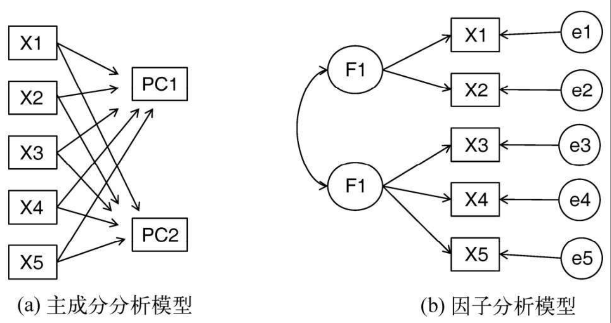
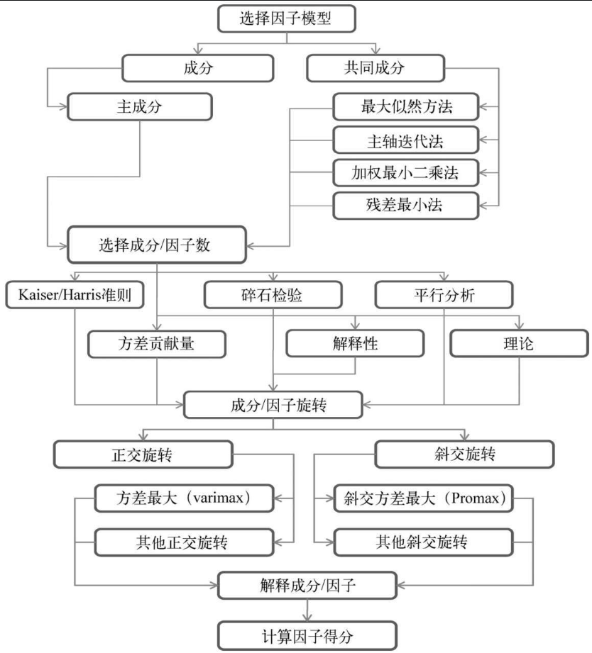
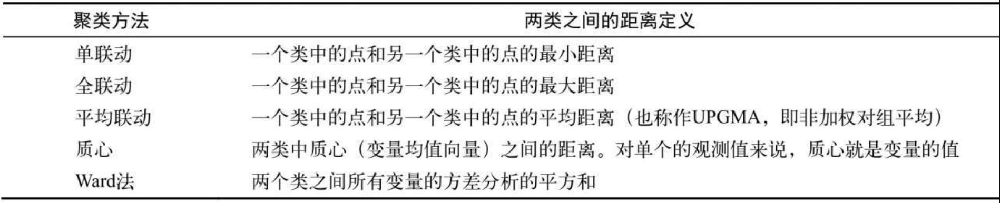
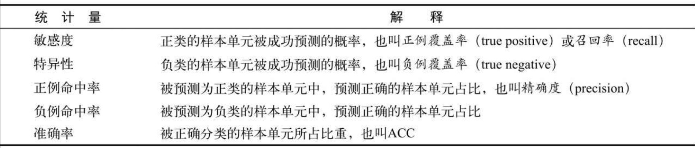
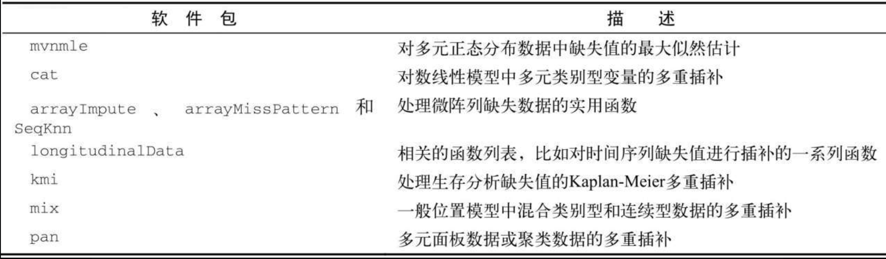
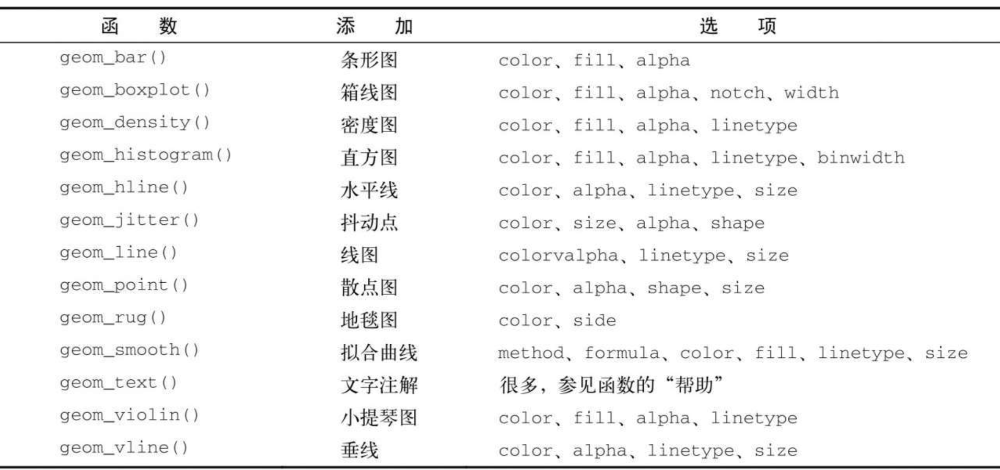
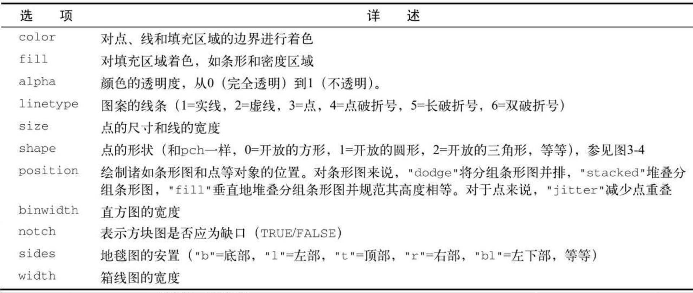
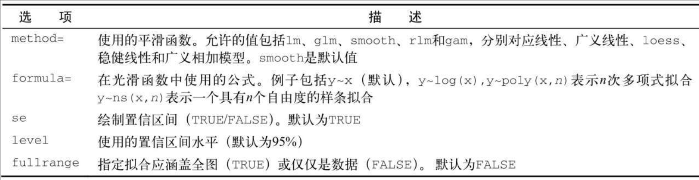
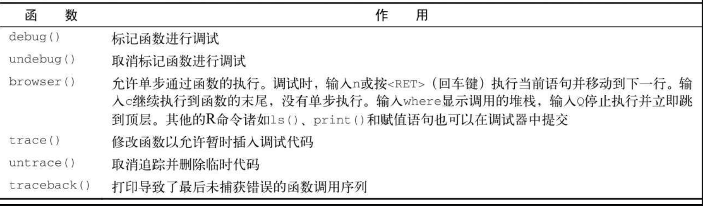

```{r default, include=FALSE}
knitr::opts_chunk$set(echo = TRUE)
knitr::opts_chunk$set(out.width= "55%")
knitr::opts_chunk$set(fig.align='center') 
```

 

# 基本操作

```{r eval=FALSE}
#查询函数功能
?getwd #在函数前加？即可在help区域显示对于函数的使用参考
```

## 工作目录

```{r eval=FALSE}
#查看当前工作目录
getwd()
#设置工作目录
setwd("D:\Desktop\转移\R cognitive model") #直接复制文件目录会报错
setwd("D:/Desktop/转移/R cognitive model") #修改\为/即可
```

## 包的安装

```{r eval=FALSE}
#包的安装
install.packages("gglpot2") #运行后安装对应包，记得加""，安装只需运行一次
library(ggplot2) #安装过之后进行引用，每次文件都要引用
```

```{r eval=FALSE}
#运行其他R脚本
source("Rstudy.R")
```

```{r eval=FALSE}
# 更新R包
install.packages("installr")
library(installr)
# 该菜单允许你安装R的新版本，更新现有的包，
# 以及安装其他有用的软件生产（如RStudio）
```


 

# 数据结构

## 向量

```{r echo=TRUE}
#1、向量（一维数组）！注意，单个向量中只能是同一类型
a1 <- c(1, 2, 5, 3, 6, -2, 4) #数值型向量
a2 <- c("one", "two", "three") #字符型向量
a3 <- c(TRUE, TRUE, TRUE, FALSE, TRUE, FALSE) #逻辑型向量
#读取向量
a1[3] # 输出5，！R中第一位数为1不是0
a1[c(1, 3, 5)] #输出1 5 6
a1[2:6] #输出2  5  3  6 -2
```

## 矩阵

```{r echo=TRUE}
#设置矩阵行列名
rnames <- c("R1", "R2", "R3", "R4", "R5") #必须一一对应
cnames <- c("C1", "C1", "C3", "C4")
b2 <- matrix(1:20, nrow = 5, ncol = 4, byrow = TRUE, #True为横着填充False为竖着
            dimnames = list(rnames, cnames))
b2
```

```{r echo=TRUE}
#矩阵读取
b2[2,2]
b2[2,] #第二列的数据
b2[,2] #第二行的数据
b2[1,c(1:4)] #第一行，对应向量的数据
```

## 数组

```{r echo=TRUE}
#3、数组（多维数组）！都是一个类型
dim1 <- c("A1", "A2")
dim2 <- c("B1", "B2", "B3")
dim3 <- c("C1", "C2", "C3", "C4")
c1 <- array(1:24, c(2, 3, 4), dimnames=list(dim1, dim2, dim3)) #创建三维数组
c1
```

## 数据框

```{r echo=TRUE}
#4、数据框（多维数组）！可以是多个类型
patientID <- c(1, 2, 3, 4)
age <- c(25, 34, 28, 52)
diabetes <- c("Type1", "Type2", "Type1", "Type1")
status <- c("Poor", "Improved", "Excellent", "Poor")
d1 <- data.frame(patientID, age, diabetes, status)
d1
```

```{r echo=TRUE}
d1[1:2] #前两列
d1[c("diabetes","age")] #对应表头的两列
d1$status #对应的一列
table(d1$diabetes, d1$status) #依据两列形成新列表
#通过attach函数简化
attach(d1)#将数据框添加至R搜索路径
table(diabetes, status)
detach(d1)#移除
#通过with函数简化
with(d1,{
  table(diabetes, status)})
```

## 列表

```{r echo=TRUE}
#5、列表（多个对象的有序集合）
f1 <- "FIRST LIST"
f2 <- c(1,2,3,4)
f3 <- matrix(1:10, nrow = 5)
f4 <- c("A", "B", "C")
f <- list(title = f1, ages = f2, f3, f4) #组合多个对象并保存为列表
f
```

 

# 创建数据集

## 读取数据

```{r eval=FALSE}
library(xlsx) #导入读取Excel的包
#读取Excel，1代表读取第一个sheet
data_1 <- read.xlsx("D:/Desktop/test.xlsx", 1) 
```

```{r eval=FALSE}
library(Hmisc)
#读取SPSS，use.value.labels导入值标签
data_2 <- spss.get("D:/Desktop/test.sav", use.value.labels = TRUE) 
```

## 数据标注

```{r echo=TRUE}
gender <- c(1, 2, 1, 2)
age <- c(25, 34, 28, 52)
diabetes <- c("Type1", "Type2", "Type1", "Type1")
status <- c("Poor", "Improved", "Excellent", "Poor")
d1 <- data.frame(gender, age, diabetes, status) #导入数据
#levles代表实际值，labels代表标签
d1$gender <- factor(d1$gender,
                    levels = c(1,2),
                    labels = c("male","famale")) 
```

 

# 图形初阶

```{r eval=FALSE}
tiff("my_pic")#设置图片名称与格式，科研建议TIFF
  attach(mtcars)
  #打开一个图形生成幅散点图，设置横纵轴
  plot(wt, mpg)
  #使用LM拟合最优曲线
  abline(lm(mpg~wt))
  #标题名称
  title("Regression")
  detach(mtcars)
#关闭图形
dev.off() 
```

```{r echo=TRUE}
dose <- c(20, 30, 40, 45, 60)
drugA <- c(16, 20, 27, 40, 60)
drugB <- c(15, 18, 25, 31, 40)
#type=b同时绘制点与线
plot(dose, drugA, type="b") 
#lty = 线型; pch = 点型; cex = 符号大小; lwd = 线宽
#col = 颜色
#pin = 图大小
#main = 标题; sub = 副标题; xlab, ylab = 坐标轴标签
#xlim,ylim = 坐标轴范围
plot(dose, drugA, 
     type="b", lty=2, cex = 1, pch=17, lwd = 1, 
     col="red",
     font.lab=3, cex.lab=1.5, font.main=4, cex.main=2,
     pin = c(2,3))
```

```{r echo=TRUE}
#通过RColorBrewer颜色配置
library(RColorBrewer)
#从Set1调色板中抽取了7种颜色
mycolors <- brewer.pal(7, "Set1")
barplot(rep(1, 6), col=mycolors)
```

## 图形组合

```{r echo=TRUE}
#图形的组合
attach(mtcars)
par(mfrow=c(2,2))#通过2*2拼图
plot(wt, mpg, main="Scatterplot of wt vs. mpg")
plot(wt, disp, main="Scatterplot of wt vs. disp")
hist(wt, main="Histogram of wt")
boxplot(wt, main="Boxplot of wt")
detach(mtcars)
```

```{r echo=TRUE}
attach(mtcars)
par(mfrow=c(3,1))#通过3*1拼图
hist(wt)
hist(mpg)
hist(disp)
detach(mtcars)
```

```{r echo=TRUE}
attach(mtcars)
layout(matrix(c(1,1,2,3), 2, 2, byrow=TRUE))#通过矩阵的标识位置来排列
hist(wt)
hist(mpg)
hist(disp)
detach(mtcars)
```

 

#数据管理

```{r echo=TRUE}
#通过transform新建变量
mydata <-data.frame(x1=c(2, 2, 6, 4),
                    x2=c(3, 4, 2, 8))
mydata#初始数据框
mydata <- transform(mydata,
                    sumx = x1+x2,
                    meanx=(x1+x2)/2)
mydata#增加变量后的数据框
```

## 数据转换

```{r eval=FALSE}
leadership$age[leadership$age ==99] <- NA
#leadership表中的age列，如果等于99，赋空值
# NA是专门的空值符号
```

```{r eval=FALSE}
#内容同上，将连续性数据转化为分类数据(新建)
leadership$agecat[leadership$age   > 75]   <- "Elder"
leadership$agecat[leadership$age >=55 & 
                  leadership$age <=75]   <- "Middle Aged"
leadership$agecat[leadership$age  < 55]   <- "Young"
```

```{r eval=FALSE}
#对上述代码的简化合并
leadership <- within(leadership, {
                    agecat <- NA
                    agecat[age > 75]             <- "Elder"
                    agecat[age >=55 & age <=75] <- "Middle Aged"
                    agecat[age < 55]             <- "Young" })
```

## 变量重命名

```{r echo=TRUE}
names(mydata)
```

```{r echo=TRUE}
names(mydata)[1] <- "Test"
names(mydata)
```

## 缺失值NA

```{r echo=TRUE}
y <- c(1, 2, 3, NA)
is.na(y) #NA可以被R识别
```

```{r echo=TRUE}
#排除缺失值
x <- c(1, 2, NA, 3)
y <- x[1]+x[2]+x[3]+x[4]
z <- sum(x)
x
y #由于存在缺失值，y为NA
z #同上
```

```{r echo=TRUE}
x <- c(1, 2, NA, 3)
y <- sum(x, na.rm=TRUE) #通过na.rm移除NA计算
y
```

## 日期

```{r echo=TRUE}
Sys.Date() #返回当天的日期 
date() #返回当前的日期和时间
```

::: {align="center"}
 日期公式
:::

```{r echo=TRUE}
#输入日期格式
mydates <- as.Date(c("2007-06-22", "2004-02-13"))
mydates
```

```{r echo=TRUE}
strDates <- c("01/05/1965", "08/16/1975")
dates <- as.Date(strDates, "%m/%d/%Y") #通过%m/%d/%Y转换日期
dates
```

```{r echo=TRUE}
#通过difftime()来计算时间间隔
today <- Sys.Date()
dob   <- as.Date("2000-01-01")
difftime(today, dob, units="weeks")
difftime(today, dob, units="days")
difftime(today, dob, units="auto")
```

## 数据转换

::: {align="center"}

:::

```{r echo=TRUE}
a <- c(1,2,3)
a
is.numeric(a)
is.vector(a)
```

```{r echo=TRUE}
a <- as.character(a)
a
is.numeric(a)
is.vector(a)
is.character(a)
```

## 数据排序

```{r echo=TRUE}
mydata <-data.frame(x1=c(2, 2, 6, 4),
                    x2=c(3, 4, 2, 8))
mydata
newdata_1 <- mydata[order(mydata$x1),] #基于x1升序排序
newdata_1
newdata_2 <- mydata[order(-mydata$x1),]#基于x1降序排序
newdata_2
```

##合并数据集

```{r echo=TRUE}
data_merge_1 <- cbind(newdata_1, newdata_2) #横向合并
data_merge_1
```

```{r echo=TRUE}
data_merge_2 <- rbind(newdata_1, newdata_2) #纵向合并
data_merge_2
```

## 随机抽样

```{r echo=TRUE}
mysample <- data_merge_2[sample(1:nrow(data_merge_2), 3, replace=FALSE), ]
mysample
```

 

# 高级数据管理

::: {align="center"}
 常用数学函数
:::

::: {align="center"}
 常用统计函数\
**通过apply计算每列的均值**\
*每行apply(mydata,1, mean)*\
*每列apply(mydata,2, mean)*
:::

## 概率函数

```{r echo=TRUE}
x <- pretty(c(-3,3), 30)
y <- dnorm(x) #密度函数（dnorm）
plot(x,y,
     type = "b"
    )

#分布函数（pnorm）
pnorm(1.96)
#分位数函数（qnorm）
qnorm(.9, mean = 500, sd = 100)
#随机数生成函数（rnorm）
set.seed(123) #固定随机化数据
rnorm(3, mean = 50, sd = 10)
```

## 文本数据处理

::: {align="center"}
 文本数据处理
:::

##实际案例 将学生的各科考试成绩组合为单一的成绩衡量指标，基于相对名次（前20%、下20%、等等）给出从A到F的评分，根据学生姓氏和名字的首字母对花名册进行排序。

```{r echo=TRUE}
# 录入数据
Student <- c( "John Davis", "Angela Williams", "Bullwinkle Moose" ,
"David Jones", "Janice Markhammer", "Chery1 Cushing",
"Reuven Ytzrhak", "Greg Knox",  "Joel England" ,
"Mary Rayburn" )
Math <- c(502, 600,  412,  358,  495, 512,  410,  625, 573, 522)
Science <- c(95,  99,  80,  82, 75,  85,  80,  95, 89, 86)
English <- c(25, 22, 18, 15, 20, 28, 15, 30, 27,18)
roster <- data.frame (Student,Math, Science, English,
stringsAsFactors=FALSE)
roster
```

```{r echo=TRUE}
#将不同数据标准化
z <- scale(roster[,2:4])
z
```

```{r echo=TRUE}
score <- apply(z, 1, mean) #基于标准化数据计算每行平均值
roster <- cbind(roster, score) #合并两组数据框
roster
```

```{r echo=TRUE}
y <- quantile(roster$score, c(.8, .6, .4, .2)) #score计算百分位数
y
```

```{r echo=TRUE}
#新编码为grade变量，基于四分位数分别赋值A-F
roster$grade[score >=y[1]] <- "A"
roster$grade[score < y[1] & score >=y[2]] <- "B"
roster$grade[score < y[2] & score >=y[3]] <- "C"
roster$grade[score < y[3] & score >=y[4]] <- "D"
roster$grade[score < y[4]] <- "F"
roster
```

```{r echo=TRUE}
#拆分姓名
name <- strsplit((roster$Student), " ")
Firstname <- sapply(name, "[", 1)
Lastname <- sapply(name, "[", 2)
roster <- cbind(Firstname, Lastname, roster[-1]) #去掉第一列
roster
```

```{r echo=TRUE}
# 排序
roster[order(Lastname, Firstname),]
```

```{r echo=TRUE}
t(roster)#转置
```

## 控制流

```{r echo=TRUE}
# for循环  for (var in seq) statement
for (i in 1:3)   
    print("Hello")
```

```{r echo=TRUE}
# while循环  while (cond) statement
i <- 2
while (i > 0) {
    print("Hello");
    i <- i -1}
```

```{r echo=TRUE}
# if-else条件 if (cond) statement1 else statement2
if (!is.character("1")) {
    print("Passed")
} else {
    print("Failed")
}
#简化版本
ifelse(!is.character("1"), print("Passed"), print("Failed"))
```

## 自编函数

```{r echo=TRUE}
mydate <- function(type="long") {  #定义函数名称
    switch(type,                   #定义过程与结果
    long= format(Sys.time(), "%A %B %d %Y"),
    short=format(Sys.time(), "%m-%d-%y"),
    cat(type, "is not a recognized type\n")
            )
        }
mydate("short")
```

 

# 基本图形

## 条形图

```{r echo=TRUE}
library(vcd)
counts <- table(Arthritis$Improved) #导入数据
```

```{r echo=TRUE}
# 纵向条形图
barplot (counts,   #
    main= "Simple Bar Plot",
    xlab= " Improvement", ylab=" Frequency" )
```

```{r echo=TRUE}
# 横向条形图
barplot (counts,
    main= "Horizontal Bar Plot",
    xlab="Frequency", ylab=" Improvement",
    horiz=TRUE)
```

```{r echo=TRUE}
counts <- table(Arthritis$Improved, Arthritis$Treatment) #导入数据
# 堆砌条形图
barplot (counts,
    main="Stacked Bar Plot",
    xlab="Treatment", ylab="Frequency",
    col=c("red", "yellow", "green") ,#设置颜色
    legend=rownames (counts)) #标签
```

```{r echo=TRUE}
# 分组条形图
barplot (counts,
    main= "Grouped Bar Plot",
    xlab= "Treatment", ylab="Frequency",
    col=c("red", "yellow", "green"), #设置颜色
    legend=rownames (counts), beside=TRUE) #标签 + 位置
```

```{r echo=TRUE}
# 棘状图 (基于比例的堆砌图形图)
attach(Arthritis)
counts <- table(Treatment, Improved)
spine(counts, main="Spinogram Example") 
detach(Arthritis)
```

## 饼图

```{r echo=TRUE}
# 导入数据
slices <- c(10, 12,4, 16, 8) 
lbls <- c("US", "UK", "Australia", "Germany", "France")
#基本饼图
pie(slices, labels = lbls, 
    main="Simple Pie Chart")
```

```{r echo=TRUE}
#比例饼图
pct <- round(slices/sum(slices)*100) # 计算比例                      
lbls <- paste(lbls, pct) 
lbls <- paste(lbls,"%",sep="")
pie(slices,labels = lbls, col=rainbow(length(lbls)),
    main="Pie Chart with Percentages")
```

```{r echo=TRUE}
#3D饼图
library(plotrix)                                               
pie3D(slices, labels=lbls,explode=0.1,
      main="3D Pie Chart ")
```

```{r echo=TRUE}
#表格转为饼图
mytable <- table(state.region)                                   
lbls <- paste(names(mytable), "\n", mytable, sep="") #将国家转化为地区
pie(mytable, labels = lbls, 
    main="Pie Chart from a dataframe\n (with sample sizes)")
```

```{r echo=TRUE}
#扇形图
fan.plot(slices, labels=lbls, main="Fan Plot")
```

## 直方图

```{r echo=TRUE}
hist(mtcars$mpg,  #基本直方图
     freq=FALSE,  #基于密度而非频率
     breaks=12,  #分组数量
     col="blue", 
     xlab="Miles Per Gallon", 
     main="Histogram, rug plot, density curve")  
lines(density(mtcars$mpg), col="red", lwd=2) #增加密度曲线
```

## 密度图

```{r echo=TRUE}
# 基本密度图
d <- density(mtcars$mpg)                                  
plot(d, main="Kernel Density of Miles Per Gallon")       
polygon(d, col="red", border="blue")                     
rug(mtcars$mpg, col="brown") 
```

```{r echo=TRUE}
# 基于sm包绘制密度图对比
library(sm)
attach(mtcars)
cyl.f <- factor(cyl, levels= c(4, 6, 8),                               
                labels = c("4 cylinder", "6 cylinder", "8 cylinder")) 
sm.density.compare(mpg, cyl, xlab="Miles Per Gallon") #创建密度图                
title(main="MPG Distribution by Car Cylinders")
colfill<-c("green","blue","red")  #填加颜色
detach(mtcars)
```

## 箱线图

::: {align="center"}
 箱线图介绍
:::

```{r echo=TRUE}
#单因素分组箱线图
boxplot(mpg~cyl,data=mtcars, #基于类别变量cly分组mpg数据
        main="Car Milage Data", 
        xlab="Number of Cylinders", 
        ylab="Miles Per Gallon")
```

```{r echo=TRUE}
#多因素分组箱线图
mtcars$cyl.f <- factor(mtcars$cyl,   #分组因素1
                       levels=c(4,6,8),
                       labels=c("4","6","8"))
mtcars$am.f <- factor(mtcars$am,    #分组因素2
                      levels=c(0,1), 
                      labels=c("auto","standard"))
boxplot(mpg ~ am.f *cyl.f,    #组合因素1*因素2
        data=mtcars, 
        varwidth=TRUE,
        col=c("gold", "darkgreen"),
        main="MPG Distribution by Auto Type", 
        xlab="Auto Type")
```

## 小提琴图

```{r echo=TRUE}
library(vioplot)
x1 <- mtcars$mpg[mtcars$cyl==4] 
x2 <- mtcars$mpg[mtcars$cyl==6]
x3 <- mtcars$mpg[mtcars$cyl==8]
vioplot(x1, x2, x3, 
        names=c("4 cyl", "6 cyl", "8 cyl"), 
        col="gold")
title("Violin Plots of Miles Per Gallon")
#在图中，白点是中位数，黑色盒型的范围是下四分位点到上四分位点，细黑线表示须。
#外部形状即为核密度估计
```

## 点图

```{r echo=TRUE}
x <- mtcars[order(mtcars$mpg),]   #导入排序数据                   
x$cyl <- factor(x$cyl)  #设置为因子数据                               
x$color[x$cyl==4] <- "red"                              
x$color[x$cyl==6] <- "blue"
x$color[x$cyl==8] <- "darkgreen" 
dotchart(x$mpg,
         labels = row.names(x), #基于names设置行名                              
         cex=.7,    #标签大小
         pch=19,    #控制点大小                                          
         groups = x$cyl,  #分组                                     
         gcolor = "black",#分组颜色
         color = x$color,
         main = "Gas Mileage for Car Models\ngrouped by cylinder",
         xlab = "Miles Per Gallon")
```

 

# 基本统计分析

## 描述性统计

```{r echo=TRUE}
# summary()函数提供了最小值、最大值、四分位数和数值型变量的均值
x <- c(1,3,5,9,10)
summary(x)
y <- c("1","3","5")
summary(y)
```

```{r echo=TRUE}
# 基于Hmisc的describe进行描述统计
library(Hmisc)
describe(x)
```

```{r echo=TRUE}
# 基于pastecs的stat.desc进行描述统计
library(pastecs)
stat.desc(x)
```

```{r echo=TRUE}
# 通过by进行分组描述性统计
x <- mtcars[order(mtcars$mpg),]                 
x$cyl <- factor(x$cyl) #导入数据
by(x, x$cyl, summary)
```

## 频数表及检验

```{r echo=TRUE}
library(vcd)
#一维列联表
mytable <- with(Arthritis, table(Improved))
mytable
```

```{r echo=TRUE}
#二维列联表
mytable <- xtabs(~Treatment+Improved, data=Arthritis)
mytable
addmargins(mytable) #增加sum
addmargins(mytable,2) #部分增加sum
```

```{r echo=TRUE}
#多维列联表
mytable <- xtabs(~Treatment+Sex+Improved, data=Arthritis )
mytable
#生成边际系数
margin.table(mytable, 1)
```

```{r echo=TRUE}
# 卡方独立性检验 （两组分类变量使用）
mytable <- xtabs(~Treatment+Improved, data=Arthritis )
chisq.test(mytable)
```

```{r echo=TRUE}
#Fisher精确检验 (望频数有其中之一小于5时替换卡方检验)
mytable <- xtabs(~Treatment+Improved, data=Arthritis )
fisher.test(mytable)
```

```{r echo=TRUE}
#Cochran-Mantel-Haenszel检验(K*2*2分析)
mytable <- xtabs(~Treatment+Improved+Sex, data=Arthritis)
mantelhaen.test(mytable)
```

## 相关分析

```{r echo=TRUE}
#相关系数
states <- state.x77[,1:6]
cov(states) # 协方差
cor(states,method = "pearson") #pearson 相关 ；呈正态分布的连续变量
cor(states,method = "spearman") #spearman 相关； pearson条件不满足时使用
cor(states,method = "kendall") #kendall 相关； 分类变量
```

```{r echo=TRUE}
# 偏相关(控制一个或多个变量时，另外两个变量之间的相互关系)
library(ggm)
pcor(c(1,5,2,3,6), cov(states)) #1,5为计算变量，2,3,6为控制变量
```

```{r echo=TRUE}
# 相关系数检验
cor.test(states[,3], states[,5], method = "pearson")
cor.test(states[,3], states[,5], method = "spearman")
cor.test(states[,3], states[,5], method = "kendall")
```

```{r echo=TRUE}
# 通过psych计算相关矩阵
library(psych)
corr.test(states, use="complete")
```

## t检验

```{r echo=TRUE}
#独立样本t检验，两组独立数据
library(MASS)
t.test(Prob~So, data=UScrime)
```

```{r echo=TRUE}
##配对样本t检验，两组配对数据
with(UScrime, t.test(U1, U2, paired=TRUE))
```

## 非参数检验

```{r echo=TRUE}
# Mann-Whitney U检验 (非正态，独立数据，对等独立t)
wilcox.test(Prob~So, data=UScrime)
```

```{r echo=TRUE}
# Wilcoxon符号秩检验（非正态，配对数据，对等配对t）
with(UScrime, wilcox.test(U1, U2, paired=TRUE, exact=FALSE))
```

```{r echo=TRUE}
#Kruskal-Wallis检验 (非正态，多组，对方差分析)
states <- data.frame(state.region, state.x77)
kruskal.test(Illiteracy~state.region, data=states)
```

 

# 回归分析

::: {align="center"}
 回归分析类型
:::

::: {align="center"}
 拟合模型常用函数
:::

## OLS回归

数据符合\
❏ 正态性:对于固定的自变量值，因变量值成正态分布。\
❏ 独立性:Yi值之间相互独立。\
❏ 线性: 因变量与自变量之间为线性相关。\
❏ 同方差性: 因变量的方差不随自变量的水平不同而变化。

```{r echo=TRUE}
#简单线性回归
fit <- lm(weight~height, data=women)
summary(fit)
# R-squared（0.991）表明模型可以解释体重99.1%的方差
# Weight = -87.51667 + 4.45 * height

plot(women$height, women$weight,
                xlab="Height (in inches)",
                ylab="Weight (in pounds)")
abline(fit)
```

```{r echo=TRUE}
# 多项式回归
fit2 <- lm(weight~height+I(height^2), data=women) #I(height^2)表示向预测等式添加一个身高的平方项
summary(fit2)
# R-squared（0.9995）表明模型可以解释体重99.995%的方差
# Weight = 261.87818 - 7.34832 * height + 0.083 * height²

plot(women$height, women$weight,
                xlab="Height (in inches)",
                ylab="Weight (in pounds)")
lines(women$height, fitted(fit2))
```

```{r echo=TRUE}
# 多元线性回归
states <- as.data.frame(state.x77[, c("Murder", "Population",
                "Illiteracy", "Income", "Frost")])
cor(states) #相关矩阵

library(car) #相关散点图
scatterplotMatrix(states,
            main="Scatter Plot Matrix")

fit <- lm(Murder~Population+Illiteracy+Income+Frost,
                    data=states)
summary(fit)
# R-squared（0.567）表明模型可以解释体重56.7%的方差
# murder = 1.235 + 2.237 * population + 4.413 * illiteracy 
#+ 6.442 * income + 5.813 * frost
    
```

```{r echo=TRUE}
#有交互项的多元线性回归
fit <- lm(mpg~hp+wt+hp:wt, data=mtcars)
summary(fit)
# mpg = 49.81 - 0.12 * hp - 8.22 * wt + 0.03 *hp *wt

library(effects)
plot(effect("hp:wt", fit, , list(wt=c(2.2,3.2,4.2))), multiline=TRUE) 
#展示交互结果
```

 

# 方差分析

举例：将10个患者都放在干预组中，然后在治疗五周和六个月后分别评价疗效;此时，时间（time）是两水平（五周、六个月）的组内因子。因为每位患者在所有水平下都进行了测量，所以这种统计设计称**单因素组内方差分析**；又由于每个受试者都不止一次被测量，也称作**重复测量方差分析**。\
举例：随机分配五位患者到干预组，另外五位到对照组，在五周和六个月后分别评价他们的测试结果。疗法和时间都作为因子时，我们既可分析疗法的影响和时间的影响，又可分析疗法和时间的交互影响。前两个称作**主效应**，交互部分称作**交互效应**。\
若**疗法结果显著**，说明干预组和对照组对焦虑症的治疗效果不同；若**时间结果显著**，说明焦虑度从五周到六个月发生了变化；若**两者交互效应显著**，说明两种疗法随着时间变化对焦虑症治疗影响不同（也就是说，焦虑度从五周到六个月的改变程度在两种疗法间是不同的）


## 正态性检验

```{r eval=FALSE}
# Q-Q图检验
library(car)
qqPlot(lm(response ~ trt, data=cholesterol), 
       simulate=TRUE, main="Q-Q Plot", labels=FALSE)
```

```{r eval=FALSE}
# bartlett检验，p > 0 代表符合正态 
bartlett.test(response ~ trt, data=cholesterol)
```

## 单因素方差分析 ANOVA

```{r include=FALSE}
library(multcomp)
```

```{r}
attach(cholesterol)
table(trt) #样本     
aggregate(response, by=list(trt), FUN=mean) #均值 
aggregate(response, by=list(trt), FUN=sd)  #标准差
#单因素方差分析 trt对response的影响
fit <- aov(response ~ trt)                                 
summary(fit)
#绘图
library(gplots)
plotmeans(response ~ trt, xlab="Treatment", ylab="Response", 
          main="Mean Plot\nwith 95% CI")
detach(cholesterol)
```

```{r}
#多重比较
TukeyHSD(fit) #多重比较结果
# 绘图
par(las=2)
par(mar=c(5,8,4,2)) 
plot(TukeyHSD(fit)) #只要线接触到虚线0代表不显著
```

## 单因素协方差分析 ACNOVA

```{r eval=FALSE}
data(litter, package="multcomp")
attach(litter)
table(dose) 
aggregate(weight, by=list(dose), FUN=mean)
# gesttime 为协变量， dose 对 weight
fit <- aov(weight ~ gesttime + dose)                             
summary(fit)
#ANCOVA的F检验表明：
#  (a)怀孕时间与幼崽出生体重相关；
#  (b)控制怀孕时间，药物剂量与出生体重相关
```

协方差分析还需要检验回归斜率

```{r}
library(multcomp)
fit2 <- aov(weight ~ gesttime*dose, data=litter)
summary(fit2)
#gesttime:dose交互效应不显著，支持了斜率相等的假设
```

```{r}
#结果可视化
library(HH)
ancova(weight ~ gesttime + dose, data=litter)
```

## 双因素方差分析

随机分配60只豚鼠，分别采用两种喂食方法（橙汁或维生素C），各喂食方法中抗坏血酸含量有三种水平（0.5mg、1mg或2mg），每种处理方式组合都被分配10只豚鼠

```{r eval=FALSE}
attach(ToothGrowth)
table(supp,dose) # 样本量
aggregate(len, by=list(supp,dose), FUN=mean)
aggregate(len, by=list(supp,dose), FUN=sd)
dose <- factor(dose) # dose转换为分组
fit <- aov(len ~ supp*dose)
summary(fit)

# 可视化 基于gplots
library(gplots)
plotmeans(len ~ interaction(supp, dose, sep=" "),
          connect=list(c(1, 3, 5),c(2, 4, 6)), 
          col=c("red","darkgreen"),
          main = "Interaction Plot with 95% CIs", 
          xlab="Treatment and Dose Combination")

# 可视化 基于HH
library(HH)
interaction2wt(len~supp*dose)
```

## 重复测量方差分析

因变量是二氧化碳吸收量，自变量是植物类型（魁北克VS．密西西比）和七种水平的二氧化碳浓度。另外，植物类型是组间因子，二氧化碳浓度是组内因子。

```{r}
CO2$conc <- factor(CO2$conc)
w1b1 <- subset(CO2, Treatment=='chilled')
fit <- aov(uptake ~ (conc*Type) + Error(Plant/(conc)), w1b1)
summary(fit)
par(las=2)
par(mar=c(10,4,4,2))
with(w1b1, 
     interaction.plot(conc,Type,uptake, 
                      type="b", col=c("red","blue"), pch=c(16,18),
                      main="Interaction Plot for Plant Type and Concentration"))
boxplot(uptake ~ Type*conc, data=w1b1, col=(c("gold","green")),
        main="Chilled Quebec and Mississippi Plants", 
        ylab="Carbon dioxide uptake rate (umol/m^2 sec)")
#魁北克省的植物比密西西比州的植物二氧化碳吸收率高，而且随着CO2浓度的升高，  
#差异越来越明显
```

## 多元方差分析MANOVA

美国谷物中的卡路里、脂肪和糖含量是否会因为储存架位置的不同而发生变化；其中1代表底层货架，2代表中层货架，3代表顶层货架。卡路里、脂肪和糖含量是因变量，货架是三水平（1、2、3）的自变量

```{r}
library(MASS)
attach(UScereal)
shelf <- factor(shelf) #转换分类
y <- cbind(calories, fat, sugars)
aggregate(y, by=list(shelf), FUN=mean)
cov(y)
fit <- manova(y ~ shelf)
summary(fit) #总结果
summary.aov(fit) #单变量结果
#三个因变量差异均显著，进一步检验需要单组多重比较
```

多元方差分析需要检验多元正态性与方差-协方差矩阵同质性 （方差-协方差矩阵同质性即指各组的协方差矩阵相同，通常可用Box's M检验来评估该假设。目前R中没有Box's M函数）

```{r}
#多元正态性
center <- colMeans(y)
n <- nrow(y)
p <- ncol(y)
cov <- cov(y)
d <- mahalanobis(y,center,cov)
coord <- qqplot(qchisq(ppoints(n),df=p),
                d, main="QQ Plot Assessing Multivariate Normality",
                ylab="Mahalanobis D2")
abline(a=0,b=1)
identify(coord$x, coord$y, labels=row.names(UScereal))
```

如果多元正态性或者方差-协方差均值假设都不满足，可以考虑用稳健MANOVA检验

```{r}
library(rrcov)
Wilks.test(y,shelf, method="mcd") 
```

```{r}
#通过回归的方式解决方差分析问题
fit.lm <- lm(response ~ trt, data=cholesterol)
summary(fit.lm)
contrasts(cholesterol$trt)
#变量trt2times表示水平1time和2times的一个对照。类似地，trt4times是1time和4times  
#的一个对照，其余以此类推。
```

 

# 功效分析

功效分析主要包括四个内容：给定任意三个，可以推算第四个 1、样本量：实验设计中每种条件/组中观测的数目 2、显著性水平（alpha）：由Ⅰ型错误的概率来定义。也可以把它看作发现效应不发生的概率。 3、功效：通过1减去Ⅱ型错误的概率来定义。我们可以把它看作真实效应发生的概率。 4、效应量：在备择或研究假设下效应的量。效应值的表达式依赖于假设检验中使用的统计方法。


 

## t检验的功效分析

pwr.t.test(n=, d=, sig.level=, power=, type=, alternative=) n为样本大小，d为效应值，sig.level表示显著性水平（默认为0.05） power为功效水平 type：独立t（"two.sample"）、单样本t（"one.sample"）配对t（"paired"） alternative"：双侧检验（"two.sided"）单侧检验（"less"或"greater"）

```{r}
library(pwr)
pwr.t.test(d=.8, sig.level=.05,power=.9, type="two.sample",  
           alternative="two.sided") 
# 结果表明：每组需要34个受试者（共68人），才能保证有90%的把握检测到0.8的效应量，
#并且最多5%的可能性会误报差异存在。
pwr.t.test(n=20, d=.5, sig.level=.01, type="two.sample", 
           alternative="two.sided") #求功效
```

## 方差分析的功效分析

pwr.anova.test(k=, n=, f=, sig.level=, power=) k是组的个数，n是各组中的样本大小

```{r}
pwr.anova.test(k=5,f=.25,sig.level=.05,power=.8)
# 结果表明：总样本大小为5×39，即195。39为五个组的均值
```

## 相关性功效分析

pwr.r.test(n=, r=, sig.level=,power=,alternative=) n是观测数目，r是效应值（相关系数的标准效应量）,sig.level是显著性水平

```{r}
pwr.r.test(r=.25, sig.level=.05, power=.90, alternative="greater")
#要满足相关要求，需要134个受试者
```

## 线性模型的功效分析

pwr.f2.test(u=, v=, f2=, sig.level=, power=) u和v分别是分子自由度和分母自由度，f2是效应量

```{r}
pwr.f2.test(u=3, f2=0.0769, sig.level=0.05, power=0.90)
#分母的自由度等于N-k-1, N是总观测数，k是预测变量数。
#本例中，N-7-1=185，即需要样本大小N=185+7+1=193。
```

## 比例检验的功效分析

pwr.2p.test(h=, n=, sig.level=, power=) h是效应值，n是各组相同的样本量 pwr.2p2n.test(h=, n1=, n2=, sig.level=, power=) 两组不同时使用以上函数

```{r}
pwr.2p.test(h=ES.h(.65, .6), sig.level=.05, power=.9, 
            alternative="greater")
#在本研究中需要两组各1605个人
```

## 卡方检验的功效分析

pwr.chisq.test(w=, N=, df=, sig.level=, power=) w是效应值，N是总样本大小，df是自由度

```{r}
prob <- matrix(c(.42, .28, .03, .07, .10, .10), byrow=TRUE, nrow=3)
ES.w2(prob) #计算效应量
pwr.chisq.test(w=.1853, df=3 , sig.level=.05, power=.9)
# 结果表明该研究需要369个受试者
```


 

# 中级绘图

## 散点图

```{r echo=TRUE}
attach(mtcars)
#基本散点图
plot(wt, mpg, pch = 19) # x与y需要为数值型向量
abline(lm(mpg ~ wt), col="red", lwd=2, lty=1) #添加拟合的线性直线           
lines(lowess(wt, mpg), col="blue", lwd=2, lty=2) #添加平滑拟合曲线
detach(mtcars)
```

```{r}
library(car) 
#按cyl的水平分别绘制mpg和wt的关系图
scatterplot(mpg ~ wt | cyl, data=mtcars, lwd=2, 
            boxplots="xy" ) #添加箱线图
```

散点图矩阵

```{r}
pairs(~mpg+disp+drat+wt, data=mtcars)
#可以看到所有指定变量间的二元关系
```

高密度散点图

```{r}
#导入数据
n <- 10000
c1 <- matrix(rnorm(n, mean=0, sd=.5), ncol=2)
c2 <- matrix(rnorm(n, mean=3, sd=2), ncol=2)
mydata <- rbind(c1, c2)
mydata <- as.data.frame(mydata)
names(mydata) <- c("x", "y")
#绘图
with(mydata,
     plot(x, y, pch=19, main="Scatter Plot with 10000 Observations"))
#用颜色密度来表示点分布的散点图
with(mydata,
     smoothScatter(x, y, main="Scatter Plot colored by Smoothed Densities"))
#六边形展示的各点上覆盖观测点数目的散点图
library(hexbin)
with(mydata, {
  bin <- hexbin(x, y, xbins=50)
  plot(bin, main="Hexagonal Binning with 10,000 Observations")
})
```

三维散点图

```{r}
library(scatterplot3d)
attach(mtcars)
#基本3d散点图
scatterplot3d(wt, disp, mpg)
#增加纵深感回归面
s3d <-scatterplot3d(wt, disp, mpg,
                    pch=16,
                    highlight.3d=TRUE,
                    type="h")
fit <- lm(mpg ~ wt+disp)
s3d$plane3d(fit)
detach(mtcars)
```

旋转三维散点图（可交互）

```{r eval=FALSE}
library(rgl)
attach(mtcars)
plot3d(wt, disp, mpg, col="red", size=5)
```

 \## 气泡图

```{r}
attach(mtcars)
r <- sqrt(disp/pi)
symbols(wt, mpg, circle=r, inches=0.30, #基本圆圈大小
        fg="white", bg="lightblue")
text(wt, mpg, rownames(mtcars), cex=0.6) #添加气泡名称
detach(mtcars)
```

## 折线图

```{r}
par(mfrow=c(1,2))
t1 <- subset(Orange, Tree==1)
plot(t1$age, t1$circumference,
     type="b")# 折线类型
```


```{r}
Orange$Tree <- as.numeric(Orange$Tree)
ntrees <- max(Orange$Tree)
xrange <- range(Orange$age)
yrange <- range(Orange$circumference) #导入数据
plot(xrange, yrange,  
     type="n", #未生成点线
) #绘图
colors <- rainbow(ntrees) #设置颜色
linetype <- c(1:ntrees) #设置线形
plotchar <- seq(18, 18+ntrees, 1)
#通过循环设置线形
for (i in 1:ntrees) {
  tree <- subset(Orange, Tree==i)
  lines(tree$age, tree$circumference,
        type="b",
        lwd=2,
        lty=linetype[i],
        col=colors[i],
        pch=plotchar[i]
  )
}
#绘制图例
legend(xrange[1], yrange[2],
       1:ntrees,
       cex=0.8,
       col=colors,
       pch=plotchar,
       lty=linetype,
       title="Tree"
)

```

## 相关图


```{r}
options(digits=2)
library(corrgram)
corrgram(mtcars, order=TRUE, lower.panel=panel.shade,
         upper.panel=panel.pie, text.panel=panel.txt,
         main="Corrgram of mtcars intercorrelations")
#蓝色和从左下指向右上的斜杠表示单元格中的两个变量呈正相关,红色负相关
#色彩越深，说明变量相关性越大
#正相关性将从12点钟处开始顺时针填充饼图，而负相关性则逆时针方向填充饼图。
```

## 马赛克图

有两个以上的类别型变量时使用\
在马赛克图中，嵌套矩形面积正比于单元格频率，其中该频率即多维列联表中的频率。颜色和/或阴影可表示拟合模型的残差值。

```{r}
library(vcd)
mosaic(Titanic, shade=TRUE, legend=TRUE)
```

 

# 广义线形模型

## Logistic回归

```{r}
data(Affairs, package="AER") #导入数据
# 创建二分变量
Affairs$ynaffair[Affairs$affairs > 0] <- 1
Affairs$ynaffair[Affairs$affairs == 0] <- 0
Affairs$ynaffair <- factor(Affairs$ynaffair, 
                           levels=c(0,1),
                           labels=c("No","Yes"))
# Logistic回归
fit.full <- glm(ynaffair ~ gender + age + yearsmarried + children + 
                  religiousness + education + occupation +rating,
                data=Affairs,family=binomial())
summary(fit.full)
#从回归系数的p值可以看到，性别、是否有孩子、学历和职业对方程的贡献都不显著
#去除这些变量重新拟合模型，检验新模型
fit.reduced <- glm(ynaffair ~ age + yearsmarried + religiousness + 
                     rating, data=Affairs, family=binomial())
summary(fit.reduced)

# 由于两模型嵌套，可以使用anova()函数对它们进行比较
# 对于广义线性回归，可用卡方检验
anova(fit.reduced, fit.full, test="Chisq")
#卡方值不显著，表明四个预测变量的新模型与九个完整预测变量的模型拟合程度一样好

# 解释模型参数
exp(coef(fit.reduced))
# 随着婚龄的增加和年龄、宗教信仰与婚姻评分的降低，婚外情优势比将上升。
```

## 泊松回归

通过一系列连续型和/或类别型预测变量来预测计数型结果变量

```{r}
#导入数据
data(breslow.dat, package="robust")
names(breslow.dat)
#泊松回归
fit <- glm(sumY ~ Base + Age + Trt, data=breslow.dat, family=poisson())
summary(fit)

exp(coef(fit))
# sumY与Age正相关，Trt负相关
```

 

# 主成分分析与因子分析

**主成分分析（PCA）**是一种数据降维技巧，它能将大量相关变量转化为一组很少的不相关变量，这些无关变量称为主成分。\
**探索性因子分析（EFA）**是一系列用来发现一组变量的潜在结构的方法。它通过寻找一组更小的、潜在的或隐藏的结构来解释已观测到的、显式的变量间的关系。

```{r , echo=FALSE, fig.cap="主成分分析与因子分析模型", out.width = '50%'}

```

分析步骤

```{r , echo=FALSE, fig.cap="主成分分析与因子分析流程", out.width = '35%'}

```

 

## 主成分分析

**判断主成分的个数** 基于特征值的方法。每个主成分都与相关系数矩阵的特征值相关联，第一主成分与最大的特征值相关联，第二主成分与第二大的特征值相关联

```{r}
library(psych)
fa.parallel(Harman23.cor$cov, n.obs=302, fa="pc", n.iter=100,
            show.legend=FALSE, main="Scree plot with parallel analysis")
# 成分分析的碎石图
# Kaiser-Harris准则建议保留特征值大于1的主成分
```

**提取主成分**

```{r}
library(psych)
PC <- principal(Harman23.cor$cov, nfactors=2, rotate="none")
PC
# PC1和PC2栏可以看到，第一主成分解释了身体测量指标58%的方差，而第二主成分解释了22%的方差
# 载荷阵解释了成分和因子的含义。
# 第一主成分与每个身体测量指标都正相关
# 第二主成分与前四个变量负相关，与后四个变量正相关
```

**主成分旋转** 旋转是一系列将成分载荷阵变得更容易解释的数学方法，它们尽可能地对成分去噪。\
旋转方法有两种：使选择的成分保持不相关（正交旋转），和让它们变得相关（斜交旋转）。

```{r}
rc <- principal(Harman23.cor$cov, nfactors=2, rotate="varimax")
rc
# 列的名字都从PC变成了RC，以表示成分被旋转
# 第一主成分主要由前四个变量来解释 RC1
# 第二主成分主要由变量5到变量8来解释 RC2
# 各个主成分对方差的解释度变化（成分1从58%变为44%，成分2从22%变为37%）
```

**获取主成分**

```{r}
# 从原始数据中获取成分得分
pc <- principal(USJudgeRatings[,-1], nfactors=2, score=TRUE)
head(pc$scores)

#获取主成分得分系数
rc <- principal(Harman23.cor$cov, nfactors=2, rotate="varimax")
round(unclass(rc$weights), 2)
```

利用公式计算主成分得分\
PC1=0.28 \* height + 0.30 \* arm.span + 0.30 \* forearm + 0.29 \* lower.leg - 0.06 \* weight - 0.08 \* bitro.diameter - 0.10 \* chest.girth - 0.04 \* chest.width\
PC2= -0.05 \* height - 0.08 \* arm.span - 0.09 \* forearm - 0.06 \* lower.leg + 0.33 \* weight + 0.32 \* bitro.diameter + 0.34\* chest.girth + 0.27 \* chest.width

 

## 探索性因子分析

**判断需提取的公共因子数**

```{r warning=FALSE}
library(psych)
covariances <- ability.cov$cov
correlations <- cov2cor(covariances)
fa.parallel(correlations, n.obs=112, fa="both", n.iter=100,
            main="Scree plots with parallel analysis")
# 碎石图 EFA建议提取两个因子
```

**提取公共因子**

```{r}
# 使用主轴迭代法（fm="pa"）提取未旋转
fa <- fa(correlations, nfactors=2, rotate="none", fm="pa")
fa
# 两个因子解释了60%的方差
```

**因子旋转**

```{r}
fa.varimax <- fa(correlations, nfactors=2, rotate="varimax", fm="pa")
fa.varimax
# 阅读和词汇在第一因子上载荷较大
#画图、积木图案和迷宫在第二因子上载荷较大
#非语言的普通智力测量在两个因子上载荷较为平均
#这表明存在一个语言智力因子和一个非语言智力因子。
```

**因子分析图**

```{r}
fa.diagram(fa.varimax, simple=FALSE)
```

**因子得分**

```{r}
fa.varimax$weights
```

 

# 时间序列分析

## 生成时间序列

myseries ＜- ts(data, start=, end=, frequency=)\
start参数和end参数（可选）给出时序的起始时间和终止时间，frequency为每个单位时间所包含的观测值数量（如frequency=1对应年度数据，frequency=12对应月度数据，frequency=4对应季度数据）

```{r}
sales <- c(18, 33, 41,  7, 34, 35, 24, 25, 24, 21, 25, 20, 
           22, 31, 40, 29, 25, 21, 22, 54, 31, 25, 26, 35)
tsales <- ts(sales, start=c(2003, 1), frequency=12) 
tsales #生成对象
plot(tsales)

start(tsales) #初始
end(tsales) #结束
frequency(tsales) #频率

tsales.subset <- window(tsales, start=c(2003, 5), end=c(2004, 6)) #提取子集
tsales.subset
```

 

## 时序平滑化

```{r}
# 简单移动平均
library(forecast)
par(mfrow=c(2,2))
ylim <- c(min(Nile), max(Nile))
plot(Nile, main="Raw time series")
# 通过调整k平滑
plot(ma(Nile, 3), main="Simple Moving Averages (k=3)", ylim=ylim)
plot(ma(Nile, 7), main="Simple Moving Averages (k=7)", ylim=ylim)
plot(ma(Nile, 15), main="Simple Moving Averages (k=15)", ylim=ylim)

```

随着k的增大，图像变得越来越平滑。因此我们需要找到最能画出数据中规律的k，避免过平滑或者欠平滑。

## 季节性分解

趋势因子（trend component）能捕捉到长期变化；\
季节性因子（seasonal component）能捕捉到一年内的周期性变化；\
随机（误差）因子（irregular/error component）则能捕捉到那些不能被趋势或季节效应解释的变化。

```{r}
plot(AirPassengers)                                               
lAirPassengers <- log(AirPassengers)
plot(lAirPassengers, ylab="log(AirPassengers)")
#分解时间序列
fit <- stl(lAirPassengers, s.window="period")           
plot(fit)
# 给出了1949~1960年的时序图、季节效应图、趋势图以及随机波动项
```

## 指数预测模型

单指数模型（simple/single exponential model）拟合的是只有常数水平项和时间点i处随机项的时间序列，这时认为时间序列不存在趋势项和季节效应\
双指数模型（double exponential model；拟合的是有水平项和趋势项的时序\
三指数模型（triple exponential model；拟合的是有水平项、趋势项以及季节效应的时序\
**单指数平滑**

```{r}
#拟合模型
library(forecast) 
fit <- HoltWinters(nhtemp, beta=FALSE, gamma=FALSE)      
fit
#进一步预测，1代表预测一步
forecast(fit, 1)  

plot(forecast(fit, 1), xlab="Year", 
     ylab=expression(paste("Temperature (", degree*F,")",)),
     main="New Haven Annual Mean Temperature") 
# 图中给出了时序值、预测值以及80%和95%的置信区间

```

**三指数平滑**

```{r}
fit <- HoltWinters(log(AirPassengers))      
fit

pred <- forecast(fit, 5) #预测了接下来五个月的乘客量                                  
pred
# 给出折线图
plot(pred, main="Forecast for Air Travel", 
     ylab="Log(AirPassengers)", xlab="Time")       
pred$mean <- exp(pred$mean)
pred$lower <- exp(pred$lower)
pred$upper <- exp(pred$upper)
p <- cbind(pred$mean, pred$lower, pred$upper)
dimnames(p)[[2]] <- c("mean", "Lo 80", "Lo 95", "Hi 80", "Hi 95")
p
```

**使用ets()进行自动指数预测**\
ets()函数可以用来拟合抑制项。时序预测一般假定序列的长期趋势是一直向上的，而一个抑制项则使得趋势项在一段时间内靠近一条水平渐近线，使其更符合实际情况。

```{r}
library(forecast)
fit <- ets(JohnsonJohnson)
fit
# 图15-10给出了其折线图以及下八个季度（默认）的预测
plot(forecast(fit), main="Johnson and Johnson Forecasts", 
     ylab="Quarterly Earnings (Dollars)", xlab="Time")

```

**时序的滞后阶数**即我们向后追溯的观测值的数量。 ACk即一系列观测值（Yt）和k时期之前的观测值（Yt-k）之间的相关性。\
这些相关性（AC1, AC2, ..., ACk）构成的图即**自相关函数图**\
ARIMA模型主要用于拟合具有平稳性（或可以被转换为平稳序列）的时间序列。建立ARIMA模型的步骤包括：\
(1) 确保时序是平稳的；\
(2) 找到一个（或几个）合理的模型（即选定可能的p值和q值）；\
(3) 拟合模型；\
(4) 从统计假设和预测准确性等角度评估模型；\
(5) 预测。

```{r}
# 序列的变换以及稳定性评估
library(forecast)
library(tseries)
plot(Nile)
ndiffs(Nile)
dNile <- diff(Nile)                                              
plot(dNile)
# 对比折线图查看平稳性
adf.test(dNile)
# 数据检验平稳性
```

```{r}
# 选择模型
Acf(dNile)
Pacf(dNile)
```

```{r}
#拟合模型
fit <- arima(Nile, order=c(0,1,1))                                 
fit
accuracy(fit)
```

```{r}
# 模型评价
qqnorm(fit$residuals)     
qqline(fit$residuals)
Box.test(fit$residuals, type="Ljung-Box")
# 模型的残差应该满足独立正态分布（即残差间没有关联
# 如果数据满足正态分布，则数据中的点会落在图中的线上
```

```{r}
# 预测
forecast(fit, 3)
plot(forecast(fit, 3), xlab="Year", ylab="Annual Flow")
```

ARIMA的自动预测

```{r}
library(forecast)
fit <- auto.arima(sunspots)
fit
forecast(fit, 3)
accuracy(fit)
```

 

# 聚类分析

层次聚类，每一个观测值自成一类，这些类每次两两合并，直到所有的类被聚成一类为止。\
划分聚类，首先指定类的个数K，然后观测值被随机分成K类，再重新形成聚合的类。

聚类分析的步骤\
(1) 选择合适的变量，选择你感觉可能对识别和理解数据中不同观测值分组有重要影响的变量。\
(2) 缩放数据，最常用的方法是将每个变量标准化为均值为0和标准差为1的变量。\
(3) 寻找异常点，这会扭曲我们得到的聚类结果。\
(4) 计算距离，需要计算被聚类的实体之间的距离。\
(5) 选择聚类算法，层次聚类适用小样本，划分的方法能处理更大的数据量，但是需要事先确定聚类的个数。\
(6) 获得一种或多种聚类方法。\
(7) 确定类的数目，常用方法是尝试不同的类数（比如2\~K）并比较解的质量。\
(8) 获得最终的聚类解决方案。\
(9) 结果可视化，层次聚类的结果通常表示为一个树状图。划分的结果通常利用可视化双变量聚类图来表示。\
(10) 解读类。\
(11) 验证结果。\

## 计算距离

两个观测值之间的欧几里得距离定义\
$$
d_{i j}=\sqrt{\sum_{p=1}^p\left(x_{i p}-x_{j p}\right)^2}
$$ 这里i和j代表第i和第j个观测值，p是变量的个数\

```{r}
data(nutrient, package="flexclust")
# 这里的nutrient表示输入数据，默认为欧几里得距离
d <- dist(nutrient)
# 前四行的距离
as.matrix(d)[1:4,1:4]
# 观测值之间的距离越大，异质性越大。
```

## 层次聚类分析

(1) 定义每个观测值（行或单元）为一类；\
(2) 计算每类和其他各类的距离；\
(3) 把距离最短的两类合并成一类，这样类的个数就减少一个；\
(4) 重复步骤(2)和步骤(3)，直到包含所有观测值的类合并成单个的类为止。\

```{r , fig.cap="层次聚类方法", warning=FALSE, out.width = '60%'}

```

```{r}
data(nutrient, package="flexclust")
nutrient.scaled <- scale(nutrient)  #标准化                                
d <- dist(nutrient.scaled) #计算聚类                                         
fit.average <- hclust(d, method="average")  # 采用平均联动                        
plot(fit.average, hang=-1, cex=.5) # 绘制树状图
# 树状图应该从下往上读，它展示了这些条目如何被结合成类。
```

```{r eval=FALSE}
# 选择聚类数据
library(NbClust)
nc <- NbClust(nutrient.scaled, distance="euclidean", 
              min.nc=2, max.nc=15, method="average")
table(nc$Best.n[1,])
# “投票”个数最多的聚类个数（2、3、5和15）
```

```{r}
# 使用五类解决方案
clusters <- cutree(fit.average, k=5) 
table(clusters)
aggregate(nutrient, by=list(cluster=clusters), median) 
aggregate(as.data.frame(nutrient.scaled), by=list(cluster=clusters),
          median)
plot(fit.average, hang=-1, cex=.8,  
     main="Average Linkage Clustering\n5 Cluster Solution")
rect.hclust(fit.average, k=5) # 叠加五类的解决方案
```

sardines canned形成自己的类，因为钙比其他食物组要高得多。beef heart也是单独成类，是因为富含蛋白质和铁。clams类是低蛋白和高铁的。从beef roast到pork simmered的类中，所有项目都是高能量和高脂肪的。最后，最大的类（从mackerel canned到bluefish baked）含有相对较低的铁\

## 划分聚类分析

**K均值聚类分析**\
(1) 选择K个中心点（随机选择K行）；\
(2) 把每个数据点分配到离它最近的中心点；\
$$
s s(k)=\sum_{i=1}^n \sum_{j=0}^p\left(x_{i j}-\bar{x}_{k j}\right)^2
$$ xij表示第i个观测值中第j个变量的值。xkj表示第k个类中第j个变量的均值，其中p是变量的个数。 (3) 重新计算每类中的点到该类中心点距离的平均值\
(4) 分配每个数据到它最近的中心点；\
(5) 重复步骤(3)和步骤(4)直到所有的观测值不再被分配或是达到最大的迭代次数。\

```{r}
data(wine, package="rattle") # 导入数据
df <- scale(wine[-1])  #标准化 
library(NbClust)
nc <- NbClust(df, min.nc=2, max.nc=15, method="kmeans") #决定聚类个数
table(nc$Best.n[1,]) # 3最多
barplot(table(nc$Best.n[1,]), 
        xlab="Numer of Clusters", ylab="Number of Criteria",
        main="Number of Clusters Chosen by 26 Criteria") 
fit.km <- kmeans(df, 3, nstart=25)  # 进行k均值聚类分析 k = 3
fit.km$size
fit.km$centers                                               
aggregate(wine[-1], by=list(cluster=fit.km$cluster), mean)

# 评估效果
ct.km <- table(wine$Type, fit.km$cluster)
library(flexclust)
randIndex(ct.km)
# 调整的兰德指数提供了一种衡量划分的标准
# 变化范围是从-1（不同意）到1（完全同意）
```

**围绕中心点的划分**\
(1) 随机选择K个观测值（每个都称为中心点）；\
(2) 计算观测值到各个中心的距离/相异性；\
(3) 把每个观测值分配到最近的中心点；\
(4) 计算每个中心点到每个观测值的距离的总和（总成本）；\
(5) 选择一个该类中不是中心的点，并和中心点互换；\
(6) 重新把每个点分配到距它最近的中心点；\
(7) 再次计算总成本；\
(8) 如果总成本比步骤(4)计算的总成本少，把新的点作为中心点；\
(9) 重复步骤(5)\~(8)直到中心点不再改变。\

```{r}
library(cluster)
fit.pam <- pam(wine[-1], k=3, stand=TRUE) #标准化       
fit.pam$medoids  #输出中心点                                 
clusplot(fit.pam, main="Bivariate Cluster Plot") #聚类方案

# 评估效果
ct.pam <- table(wine$Type, fit.pam$clustering)
randIndex(ct.pam)
```

## 避免不存在的类

```{r}
library(fMultivar)
set.seed(1234)
df <- rnorm2d(1000, rho=.5)
df <- as.data.frame(df)
plot(df, main="Bivariate Normal Distribution with rho=0.5")

library(NbClust)
nc <- NbClust(df, min.nc=2, max.nc=15, method="kmeans")
barplot(table(nc$Best.n[1,]), 
        xlab="Numer of Clusters", ylab="Number of Criteria",
        main  ="Number of Clusters Chosen by 26 Criteria")

library(cluster)
fit <- pam(df, k=2)
df$clustering <- factor(fit$clustering)

plot(nc$All.index[,4], type="o", ylab="CCC",
     xlab="Number of clusters", col="blue")
# 当CCC的值为负并且对于两类或是更多的类递减时

```

 

# 分类（有监督机器学习）

```{r}
#导入数据
loc <- "http://archive.ics.uci.edu/ml/machine-learning-databases/"
ds  <- "breast-cancer-wisconsin/breast-cancer-wisconsin.data"
url <- paste(loc, ds, sep="")

breast <- read.table(url, sep=",", header=FALSE, na.strings="?")
names(breast) <- c("ID", "clumpThickness", "sizeUniformity",
                   "shapeUniformity", "maginalAdhesion", 
                   "singleEpithelialCellSize", "bareNuclei", 
                   "blandChromatin", "normalNucleoli", "mitosis", "class")

df <- breast[-1]
df$class <- factor(df$class, levels=c(2,4), 
                   labels=c("benign", "malignant"))

set.seed(1234)
train <- sample(nrow(df), 0.7*nrow(df)) #设定70%样本为训练集
df.train <- df[train,] #设置训练集
df.validate <- df[-train,] #设置验证集
table(df.train$class)
table(df.validate$class)
```

## 逻辑回归

根据一组数值变量预测二元输出\

```{r}
fit.logit <- glm(class~., data=df.train, family=binomial()) # 拟合逻辑回归
summary(fit.logit) # 模型检验
prob <- predict(fit.logit, df.validate, type="response")
logit.pred <- factor(prob > .5, levels=c(FALSE, TRUE), 
                     labels=c("benign", "malignant"))
logit.perf <- table(df.validate$class, logit.pred, #评估准确性
                    dnn=c("Actual", "Predicted"))
logit.perf
# 模型正确判别了118个类别为良性的患者和76个类别为恶性的患者。
# 在验证集上，正确分类的模型（即准确率，accuracy）为(76+118)/200=97%
```

## 决策树

对预测变量进行二元分离，从而构造一棵可用于预测新样本单元所属类别的树\
**经典决策树**\
(1) 选定一个最佳预测变量将全部样本单元分为两类，实现两类中的纯度最大化\
(2) 对每一个子类别继续执行步骤(1)\
(3) 重复步骤(1)\~(2)，直到子类别中所含的样本单元数过少，或者没有分类法能将不纯度下降到一个给定阈值以下。\
(3) 重复步骤(1)\~(2)，直到子类别中所含的样本单元数过少，或者没有分类法能将不纯度下降到一个给定阈值以下。\

```{r}
library(rpart)
set.seed(1234)
dtree <- rpart(class ~ ., data=df.train, method="class",  # 生成树    
               parms=list(split="information"))
dtree$cptable
plotcp(dtree)

dtree.pruned <- prune(dtree, cp=.0125)  #剪枝

library(rpart.plot)
prp(dtree.pruned, type = 2, extra = 104,  
    fallen.leaves = TRUE, main="Decision Tree")

dtree.pred <- predict(dtree.pruned, df.validate, type="class")
dtree.perf <- table(df.validate$class, dtree.pred, 
                    dnn=c("Actual", "Predicted"))
dtree.perf
```

**条件推断树**\
(1) 对输出变量与每个预测变量间的关系计算p值。\
(2) 选取p值最小的变量。\
(3) 在因变量与被选中的变量间尝试所有可能的二元分割（通过排列检验），并选取最显著的分割。\
(4) 将数据集分成两群，并对每个子群重复上述步骤。\
(5) 重复直至所有分割都不显著或已到达最小节点为止。\

```{r}
library(party)
fit.ctree <- ctree(class~., data=df.train)
plot(fit.ctree, main="Conditional Inference Tree")

ctree.pred <- predict(fit.ctree, df.validate, type="response")
ctree.perf <- table(df.validate$class, ctree.pred, 
                    dnn=c("Actual", "Predicted"))
ctree.perf
```

## 随机森林

在随机森林中，我们同时生成多个预测模型，并将模型的结果汇总以提升分类准确率\
随机森林过程：\
假设训练集中共有N个样本单元，M个变量\
(1) 从训练集中随机有放回地抽取N个样本单元，生成大量决策树。\
(2) 在每一个节点随机抽取m＜M个变量，将其作为分割该节点的候选变量。每一个节点处的变量数应一致。\
(3) 完整生成所有决策树，无需剪枝（最小节点为1）。\
(4) 终端节点的所属类别由节点对应的众数类别决定。\
(5) 对于新的观测点，用所有的树对其进行分类，其类别由多数决定原则生成。\

```{r}
library(randomForest)
set.seed(1234)
fit.forest <- randomForest(class~., data=df.train,    # 生成森林    
                           na.action=na.roughfix,
                           importance=TRUE)             
fit.forest
importance(fit.forest, type=2)                       # 给出变量重要性   
forest.pred <- predict(fit.forest, df.validate)         
forest.perf <- table(df.validate$class, forest.pred, 
                     dnn=c("Actual", "Predicted"))
forest.perf

```

## 支持向量机

SVM旨在在多维空间中找到一个能将全部样本单元分成两类的最优平面，这一平面应使两类中距离最近的点的间距（margin）尽可能大，在间距边界上的点被称为支持向量（support vector，它们决定间距），分割的超平面位于间距的中间。

```{r}
library(e1071)
set.seed(1234)
fit.svm <- svm(class~., data=df.train)
fit.svm
svm.pred <- predict(fit.svm, na.omit(df.validate))
svm.perf <- table(na.omit(df.validate)$class, 
                  svm.pred, dnn=c("Actual", "Predicted"))
svm.perf
```

带RBF核的SVM模型\

```{r}
set.seed(1234)
tuned <- tune.svm(class~., data=df.train, #变换参数
                  gamma=10^(-6:1),
                  cost=10^(-10:10))
tuned  #输出最优模型
fit.svm <- svm(class~., data=df.train, gamma=.01, cost=1) #拟合模型
svm.pred <- predict(fit.svm, na.omit(df.validate))
svm.perf <- table(na.omit(df.validate)$class,
                  svm.pred, dnn=c("Actual", "Predicted"))
svm.perf #评估交叉验证表现
```

## 通过不同模型选择最优解

```{r , fig.cap="评估参数", warning=FALSE}

```

```{r}
performance <- function(table, n=2){
  if(!all(dim(table) == c(2,2)))
    stop("Must be a 2 x 2 table")
  tn = table[1,1]
  fp = table[1,2]
  fn = table[2,1]
  tp = table[2,2]
  sensitivity = tp/(tp+fn)
  specificity = tn/(tn+fp)
  ppp = tp/(tp+fp)
  npp = tn/(tn+fn)
  hitrate = (tp+tn)/(tp+tn+fp+fn)
  result <- paste("Sensitivity = ", round(sensitivity, n) ,
                  "\nSpecificity = ", round(specificity, n),
                  "\nPositive Predictive Value = ", round(ppp, n),
                  "\nNegative Predictive Value = ", round(npp, n),
                  "\nAccuracy = ", round(hitrate, n), "\n", sep="")
  cat(result)
}
# 对五种分类器进行评估
performance(logit.perf)
performance(dtree.perf)
performance(ctree.perf)
performance(forest.perf)
performance(svm.perf)
```

 

# 处理缺失数据

## 处理缺失值的步骤

通用步骤为\
(1) 识别缺失数据\
(2) 检查导致数据缺失的原因；\
(3) 删除包含缺失值的实例或用合理的数值代替（插补）缺失值。\
缺失数据的分类\
(1) 完全随机缺失:某变量的缺失数据与其他任何观测或未观测变量都不相关\
(2) 随机缺失:某变量上的缺失数据与其他观测变量相关，与它自己的未观测值不相关\
(3) 非随机缺失:缺失数据不属于完全随机缺失和随机缺失）\
**识别缺失值NA**\

```{r eval=FALSE}
data(sleep, package="VIM")
# 列出没有缺失值的行
sleep[complete.cases(sleep), ]
# 列出有一个或多个缺失值的行
sleep[! complete.cases(sleep), ]
```

```{r}
sum(is.na(sleep$Dream))
mean(is.na(sleep$Dream))
mean(! complete.cases(sleep))
```

**列表显示缺失值**\

```{r eval=FALSE}
library(mice)
md.pattern(sleep)
```

**图形显示缺失值**\

```{r}
library("VIM")
aggr(sleep, prop=FALSE, numbers=TRUE)
matrixplot(sleep)
# 按行展示真实值和缺失值的矩阵图
marginplot(sleep[c("Gest","Dream")], pch=c(20), 
           col=c("darkgray", "red", "blue"))
#边界展示了缺失数据的信息
```

**相关性探索缺失值**\

```{r warning=FALSE}
x <- as.data.frame(abs(is.na(sleep)))
y <- x[which(apply(x,2,sum)>0)]
cor(sleep, y, use="pairwise.complete.obs")
# 行为可观测变量，列为表示缺失的指示变量
```

**删除NA实例**\

```{r eval=FALSE}
options(digits=1)
cor(na.omit(sleep)) # 删除所有含有缺失值的行
fit <- lm(Dream ~ Span + Gest, data=na.omit(sleep))
summary(fit)
```

## 多重插补

**多重插补**（MI）是一种基于重复模拟的处理缺失值的方法。它将从一个包含缺失值的数据集中生成一组完整的数据集（通常是3到10个）。每个模拟数据集中，缺失数据将用**蒙特卡洛方法**来填补。

```{r warning=FALSE}
options(digits=3)
library(mice)
data(sleep, package="VIM")
# 一个包含缺失数据的数据框开始，然后返回一个包含多个（默认5）完整数据集的对象
imp <- mice(sleep)
# 包含多个单独统计分析结果
fit <- with(imp, lm(Dream ~ Span + Gest))
# 统计分析平均结果
pooled <- pool(fit)
summary(pooled)
imp # 查看多重插补具体内容
```

## 处理缺失数据的其他方法

```{r , fig.cap="处理缺失数据的其他方法", warning=FALSE}

```

 

# ggplot2进行高级绘图

```{r ,echo=FALSE, fig.cap="常见几何函数", warning=FALSE, out.width = '60%' }

```

```{r ,echo=FALSE, fig.cap="基本选项", warning=FALSE, out.width = '60%' }

```

 

## 分组

```{r}
#分组密度图
data(Salaries, package="carData")
library(ggplot2)
ggplot(data=Salaries, #导入数据
       aes(x=salary, fill=rank)) + #设定数据，通过+补充
       geom_density(alpha=.3) #设定密度图
```

```{r}
#分组散点图
ggplot(Salaries, 
       aes(x=yrs.since.phd, y=salary, color=rank,shape=sex)) + #设定内部
       geom_point() #设定散点图
```

```{r}
#分组条形图
library(patchwork)
p1 <- ggplot(Salaries, aes(x=rank, fill=sex)) +
  geom_bar(position="stack") + labs(title='position="stack"')

p2 <- ggplot(Salaries, aes(x=rank, fill=sex)) +
  geom_bar(position="dodge") + labs(title='position="dodge"')

p3 <- ggplot(Salaries, aes(x=rank, fill=sex)) +
  geom_bar(position="fill") + labs(title='position="fill"')
#基于patchwork可以组合图形
(p1 | p2) / (p3 | plot_spacer())
```

```{r}
#不同的基本设置输出不同
p1 <- ggplot(Salaries, aes(x=rank, fill=sex))+ geom_bar()

p2 <- ggplot(Salaries, aes(x=rank)) + geom_bar(fill="red")

p3 <- ggplot(Salaries, aes(x=rank, fill="red")) + geom_bar()

(p1 | p2) / (p3 | plot_spacer())
```

 

## 刻面

```{r}
#直方图刻面
data(singer, package="lattice")
ggplot(data=singer, aes(x=height)) +
  geom_histogram() + #设置直方图
  facet_wrap(~voice.part, nrow=4) #将voice水平排列为4列的独立图
```

```{r}
#散点图刻面
ggplot(Salaries, aes(x=yrs.since.phd, y=salary, color=rank,
                     shape=rank)) + geom_point() + facet_grid(.~sex)
```

```{r}
#密度图刻面
data(singer, package="lattice")
library(ggplot2)
ggplot(data=singer, aes(x=height, fill=voice.part)) +
  geom_density() +
  facet_grid(voice.part~.)
```

 

## 添加光滑曲线

```{r echo=FALSE, fig.cap="平滑曲线选项", warning=FALSE}

```

```{r}
data(Salaries, package="carData")
library(ggplot2)
ggplot(data=Salaries, aes(x=yrs.since.phd, y=salary)) +
  geom_smooth() + #散点图的关系（包含置信区间） 
  geom_point() 
```

```{r}
ggplot(data=Salaries, aes(x=yrs.since.phd, y=salary,
                          linetype=sex, shape=sex, color=sex)) +
  geom_smooth(method=lm, formula=y~poly(x,2), #拟合多项回归
              se=FALSE, size=1) +
  geom_point(size=2)
```

 

## 修改ggplot2图形的外观

**修改坐标轴**\

```{r}
data(Salaries,package="carData")
ggplot(data=Salaries, aes(x=rank, y=salary, fill=sex)) +
  geom_boxplot() +
  # break因子水平排序 labels水平标签
  scale_x_discrete(breaks=c("AsstProf", "AssocProf", "Prof"),
                   labels=c("Assistant\nProfessor",
                            "Associate\nProfessor",
                            "Full\nProfessor")) +
  # break刻度标记 labels刻度标记标签
  scale_y_continuous(breaks=c(50000, 100000, 150000, 200000),
                     labels=c("$50K", "$100K", "$150K", "$200K")) +
  labs(title="Faculty Salary by Rank and Sex", x="", y="")
```

**修改图例**\

```{r}
data(Salaries,package="carData")
ggplot(data=Salaries, aes(x=rank, y=salary, fill=sex)) +
  geom_boxplot() +
  scale_x_discrete(breaks=c("AsstProf", "AssocProf", "Prof"),
                   labels=c("Assistant\nProfessor",
                            "Associate\nProfessor",
                            "Full\nProfessor")) +
  scale_y_continuous(breaks=c(50000, 100000, 150000, 200000),
                     labels=c("$50K", "$100K", "$150K", "$200K")) +
  labs(title="Faculty Salary by Rank and Gender",
       x="", y="", fill="Gender") +
  #legend.position控制图例位置
  #可值包括"left"、"top"、"right"（默认值）和"bottom"
  #也可以在图中给定的位置指定一个二元素向量
  theme(legend.position=c(.1,.8))
```

**修改标尺**\

```{r}
ggplot(mtcars, aes(x=wt, y=mpg, size=disp)) +
  geom_point(shape=21, color="black", fill="cornsilk") +
  labs(x="Weight", y="Miles Per Gallon",
       title="Bubble Chart", size="Engine\nDisplacement") #通过size设置标尺

```

```{r}
data(Salaries, package="carData")
ggplot(data=Salaries, aes(x=yrs.since.phd, y=salary, color=rank)) +
  scale_color_manual(values=c("orange", "olivedrab", "navy")) + #设置因子颜色
  geom_point(size=2)
```

```{r}
ggplot(data=Salaries, aes(x=yrs.since.phd, y=salary, color=rank)) +
  scale_color_brewer(palette="Set1") + #基于现有设定改变因子颜色
  geom_point(size=2)
```

**设定主题**\

```{r}
data(Salaries, package="car")
library(ggplot2)
mytheme <- theme(plot.title=element_text(face="bold.italic",
                                         size="14", color="brown"),
                 axis.title=element_text(face="bold.italic",
                                         size=10, color="brown"),
                 axis.text=element_text(face="bold", size=9,
                                        color="darkblue"),
                 panel.background=element_rect(fill="white",
                                               color="darkblue"),
                 panel.grid.major.y=element_line(color="grey",
                                                 linetype=1),
                 panel.grid.minor.y=element_line(color="grey",
                                                 linetype=2),
                 panel.grid.minor.x=element_blank(),
                 legend.position="top")

ggplot(Salaries, aes(x=rank, y=salary, fill=sex)) +
  geom_boxplot() +
  labs(title="Salary by Rank and Sex", 
       x="Rank", y="Salary") +
  mytheme
```

## 保存图形

```{r eval=FALSE}
ggplot(data=mtcars, aes(x=mpg)) + geom_histogram()
#当前路径下将myplot存为mygraph.png的5英寸×4英寸（12.7厘米×10.2厘米）PNG图片
#文件扩展名为ps、tex、jpeg、pdf、tiff、png、bmp、svg或wmf。
ggsave(file="mygraph.png",plot=myplot, width=5, height=4 )
```

 

# 编写有效的代码

## 有效的数据输入

使用read.table()函数从含有分隔符的文本文件中读取数据的时候，你可以通过指定所需的变量和它们的类型实现显著的速度提升。

```{r eval=FALSE}
my.data.frame <- read.table(mytextfile, header=TRUE, sep=', ',
  colClasses=c("numeric", "numeric", "character", #通过包含colClasses的函数实现
  NULL, "numeric", NULL, "character", NULL,
  NULL, NULL))
```

通过colClasses制定读取数据的类型可以加快运行速度

```{r eval=FALSE}
my.data.frame <- read.table(mytextfile, header=TRUE, sep=', ')
```

## 矢量化

在有可能的情况下尽量使用矢量化，而不是循环。这里的矢量化意味着**使用R中的函数**，这些函数旨在以高度优化的方法处理向量。

```{r}
set.seed(1234)
mymatrix <- matrix(rnorm(10000000), ncol=10)
accum <- function(x){
  sums <- numeric(ncol(x))
  for (i in 1:ncol(x)){
    for(j in 1:nrow(x)){
      sums[i] <- sums[i] + x[j,i]
    }
  }
}
system.time(accum(mymatrix))   # 通过循环计算的时间
system.time(colSums(mymatrix)) # 通过矢量化计算的时间
```

## 大小正确的对象

与从一个较小的对象开始，然后通过附加值使其增大相比，初始化对象到所需的最终大小再填写值更加高效。

```{r}
set.seed(1234)
k <- 100000
x <- rnorm(k)

y <- 0
system.time(for (i in 1:length(x)) y[i] <- x[i]^2)

y <- numeric(k)
system.time(y <- x^2)
```

## 并行化

并行化包括分配一个任务，在两个或多个核同时运行组块，并把结果合在一起。

```{r eval=FALSE}
library(foreach)                                  
library(doParallel)
registerDoParallel(cores=4) #电脑核心数量

eig <- function(n, p){   #定义函数                         
  x <- matrix(rnorm(100000), ncol=100)
  r <- cor(x)
  eigen(r)$values
} 
n <- 1000000                                      
p <- 100
k <- 500

system.time(  #正常执行时间
  x <- foreach(i=1:k, .combine=rbind) %do% eig(n, p)    
)

system.time(  #并行执行时间
  x <- foreach(i=1:k, .combine=rbind) %dopar% eig(n, p)
)
```

 

# 调试

## R常见的错误来源

对象名称拼写错误，或是对象不存在。 函数调用参数时设定错误。 对象的内容不是用户期望的结果。尤其是当把NULL或者含有NaN或NA值的对象传递给不能处理它们的函数时，错误经常发生。

## 调试工具

```{r echo=FALSE, fig.cap="内部调试函数", warning=FALSE}

```

```{r eval=FALSE}
f <- function(x, y){
  z <- x + y
  g(z)
}
g <- function(x){
  z <- round(x)
  h(z)
}

h <- function(x){
  set.seed(1234)
  z <- rnorm(x)
  print(z)
}
# 使用recover()模式让你探索从函数调用的序列中选择的任何函数的任意对象的内容。
options(error=recover)
f(2,3)
f(2, -3) #进入该函数并分别检查
```

```{r}
options(error=NULL)
```
