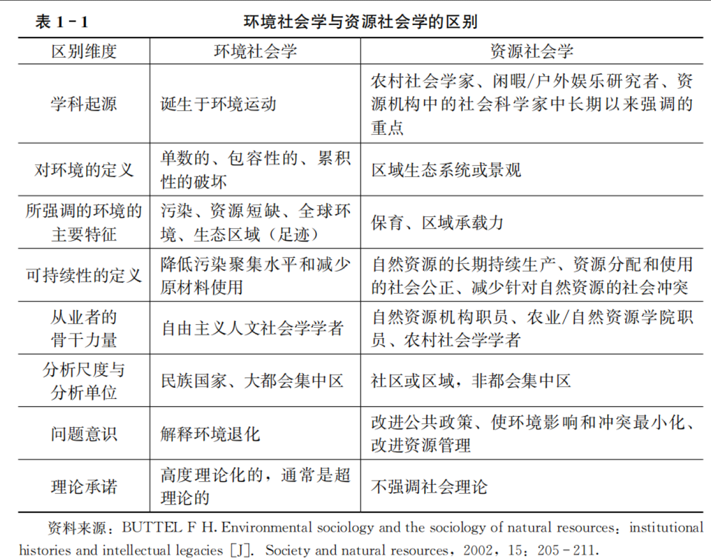
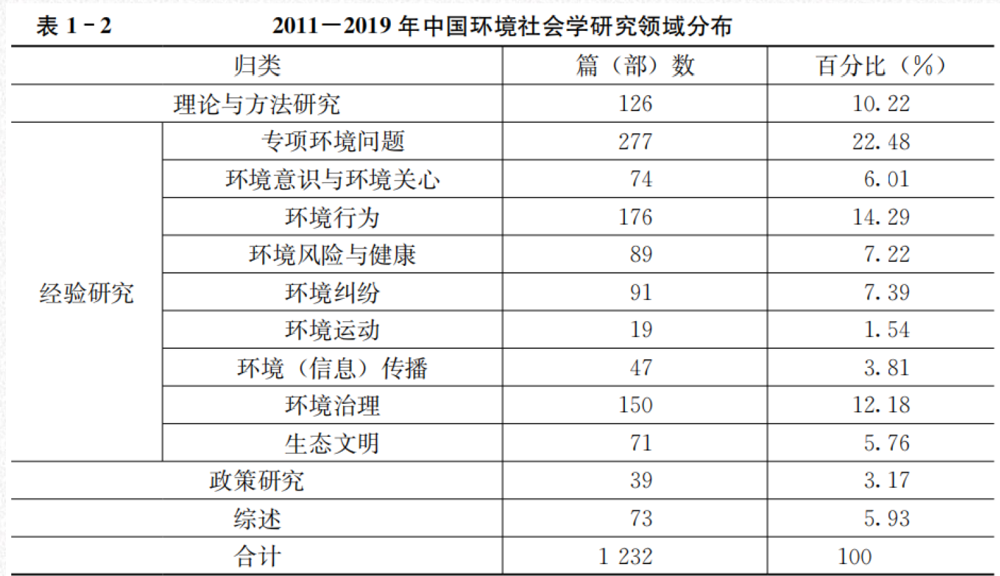
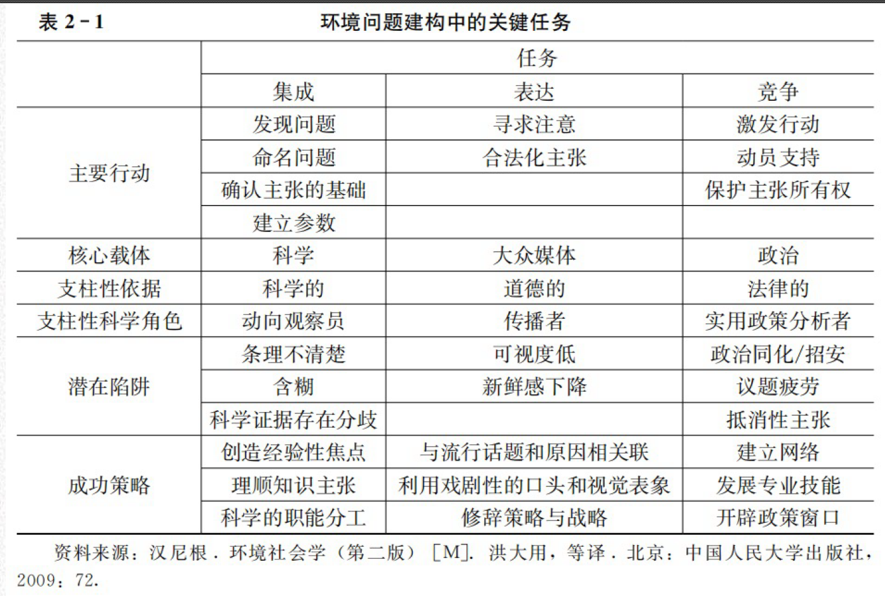
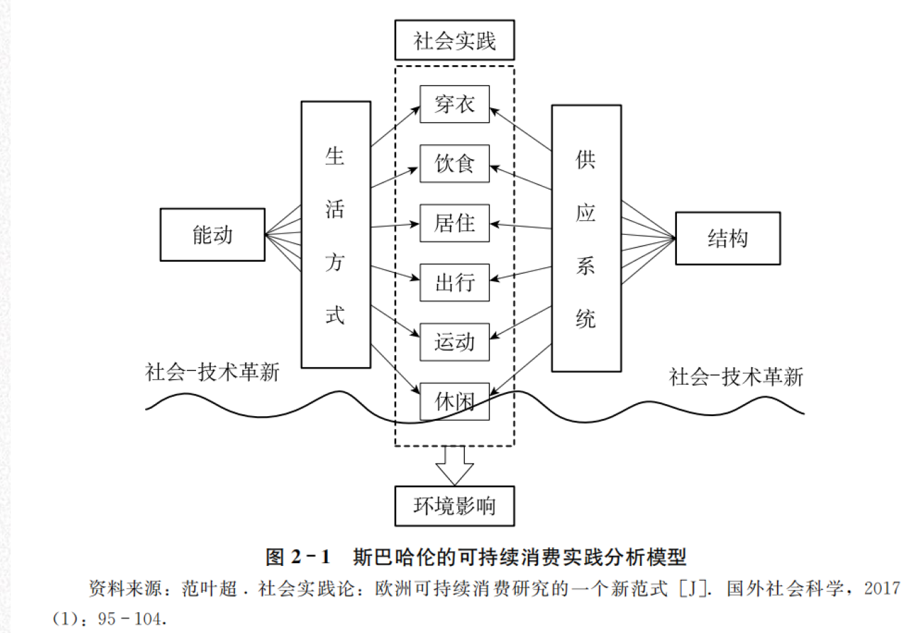
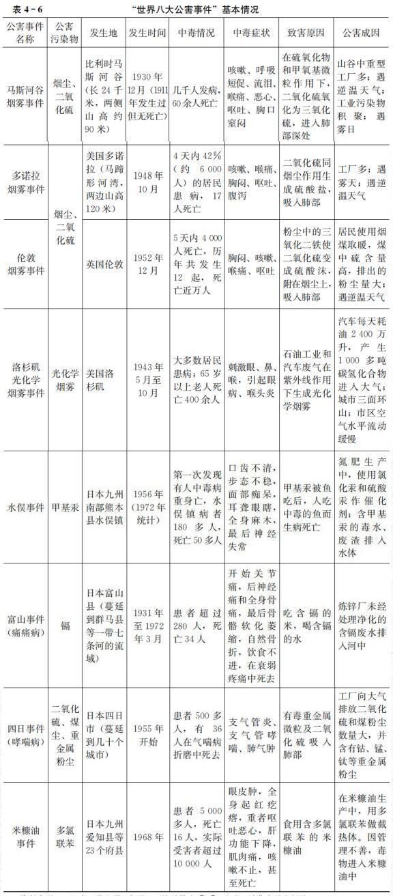
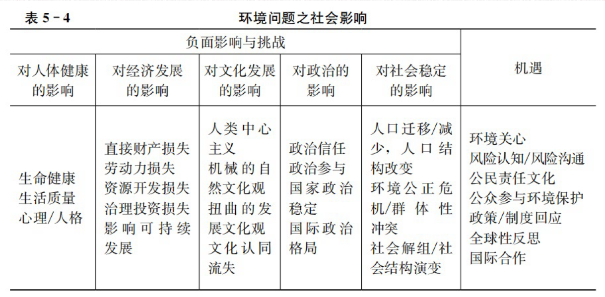
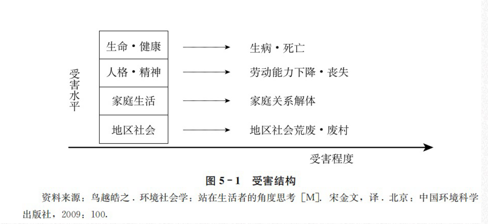
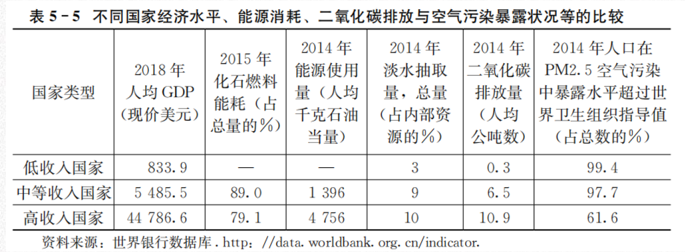
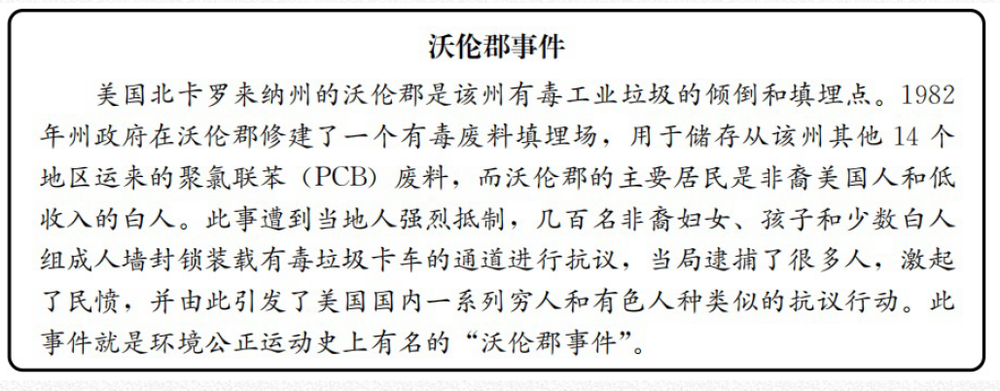
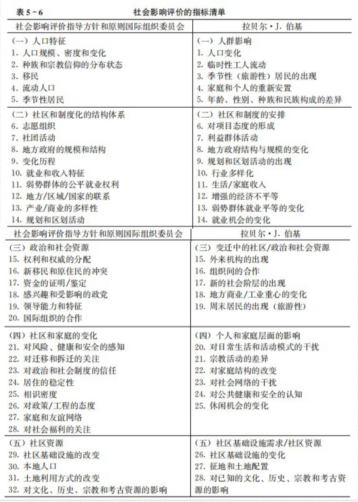

# 环境社会学概述

## 环境的科学研究

联合国环境规划署将**环境定义**为：影响生物个体或群落的外部因素和条件的总和，包括生物体周围的自然要素和人文要素。

“**环境**”区分为以下四类：聚落环境、地理环境、地质环境和星际环境。
1. 聚落环境是与人类的生产、生活关系最密切、最直接的环境，包括院落、村落、城市等；
2. 地理环境是人类活动的舞台和基地，包括大气圈、水圈、土壤圈、生物圈等；
3. 地质环境主要是指岩石圈，为人类提供丰富的矿藏；
4. 星际环境就是宇宙，它将是人类未来的活动场所。

环境中的**资源**（或自然资源），是人类生存与发展的重要的、直接的物质基础。一方面是取之不尽的资源，一方面是可能枯竭的能源（可再生与不可再生能源）。

**环境问题**就是人与环境关系的失调，这种失调不仅影响到环境系统的正常运行，而且对人类社会自身构成了威胁。
	一种是自然灾害引起的原生环境问题，也叫第一环境问题 
	另一种是人类活动引起的次生环境问题，也叫第二环境问题。
	
**环境科学**定义是研究社会经济发展过程中出现的环境质量变化的科学。
在发展原有的“污染环境”研究的基础上，环境科学需要更注重资源与生态系统、环境与生态系统的变化演替以及灾害与生态环境安全等方面的研究，更注重提升人类社会对可能到来的环境变化的应对能力。

## 环境社会学的特色

**环境社会学的定义**：从探讨当代环境问题产生的社会原因、造成的社会影响以及引发的社会应对及其效果入手，揭示环境与社会密切联系、相互作用的复杂规律。

	环境社会学与环境心理学有什么差异？
	我认为环境社会揭示的环境问题与社会的相互关系，二环境心理学则细化到环境问题与人的关系。

**环境问题的社会学视角**
1. 人与人之间是存在社会差异的；不能仅仅关注人类行为的共同性；
2. 人与人之间的行为差异具体表现为社会角色要求的差异，是由特定的社会制度与文化环境所塑造的。
3. 人类社会与环境关系之间的失调所导致的环境问题，在本质上不是一个人的“德性”问题。
4. 环境问题具有社会建构性。

**环境社会学的学科特点**
1. 与自然科学、技术科学的环境研究相比，环境社会学更加重视**环境与社会之间的互动关**系，更加强调环境衰退及其治理的社会因素。
2. 与传统社会学相比，环境社会学更加重视**社会分析中的环境因素**。
3. 作为社会学的分支学科，环境社会学更加关注**环境议题之社会原因、社会影响和社会应对的综合性**。
4. 作为社会学的分支学科，环境社会学更加注重**分析具体的社会过程对于环境的影响**。
5. 作为社会学的分支学科，环境社会学更加注重**对环境问题的经验分析和研究**。

环境社会学与资源社会学的区别


## 环境社会学的产生与发展

环境社会学的产生是对日趋严重的环境问题的反映
环境社会学是第二次世界大战以后社会学自身分化发展的产物

环境社会学的**发展阶段**
1. 第一阶段是从社会学产生到20世纪70年代：没有明确意义上的环境社会学学科
2. 第二阶段是整个20世纪70年代：环境社会学学科的确立阶段。随着环境问题和生态危机引起全球关注，不仅相关的调查研究不断增加。
	1. 标志性事件就是卡顿和邓拉普1978年发表了一篇题为《环境社会学：一个新范式》的文章。**新环境范式**
		1. 社会生活是由许多相互依存的生物群落构成的，人类只是其中的一种；
		2. 复杂的因果关系与自然反馈，会使有目的的社会行为导致预料不到的后果
		3. 世界是有限度的，经济增长与社会进步等现象都存在自然与生物上的限制。
3. 第三个阶段是20世纪80年代：环境保护思潮在一定程度上遭受抑制，发展低迷倒退。
4. 第四个阶段是20世纪90年代：随着全球气候变暖议题进入公众视野，全球性的环境变化再度抓住人们的眼球。环境社会学迅速发展。
5. 21世纪以来，可以说是环境社会学发展的第五个阶段：一些发展中国家在发展过程中造成的国内、国际层面的生态环境影响受到了广泛关注；二是环境治理的全球化进程日益加速。

主要的**环境社会学社区**
美国是环境社会学的诞生地；
欧洲：荷兰瓦格宁根大学是环境社会学的学术重镇；
澳大利亚学者在资源使用和管理方面的社会学研究有重要影响（澳大利亚国立大学）；
日本环境社会学学会是世界规模最大的环境社会学学会。
中国社会学会2009年将原人口与环境社会学专业委员会更名重建为**环境社会学专业委员会**，创建了“中国环境社会学网”，确立了中国环境社会学学术年会制度，迄今已经成功举办了六届年会。
环境社会学专业委员会编辑出版《**中国环境社会学**》。

## 环境社会学研究及其方法论

环境社会学的研究领域


环境社会学理论的视角

**结构功能主义**
1. **环境问题的产生在很大程度上是由于人们价值观的扭曲，因为正是人们对于环境的看法指导着其针对环境的行动；**
2. 环境问题是某种社会过程的必然结果；
3. 社会系统是在对环境的不断适应中进化的，当环境状况持续恶化时，社会系统会自动调整以建设性地回应环境威胁；
结构功能主义视角的局限在于忽视了社会系统内部强制与紧张的一面，忽视了社会不平等和权利分配问题。同时，其关于解决环境问题的乐观看法不仅有可能模糊人们的环保意识，而且与环境状况实际的演变趋势很不相符。

**社会冲突论**
1. 社会中的权力分配是不平等的，掌握权力的精英影响着社会事件，他们通过控制经济、法律以及环境导向设定区域及国家层次的议事日程。
2. 环境问题是不可避免的，因为**环境问题的产生源于对精英利益有利的社会安排**；
3. 全球环境危机正是全球财富与权力分化的直接后果；
4. 解决环境问题的关键是促进资源在全世界的公平分配，这既是对社会正义的追求，也是保护自然环境的一种策略。
从长远的观点看，所有社会成员、所有国家在保护自然环境方面实际上有着重要的共同利益；社会主义国家同样存在严重的环境问题。

**社会建构主义**
1. 对于人类社会与自然环境之间关系的理解是一种文化现象；
2. 这种文化现象总是通过特定的、具体的社会过程，经由社会不同群体的认知与协商而形成的；
3. **环境问题一词本身基本上是一个符号，是不同群体表达自身意见的一个共同符号**；
4. 特定的环境状况最终被“确认”为环境问题，实际上反映的是不同群体之间意见竞争的暂时结果，这种结果的出现源于一系列互动工具与方法的使用，并且涉及权力的运用；
5. 解决特定环境问题的关键是利用科学知识、大众传媒、组织工具以及公众行动成功地建构环境问题，并使之为其他人群所接受，进入决策议程，最终转变为政策实践。

**环境社会学研究的核心议题：环境问题的社会原因、社会影响以及社会应对**

环境社会学研究的**方法论之争**
1. 如何看待环境。
2. 如何看待环境与社会。
3. 如何看待环境问题。
4. 如何看待环境问题研究中的行动因素与结构因素。、
5. 如何看待环境问题研究中的价值介入。

# 环境社会学的主要理论

## 古典社会学家对环境问题的理论解释

**马克思**
马克思认为资本主义农业生产不仅使得普通劳动者和他们的劳动异化，同时也使得他们对自然变得陌生起来。在资本主义农业发展过程中，农民被迫离开他们的土地，成为城市产业工人的一员，农场主为了摄取最大的利润，对土地进行了最大限度的开发和利用
，由此导致了一系列的环境问题，而产生这些问题的根本原因就是资本主义制度。
马克思认为人类和自然的可持续关系并不会自动来临。相反，他认为需要一系列的措施，例如通过人口疏散消除城乡对立、通过土壤营养循环恢复和提升土壤的肥力。

**韦伯**
韦伯对资本主义与环境关系的分析更侧重于资本主义发展对能源和石化燃料的依赖。
韦伯指出整个生活模式的理性化（或“祛魅”）与那些和自然紧密联系的、依靠有机过程和自然事件的农民是对立的，因此传统有机生活的解体是伴随着理性工业资本主义发展的。在这一过程中，有机的原材料和劳动力被无机的原材料和生产方式替代。

**涂尔干**
决定社会演进的原因存在于个人之外，也就是说存在于个人生活的环境之中；同样，社会之所以发生变化，是因为环境发生了变化。

## 当代西方环境社会学的理论流派

### 范式转移理论和后物质主义价值观

人类豁免主义范式
- 第一，人类在地球生物中是独一无二的，因为他们有文化；
- 第二，文化可以无限地变动，而且比生物学特征变化快得多；
- 第三，许多人类差异是社会引入而非天生的，它们可以被社会改造，而且不利的差异可以被消除；
- 第四，文化积累意味着进化可以无限地进行，这使得所有社会问题最终都可以得到解决。

后物质主义价值观认为人们对环境的关心属于后物质主义价值观的一部分
物质主义价值观关注经济发展、国家安全，而后物质主义价值观则强调生活质量和个人自由。

### 政治经济学视角

艾伦·施耐伯格认为分析环境问题应深入资本主义社会政治经济制度中，在资本主义制度下，企业为了追求高利润必须不断地扩大投资才能在残酷的竞争中生存下去。这就是说一个企业追求利润是永无止境的，不断扩大的生产必须伴随日益增长的消费过程。

经济增长是大家所乐见的，但是其不断地投资引发的环境后果最终会损害经济的长期发展。

### 世界体系理论和世界社会理论
根据世界体系理论，世界经济体可以分为三个部分：核心、边缘和半边缘。这种不平等的体系使得核心国家可以通过国际贸易向边缘国家和半边缘国家转移不利于它们的环境后果，从而实现最大利润和超级工业化。

### IPAT模型解释

量化以人类为中心的环境影响的函数I＝PAT
其中I代表环境影响，是人口数量（P）、富裕程度（A）和技术应用（T）的乘积。

### 环境建构主义理论

汉尼根认为环境问题的社会建构有三项关键任务：环境主张的集成、环境主张的表达、竞争环境主张。环境主张的成功还与听众规模和影响力有着密切关系。关键就在于维持和建构环境主张的四种特性：独特性、关联性、关注度、熟悉性。



成功建构环境问题的六个必要条件。
1. 一个环境问题的主张必须有科学权威的支持和证实。
2. 对环境问题的建构要有一个或者多个“科学的普及者”，这样他们就能将深奥的科学研究转化为通俗易懂的环境主张。
3. 一个有前景的环境问题必须受到大众媒介的关注，其相关的主张要被塑造得正式而重要，例如全球变暖。
4. 一个潜在的环境问题必须用非常形象化和视觉化的形式生动地表达出来。、
5. 对环境问题采取行动必须要有看得见的经济收益。
6. 需要能够确保环境问题建构合法性和持续性的制度化支持者。

### 环境公正理论

环境公平不是孤立存在的，必须在环境事务和过程中体现出来。环境公平可以分为三个部分：第一个是程序公平，第二个是地域公平，第三个是社会公平。

对于环境公正的定义目前还存在不同的版本，但是核心思想是一致的，即所有的人不分世代、种族、文化、性别，或社会、经济地位，在环境资源、机会的使用和风险的分配上一律平等，享有同等的权利和承担同等的义务。

### 生态现代化理论

生态现代化是现代社会历史发展的一个阶段。在哈伯看来，工业社会的发展存在三个阶段。第一个阶段是工业突破阶段，第二个阶段是工业社会建设阶段，第三个阶段是工业体系向生态转向的超级工业化阶段。这三个阶段的发展动力都包括经济和技术，但是在第三个阶段发展的动力还包括协调人类活动和环境的影响的需求。

国家实现生态现代化的能力与在技术和制度层面来解决问题的能力密切相关，取决于四个基本变量：首先是问题压力，；其次是有着开放的政策风格；再次是创新能力；最后是战略精熟性。

### 风险社会理论

为环境遭破坏并非是现代化进程失败的产物，而恰恰是这一进程取得成功所带来的后果。在现代工业社会，自然风险和技术风险是相互交织在一起，无法区分的。
吉登斯的风险社会理论建立在对现代性的反思和重构上。他将风险区分为“外部风险”和“人造风险”。

### 社会实践论

社会科学研究的基本领域应是跨越空间和时间的有序社会实践，而并非传统认为的个体行动者的经验或社会总体的任何存在形式。



### 环境流动理论

环境流动是由人为因素引起的、与生态系统运行相关的一系列物质性流动。在物质性流动的众多影响因素中，环境流动关注受人类社会活动影响的物质性流动在流动方向、数量和质量等方面的特征，以专门分析环境变化的社会成因。

## 中国环境社会学的理论建设

### 阐释中国环境问题的“社会转型范式”

社会转型就是指社会结构和社会运行机制从一个形式转向另外一种形式的过程，当然也包括社会价值观和行为方式的转换。
以工业化、城市化和地区发展不平衡为主要特征的社会结构转型，以建立市场经济体制、放权让利改革和控制体系变化为主要特征的体制转轨，以道德滑坡、消费主义兴起、行为短期化和社会流动加速为主要特征的价值观念变化，在很大程度上直接加剧了中国环境状况的恶化，导致中国环境问题具有特定的社会特征。

### 揭示环境问题演化机制的“次生焦虑”概念

次生焦虑是近代以来我国在面临“救亡图存”外部世界的压力情况下，选择追赶现代化道路，加之历史文化压力和中国人的特殊心理文化结构产生的一种社会性焦虑。这种焦虑被认为是中国环境问题和其他社会问题的社会文化根源。

### 关于中国农村环境污染和冲突的政经一体化增长推进机制解释

在以经济增长为主要任期考核指标的压力型行政体制下，GDP和财政税收的增长成为地方官员的优先选择，从而导致重增长、轻保护的环境保护主义倾向，地方政府和企业有可能结成增长的同盟，受害农民的经济利益和健康权利往往受到忽视，导致围绕污染而生的社会冲突加剧。

### 理性困境视角

中国的环境问题，尤其是在微观和中观层面的，主要是由社会行动者的环境行为失当造成的。当然，这个行动者包括个人行动者（公众）和作为法人的行动者（企业和政府组织）。作为个体理性和集体理性冲突的社会根源主要包括三个方面：有私无公的传统文化惯性、价值观多元化导致的集体价值理性认同的缺失，以及制度变迁中制度约束的弱化和偏离。

# 前工业社会的环境问题

## 采集、狩猎与渔业社会的环境问题

### 人类对环境的影响

因为先民对自然缺乏科学认知，大自然显得神秘莫测，而且威力无穷。由于人口稀少、人口密度小，因此人类对自然环境的影响非常微弱。
不过，“在旧石器时代晚期，人类对自然的破坏力已经初现端倪”。

##  游牧社会的环境问题

### 人类对环境的影响

**经济因素**
由于粮食生产需求，很多草原地区被开垦成农区或半农半牧区，牧区范围被不断压缩，这导致很多优质草场被破坏甚至形成沙化问题。

**经济因素**
战争是草原退化的关键因素之一。
军事屯田是草场退化的又一个重要影响因素。在历史上，很多昔日的绿色走廊因此变为戈壁荒漠。

### 人类的环境观

**生产习俗中的环境观**

在传统游牧社会，牧民从水和草两方面来考虑放牧，形成了有利于草场保护的生产实践。
蒙古族也把牲畜数量视为财富和地位的象征，这种衡量原则或曰文化同样助长了超载放牧，对草原环境产生了破坏性影响。

```
依靠环境也影响环境
```

**宗教崇拜与禁忌中的环境观**

宗教信仰中的“规训”与“惩罚”促使人们尊重自然和遵守自然法则，在客观上对自然环境起到了保护作用。

## 农业社会的环境问题

### 人类对环境的影响

**森林破坏**

自农业时代开启以来，森林遭到砍伐和破坏的范围越来越大，遭到破坏的程度越来越深。
- 农业发展对森林系统的侵蚀。
- 人口压力加剧了毁林开荒问题。
- 生活燃料需求和经济利益刺激导致森林资源遭到持续破坏。
- 大型工程建设破坏了森林资源。
- 屯田导致了大面积森林毁坏问题。
- 战争加剧了森林毁坏。

**水土流失**
植被不良、滥砍滥伐、盲目开荒、森林破坏、超越生态承载力的农耕活动都会使土壤受到侵蚀，继而导致水土流失问题出现。
人口增长和人地矛盾是直接影响因素。

**土地沙化**
人地冲突的后果有很多表现形式，其中土地沙化是最直接的表现形式。
近百年的大肆毁林，使得绿色屏障被摧毁，导致了比较严重的沙尘暴问题。土地沙化的累积效应会诱发沙漠的产生。

**生物多样性减少**

生物多样性指的是生物与环境组成的生态复合体以及与此相关的各种生态过程的总和，它是人类赖以生存的条件，是经济社会可持续发展的基础。

**海洋环境变化**

人类高强度的捕捞活动导致了海洋资源减少问题。
围海造地在增加发展空间的同时也导致了环境问题。

### 环境对人类社会的反作用

**灾荒问题**

人类的滥砍滥伐导致环境破坏与生态恶化，而这反过来又导致水土流失和土地肥力减弱问题，进而引发洪灾、旱灾、荒灾以及饥饿等问题，甚至导致大量流民以及社会秩序和政治不稳定等次生问题。

**健康受损问题**

环境污染导致的健康受损是当代环境社会学关注的重要内容。日本的水俣病、痛痛病等环境公害就引起了环境社会学界的广泛关注。

**文明的衰亡**

历史上，有些文明的衰落和消亡与人类活动有着密切关联，其中苏美尔文明的衰落是一个典型。

```
还有对心理方面的健康问题
```

### 人类的环境观

**自然环境支配论**

自然崇拜是指人类出于对一些未知力量（鬼神等）的敬畏，将自然作为一种信仰对象而进行崇拜。
地理环境决定着人们的思想气质，而思想气质又决定着社会的政治法律制度；另一方面，地理环境决定生产力，生产力决定生产关系从而决定一切社会关系。

**人与自然和谐观**

强调人类的生产生活实践应该顺应自然规律，从而达到人与自然的和谐统一。

**人类中心主义**

人类中心主义认为人类是宇宙的中心，是自然的掌控者，人可以根据自身需要而改造自然。

```
从理论发展的角度将，自然环境支配与人类中心主义是两个极端，而人与自然和谐观是二者的中和
```

# 工业社会的环境问题

## 工业社会的发展及特征

### 工业社会发展对环境的影响

大规模工业化和城市化对能源获取和废物排放产生了巨大需求，继而带来日益严重的生态环境问题。
环境污染变动趋势可能与经济发展趋势呈倒U形关系。20世纪90年代，由美国经济学家格鲁斯曼和克鲁格提出的环境库兹涅茨曲线（EKC）描述了经济发展与环境污染水平的演替关系。
根据世界银行发布的相关数据分析发现：其一，工业化、城市化给生态环境带来了巨大压力；其二，不同发展程度国家的能源消耗水平及PM2.5平均暴露水平呈现巨大差异。

全球化和市场化如同双刃剑，在带来环境治理机遇的同时，也造成环境破坏。
部分发达国家和地区的城市污染增长比率明显低于欠发达国家和地区。

埃利希与霍尔登提出了“IPAT模型”，试图包容双方的竞争性观点。这一模型还表明，富裕的生活方式比不富裕的生活方式消费了更多的资源，制造了更多的污染。
为了克服IPAT模型中影响因素的同比例线性变化问题，研究者们将IPAT模型修正为随机影响回归模型，即STIRPAT模型。

除了人口、富裕程度、技术对环境产生影响外，文化、价值观念、生活方式、消费结构、人格系统等要素同样对环境具有深刻影响。

## 工业社会的环境问题

18世纪60年代至20世纪60年代被视为传统工业文明时期，这两百年间科技快速发展，劳动生产率大幅提高，人类利用和改造环境的能力逐步增强，对自然的开发能力达到了空前水平。

**工业社会的环境问题特点**

1. 污染源复杂。在一国之内，既有来自工矿企业等的生产污染，也有来自普通公众的生活污染；从国际层面看，既有来自发达国家的污染源，也有来自发展中国家的污染源。
2. 影响在空间和时间维度上有扩展趋势。
3. 影响的不可预见性。环境变化及环境问题的呈现是一个大规模、长时间潜伏的过程，其影响在特定时段内具有隐蔽性和累积性的特点。

**工业社会的环境问题类型**

1. 原生环境问题和次生环境问题：由自然灾害引发的环境问题被称为**原生环境问题**，由人类活动引发的环境问题被称为**次生环境问题**。
2. 环境污染与生态破坏：**环境污染**是指由于人为因素，环境的化学组成或物理状态发生了变化，与原来情况相比，环境质量恶化，扰乱和破坏了人们正常的生产和生活条件。**生态破坏**是指人类社会活动引起的生态退化及由此衍生的环境效应，导致环境结构和功能变化，对人类生存发展及环境本身发展产生不利影响的现象

**全球环境问题**

1. 全球气候变化
2. 臭氧层破坏
3. 生物多样性锐减
4. 酸雨污染
5. 森林资源锐减
6. 土地荒漠化
7. 大气污染
8. 淡水资源危机
9. 海洋退化
10. 危险废物越境转移

**工业社会环境问题的发展趋势**

1. 全球化。
2. 复杂化。
3. 社会化。
4. 政治化。
5. 科技化和市场化。



## 当代中国的环境问题

```
我国早期由于快速发展的需要，形成了一种高投入、低产出的资源浪费型发展模式
```

2015年，我国经济生态生产总值为122.8万亿元，其中，GDP为72.3万亿元，生态破坏成本为0.63万亿元，污染损失成本为2万亿元，生态破坏成本和污染损失成本总占比约为2.10％。

**我国政府的应对策略**

1. 进入21世纪以来，国家治理的顶层设计高度重视生态环境保护，秉持“绿水青山就是金山银山”的重要理念。
2. 在治理制度安排方面，连续出台各类环境政策法规，逐步完善环境治理政策体系。
3. 环境保护组织建设逐步升级。
4. 国家持续加大环境污染治理投资力度。

**中国环境问题的特征**

我国自然灾害具有独特的空间分布规律，灾情总体上呈现出**南重北轻、中东部重西部轻的空间分布格局**，灾最严重的省份基本集中于**西南及长江中下游地区**。
目前中国环境保护的基本状况是：**总体环境质量在改善，环境治理和保护工作仍面临巨大压力**。

1. 压缩性特征：我国环境问题的压缩性特征体现在时空两个维度上
2. 复合特征：原因复杂、影响复杂
3. 区域差异特征：农村地区的水环境和固体废弃物污染问题凸显，并且我国污染治理投资主要向城市地区倾斜；，东部发达地区越来越重视环境保护，西部大开发的推进使得西部地区的生态环境面临巨大压力。

**中国环境问题的发展趋势**

1. 环境总体质量有所改善，但生态环境保护工作仍然面临巨大压力。
2. 环境问题与其他社会问题交织，加剧社会矛盾。
3. 环境不公正问题显现，需引起重视。
4. 环境问题成为全民关注的公共议题，公众参与环境保护的呼声越来越高。
5. 基于我国环境问题的紧迫性、综合性和复杂性，亟须动员多元社会力量参与环境治理和保护工作。

# 环境问题的社会影响

## 环境问题的社会影响



### 对人体健康的影响

第一个层面，环境问题对个体健康乃至生命造成威胁和伤害。
- 2012年估计约650万人死于空气污染，占全球死亡总人数的11.6％。
- 据世界卫生组织估算，气候变化预计将在2030—2050年间，每年造成约25万人死于营养不良、疟疾、腹泻和气温过高。
- 第二个层面，因受害者健康损害导致受害者的家庭生计和家庭关系陷入紧张状态甚至解体。
- 第三个层面，健康伤害影响受害者的精神、心理，甚至人格。



### 对经济发展的影响

根据中华人民共和国国家统计局统计，2017年我国环境污染治理投资总额为9538.95亿元，占国内生产总值（GDP）的1.15％，占全社会固定资产投资总额的1.6％。

### 对文化发展的影响

人在改造自然的实践中形成反自然的文化观，即机械化的二元论自然文化观和扭曲的发展文化观，它们共同构筑了一股强大的反自然文化力量，在实践中造成严重的环境问题。

20世纪70年代，随着诸如生态环境破坏、种族冲突等一系列问题涌现，西方社会迎来一场深刻的价值观革命，即人们由强调经济和人身安全的价值取向向强调自我表现、生活质量、社会公正的价值取向转变，后者即英格尔哈特所提倡的“**后物质主义价值观**”。

随着社会的代际更替、年轻一代新的价值观的产生和形成，包含保护环境、追求高层次精神生活等行为准则的后物质主义价值观逐渐成为社会的主流价值观念。

### 对政治的影响

1. 环境问题的集中涌现将突破政治稳定的底线。
2. 对政治参与的影响。
3. 环境问题对国际政治的影响。

### 对社会稳定的影响

1. 损害人民健康、财产安全，降低生命和家庭生活质量，造成人口迁移和减少，改变人口结构。
2. 因制度安排不合理造成环境不公正，进而导致社会矛盾。
3. 社会发展进程中的历史因素和一些非个人的制度、市场因素（如工业发展的历史模式、产业重组与经济调整、劳动力流动、城镇化和居住区隔等），使得社会下层人群不成比例地承受着经济发展带来的负面环境后果。

### 带来的机遇

让人类正视人与环境之间的关系，促进个体间、组织间、国际的风险沟通和环境保护行为。

## 环境问题社会影响的差异性分配

西方学者有关不同人群非公正地承担着环境问题带来的影响和风险的解释，有三项相互关联的重要模型：**理性选择模型、种族歧视模型和社会政治模型**。

### 地理性差异分配

**地区层次**上的环境问题的社会影响分配指一国范围内或特定区域内环境问题的社会影响分配，其表现多样化

**国际层次**上的环境问题社会影响分配指环境问题社会影响在全球跨越国界（国与国之间）的流动与分配




在占用大量资源、破坏全球环境的同时，发达国家还借援助开发和投资之名，将危害环境和人体健康的生产行业转移到发展中国家，进行**生态殖民**。

为了应对“洋垃圾”跨国非法转移，近年来，我国在制度安排上做了很多努力：2011年制定并执行《**固体废物进口管理办法**》；为全面禁止洋垃圾入境，保护生态环境安全和人民群众身体健康，2017年7月出台了《**禁止洋垃圾入境推进固体废物进口管理制度改革实施方案**》，分批分类调整进口固体废物管理目录，大幅减少进口种类和数量。

```
生态殖民这一现象除了发达国家转向发展中国家，是否也会有从发达城市转向非发达城市

```

### 社会性差异分配



在我国，虽然不存在种族歧视问题，但特殊的社会结构和发展历程也构成了**特殊的环境不公正问题**。

对本溪市环境污染与居民居住区位分布的研究显示，工人和一般干部居住在严重污染地区的机会明显高于领导干部居住在此类地区的机会，污染程度低的地方居住领导干部的比例更高。

**不同社会经济地位人群不合理地暴露在环境风险中是推动“环境公正”运动发展的重要原因。**

```
任何一代人对自身利益的追求既不应损害同时代人的利益，也不应该以损害后代人的利益为代价。
```

### 时间向度差异分配

**代际公正**，是指在社会发展过程中，权利和责任在不同代人之间的分配原则和实现情况能够做到协调、公平、合理。

## 环境问题的社会影响评价

**社会影响评价**是一套对社会影响预先做出评估的知识系统，用于对因拟建项目或政策改变造成的环境变化，进而导致的对社区和个人日常生活品质产生的影响进行评价。

《国际社会影响评价手册》对**社会影响评价**的定义是“对干预性的行动（政策、项目、规划和工程）的预料到的或未预料到的社会后果进行分析（预测、估算和反思）和管理”。

西方学者对社会影响评价概念的界定包括四个部分：**社会经济、影响、评估和减少负面影响**。
- 社会经济包括项目的经济面向（如投入产出，收益成本等）、社会面向（如人口、城市规划、体制等）和文化面向（如价值观、认知、习俗等）；
- 影响包括项目和行动产生的直接和间接的、有意和意外的后果；
- 评估往往是基于过去类似行动或项目的影响的既存经验知识的预期性的评价；
- 减少负面影响是通过预先行动管理和减少项目开发的负面影响（或加强正面影响），减少负面影响的措施包括规避、最小化、补偿。

社会影响评价和环境影响评价的结合，即环境社会影响评价（ESIA）。

### 环境问题社会影响评价的理论基础

- 可持续发展理论
- 环境公正理论
- 社会冲突理论
- 组织理论
- 系统科学理论

### 环境问题社会影响评价目的、主体、指标、方法和程序

### 社会影响评价目的

- 实施一项计划将会发生什么？
- 谁将受到影响？
- 谁受益谁受损？
- 不同的备选方案有何变化？
- 如何避免和减缓不利影响，提高利益？

帮助决策者做出合理决策，避免或降低不利影响，为无法避免地负面影响设计减缓措施;
帮助受影响的公众了解预计行动对他们可能造成的影响，使他们明了预计行动中将带来的变化。

### 社会影响评价主体

国际上，社会影响评价的发展趋势为由专家决策转化为大众影响决策的公众参与过程。

### 社会影响评价主体



### 社会影响评价方法

**技术式社会影响评价方法**侧重于从技术角度，对重大项目等可能带来的社会负面影响进行尽可能
精确的计算和分析，特别强调量化等技术手段在评估中的重要性。

**参与式方法**通过“体验”来理解并评价社会变化和影响。这种方法要求从受影响人群（如原住民
）的角度来评估影响，应使受益和受损群体参与到确定指标、环境及社会影响测量方法，以及影
响评估和检测过程中，参与到关于他们未来的决策中。

### 社会影响评价程序

1. 辨识潜在受影响群体，制订公众参与计划
2. 描述计划行动
3. 基线研究
4. 辨析可能的社会影响
5. 调查可能的社会影响
6. 预判受影响公众的可能反应
7. 评估次级和累积影响
8. 计划行动的备选方案
9. 制定一套减缓、补救和增强方案／计划
10. 制定一套监察程序

### 社会影响评价的基本原则

1. 规划和社会影响评价要保证相关群体基本权力平等；
2. 规划性干预的社会影响是可预测的；
3. 规划性干预能被调整，以减少负面影响，提升其正面效果；
4. 社会影响评价应纳入决策的全过程；
5. 应当更多地关注可持续发展的社会方面，社会影响评价能够提供更好的发展方式，平衡经济利益和社会成本；
6. 所有干预性规划及其评价应有助于地方社区和人力资本的培育及强化民主过程；
7. 对于从干预性规划中获益的人群应当仔细调查；
8. 当一些不可避免的影响存在时，应对干预性规划的不同方案进行比较；
9. 即使干预性规划得到批准或被认为是有益的，也应当对其环境和社会潜在影响进行全面评价；
10. 在评价过程中地方性知识、经验和文化应当被充分考虑到；
11. 在评价和干预时，不应当使用暴力、恫吓和威胁；
12. 侵犯人权的所有干预性计划都应当停止。

### 我国当代环境问题社会影响评价存在的问题

1. 制度支持欠缺
2. 社会影响评价体系自身缺陷
3. 公众参与面临的困境
	1. 社会熟知度低
	2. 公众参与的保障体制不健全
	3. 参与途径和技能匮乏


# 环境关心

## 环境关心概述

## 测量环境关心的复杂性

## 环境关心的影响因素和理论解释

## 环境关心研究的意义