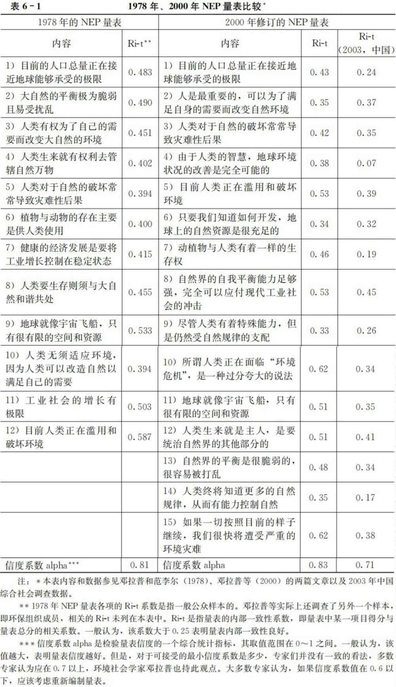
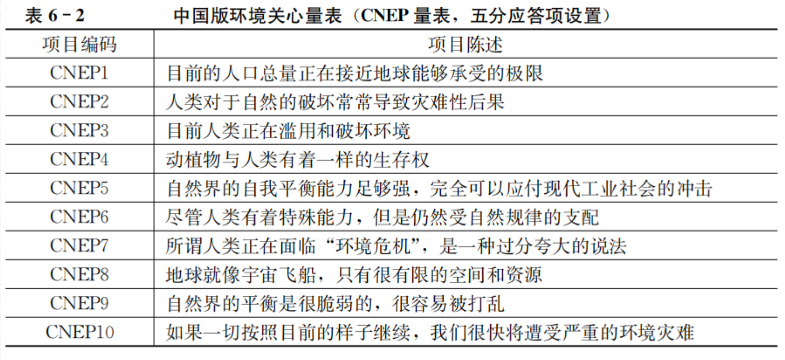
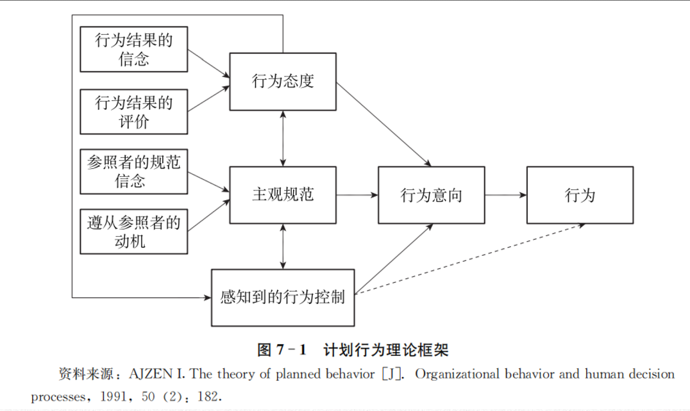
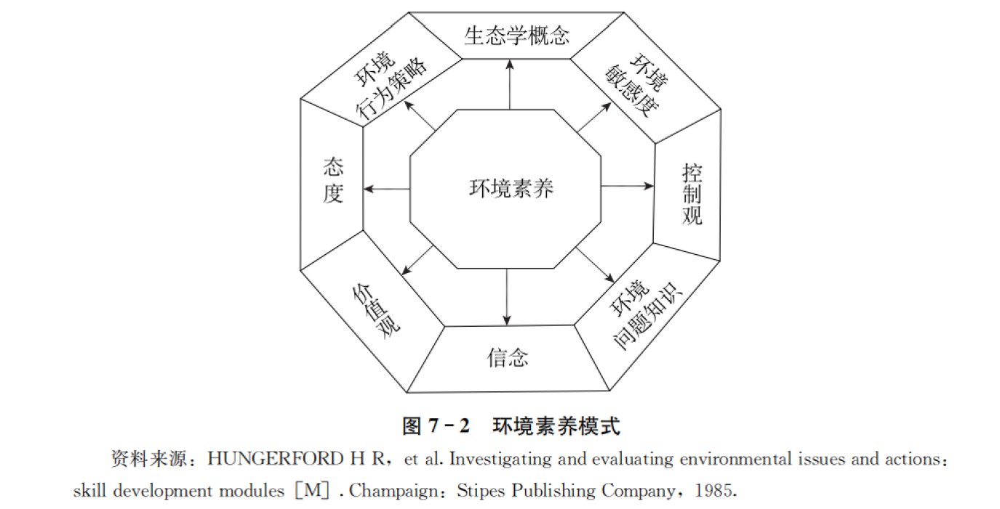
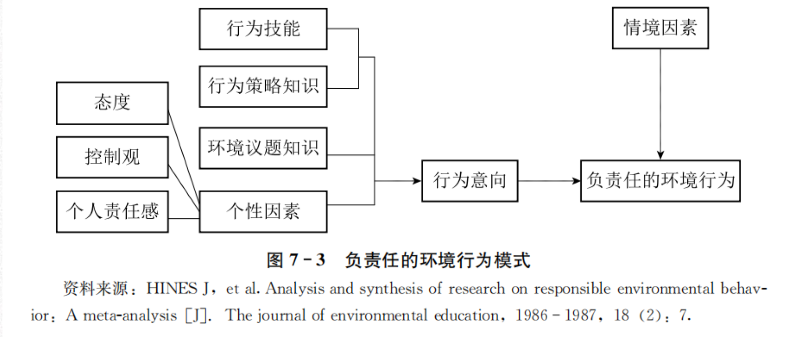
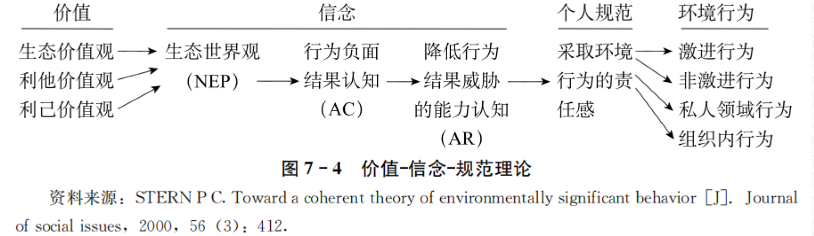
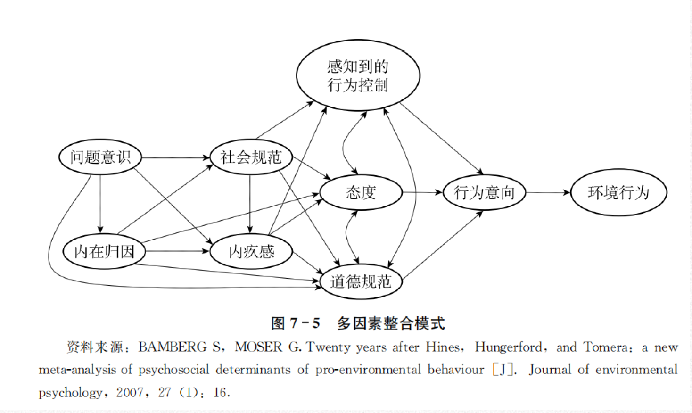
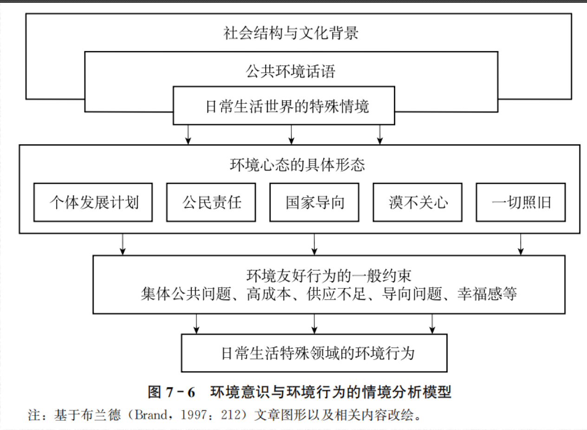
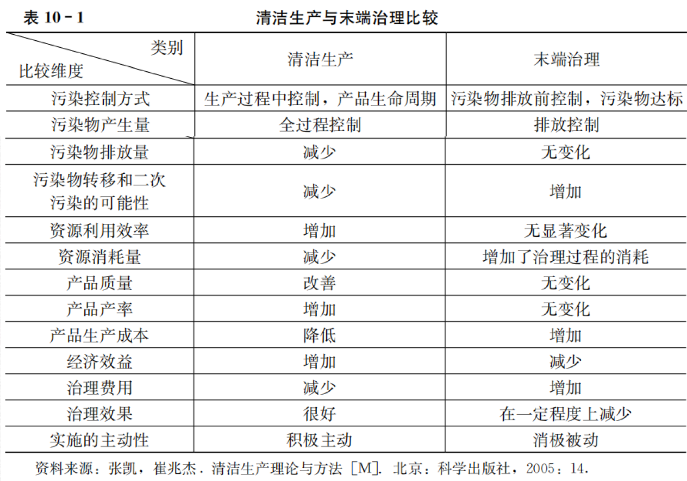
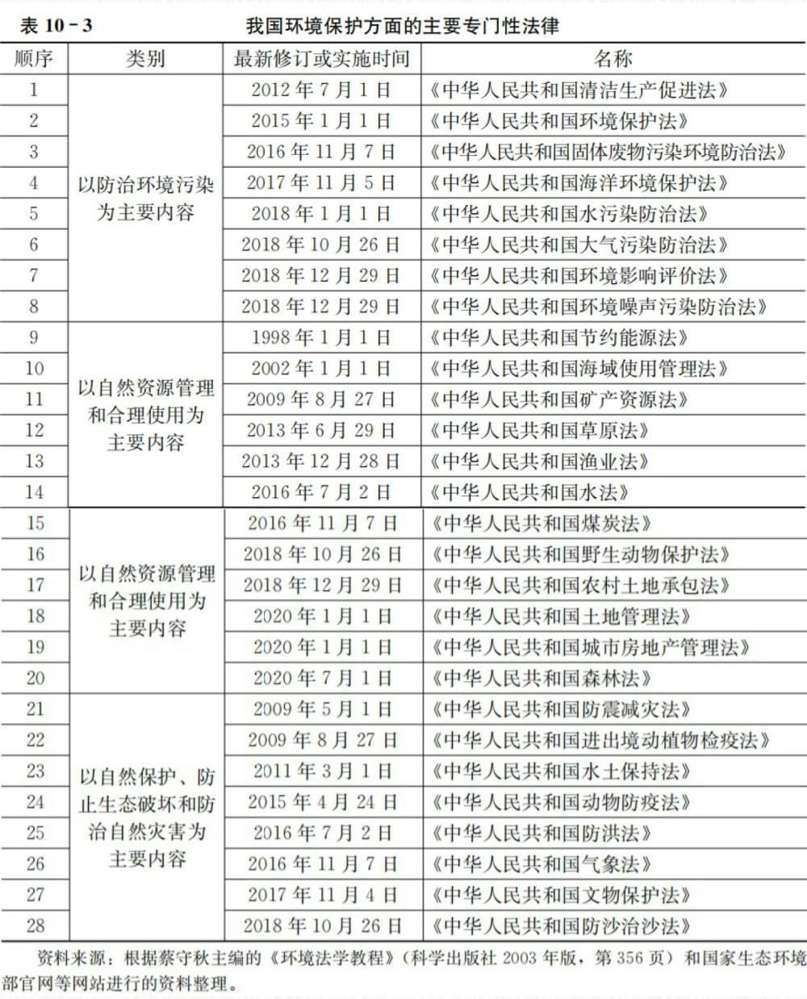

# 环境社会学概述

## 环境的科学研究

联合国环境规划署将**环境定义**为：影响生物个体或群落的外部因素和条件的总和，包括生物体周围的自然要素和人文要素。

“**环境**”区分为以下四类：聚落环境、地理环境、地质环境和星际环境。
1. 聚落环境是与人类的生产、生活关系最密切、最直接的环境，包括院落、村落、城市等；
2. 地理环境是人类活动的舞台和基地，包括大气圈、水圈、土壤圈、生物圈等；
3. 地质环境主要是指岩石圈，为人类提供丰富的矿藏；
4. 星际环境就是宇宙，它将是人类未来的活动场所。

环境中的**资源**（或自然资源），是人类生存与发展的重要的、直接的物质基础。一方面是取之不尽的资源，一方面是可能枯竭的能源（可再生与不可再生能源）。

**环境问题**就是人与环境关系的失调，这种失调不仅影响到环境系统的正常运行，而且对人类社会自身构成了威胁。
	一种是自然灾害引起的原生环境问题，也叫第一环境问题 
	另一种是人类活动引起的次生环境问题，也叫第二环境问题。
	
**环境科学**定义是研究社会经济发展过程中出现的环境质量变化的科学。
在发展原有的“污染环境”研究的基础上，环境科学需要更注重资源与生态系统、环境与生态系统的变化演替以及灾害与生态环境安全等方面的研究，更注重提升人类社会对可能到来的环境变化的应对能力。

## 环境社会学的特色

**环境社会学的定义**：从探讨当代环境问题产生的社会原因、造成的社会影响以及引发的社会应对及其效果入手，揭示环境与社会密切联系、相互作用的复杂规律。

	环境社会学与环境心理学有什么差异？
	我认为环境社会揭示的环境问题与社会的相互关系，二环境心理学则细化到环境问题与人的关系。

**环境问题的社会学视角**
1. 人与人之间是存在社会差异的；不能仅仅关注人类行为的共同性；
2. 人与人之间的行为差异具体表现为社会角色要求的差异，是由特定的社会制度与文化环境所塑造的。
3. 人类社会与环境关系之间的失调所导致的环境问题，在本质上不是一个人的“德性”问题。
4. 环境问题具有社会建构性。

**环境社会学的学科特点**
1. 与自然科学、技术科学的环境研究相比，环境社会学更加重视**环境与社会之间的互动关**系，更加强调环境衰退及其治理的社会因素。
2. 与传统社会学相比，环境社会学更加重视**社会分析中的环境因素**。
3. 作为社会学的分支学科，环境社会学更加关注**环境议题之社会原因、社会影响和社会应对的综合性**。
4. 作为社会学的分支学科，环境社会学更加注重**分析具体的社会过程对于环境的影响**。
5. 作为社会学的分支学科，环境社会学更加注重**对环境问题的经验分析和研究**。

环境社会学与资源社会学的区别


## 环境社会学的产生与发展

环境社会学的产生是对日趋严重的环境问题的反映
环境社会学是第二次世界大战以后社会学自身分化发展的产物

环境社会学的**发展阶段**
1. 第一阶段是从社会学产生到20世纪70年代：没有明确意义上的环境社会学学科
2. 第二阶段是整个20世纪70年代：环境社会学学科的确立阶段。随着环境问题和生态危机引起全球关注，不仅相关的调查研究不断增加。
	1. 标志性事件就是卡顿和邓拉普1978年发表了一篇题为《环境社会学：一个新范式》的文章。**新环境范式**
		1. 社会生活是由许多相互依存的生物群落构成的，人类只是其中的一种；
		2. 复杂的因果关系与自然反馈，会使有目的的社会行为导致预料不到的后果
		3. 世界是有限度的，经济增长与社会进步等现象都存在自然与生物上的限制。
3. 第三个阶段是20世纪80年代：环境保护思潮在一定程度上遭受抑制，发展低迷倒退。
4. 第四个阶段是20世纪90年代：随着全球气候变暖议题进入公众视野，全球性的环境变化再度抓住人们的眼球。环境社会学迅速发展。
5. 21世纪以来，可以说是环境社会学发展的第五个阶段：一些发展中国家在发展过程中造成的国内、国际层面的生态环境影响受到了广泛关注；二是环境治理的全球化进程日益加速。

主要的**环境社会学社区**
美国是环境社会学的诞生地；
欧洲：荷兰瓦格宁根大学是环境社会学的学术重镇；
澳大利亚学者在资源使用和管理方面的社会学研究有重要影响（澳大利亚国立大学）；
日本环境社会学学会是世界规模最大的环境社会学学会。
中国社会学会2009年将原人口与环境社会学专业委员会更名重建为**环境社会学专业委员会**，创建了“中国环境社会学网”，确立了中国环境社会学学术年会制度，迄今已经成功举办了六届年会。
环境社会学专业委员会编辑出版《**中国环境社会学**》。

## 环境社会学研究及其方法论

环境社会学的研究领域


环境社会学理论的视角

**结构功能主义**
1. **环境问题的产生在很大程度上是由于人们价值观的扭曲，因为正是人们对于环境的看法指导着其针对环境的行动；**
2. 环境问题是某种社会过程的必然结果；
3. 社会系统是在对环境的不断适应中进化的，当环境状况持续恶化时，社会系统会自动调整以建设性地回应环境威胁；
结构功能主义视角的局限在于忽视了社会系统内部强制与紧张的一面，忽视了社会不平等和权利分配问题。同时，其关于解决环境问题的乐观看法不仅有可能模糊人们的环保意识，而且与环境状况实际的演变趋势很不相符。

**社会冲突论**
1. 社会中的权力分配是不平等的，掌握权力的精英影响着社会事件，他们通过控制经济、法律以及环境导向设定区域及国家层次的议事日程。
2. 环境问题是不可避免的，因为**环境问题的产生源于对精英利益有利的社会安排**；
3. 全球环境危机正是全球财富与权力分化的直接后果；
4. 解决环境问题的关键是促进资源在全世界的公平分配，这既是对社会正义的追求，也是保护自然环境的一种策略。
从长远的观点看，所有社会成员、所有国家在保护自然环境方面实际上有着重要的共同利益；社会主义国家同样存在严重的环境问题。

**社会建构主义**
1. 对于人类社会与自然环境之间关系的理解是一种文化现象；
2. 这种文化现象总是通过特定的、具体的社会过程，经由社会不同群体的认知与协商而形成的；
3. **环境问题一词本身基本上是一个符号，是不同群体表达自身意见的一个共同符号**；
4. 特定的环境状况最终被“确认”为环境问题，实际上反映的是不同群体之间意见竞争的暂时结果，这种结果的出现源于一系列互动工具与方法的使用，并且涉及权力的运用；
5. 解决特定环境问题的关键是利用科学知识、大众传媒、组织工具以及公众行动成功地建构环境问题，并使之为其他人群所接受，进入决策议程，最终转变为政策实践。

**环境社会学研究的核心议题：环境问题的社会原因、社会影响以及社会应对**

环境社会学研究的**方法论之争**
1. 如何看待环境。
2. 如何看待环境与社会。
3. 如何看待环境问题。
4. 如何看待环境问题研究中的行动因素与结构因素。、
5. 如何看待环境问题研究中的价值介入。

# 环境社会学的主要理论

## 古典社会学家对环境问题的理论解释

**马克思**
马克思认为资本主义农业生产不仅使得普通劳动者和他们的劳动异化，同时也使得他们对自然变得陌生起来。在资本主义农业发展过程中，农民被迫离开他们的土地，成为城市产业工人的一员，农场主为了摄取最大的利润，对土地进行了最大限度的开发和利用
，由此导致了一系列的环境问题，而产生这些问题的根本原因就是资本主义制度。
马克思认为人类和自然的可持续关系并不会自动来临。相反，他认为需要一系列的措施，例如通过人口疏散消除城乡对立、通过土壤营养循环恢复和提升土壤的肥力。

**韦伯**
韦伯对资本主义与环境关系的分析更侧重于资本主义发展对能源和石化燃料的依赖。
韦伯指出整个生活模式的理性化（或“祛魅”）与那些和自然紧密联系的、依靠有机过程和自然事件的农民是对立的，因此传统有机生活的解体是伴随着理性工业资本主义发展的。在这一过程中，有机的原材料和劳动力被无机的原材料和生产方式替代。

**涂尔干**
决定社会演进的原因存在于个人之外，也就是说存在于个人生活的环境之中；同样，社会之所以发生变化，是因为环境发生了变化。

## 当代西方环境社会学的理论流派

### 范式转移理论和后物质主义价值观

人类豁免主义范式
- 第一，人类在地球生物中是独一无二的，因为他们有文化；
- 第二，文化可以无限地变动，而且比生物学特征变化快得多；
- 第三，许多人类差异是社会引入而非天生的，它们可以被社会改造，而且不利的差异可以被消除；
- 第四，文化积累意味着进化可以无限地进行，这使得所有社会问题最终都可以得到解决。

后物质主义价值观认为人们对环境的关心属于后物质主义价值观的一部分
物质主义价值观关注经济发展、国家安全，而后物质主义价值观则强调生活质量和个人自由。

### 政治经济学视角

艾伦·施耐伯格认为分析环境问题应深入资本主义社会政治经济制度中，在资本主义制度下，企业为了追求高利润必须不断地扩大投资才能在残酷的竞争中生存下去。这就是说一个企业追求利润是永无止境的，不断扩大的生产必须伴随日益增长的消费过程。

经济增长是大家所乐见的，但是其不断地投资引发的环境后果最终会损害经济的长期发展。

### 世界体系理论和世界社会理论
根据世界体系理论，世界经济体可以分为三个部分：核心、边缘和半边缘。这种不平等的体系使得核心国家可以通过国际贸易向边缘国家和半边缘国家转移不利于它们的环境后果，从而实现最大利润和超级工业化。

### IPAT模型解释

量化以人类为中心的环境影响的函数I＝PAT
其中I代表环境影响，是人口数量（P）、富裕程度（A）和技术应用（T）的乘积。

### 环境建构主义理论

汉尼根认为环境问题的社会建构有三项关键任务：环境主张的集成、环境主张的表达、竞争环境主张。环境主张的成功还与听众规模和影响力有着密切关系。关键就在于维持和建构环境主张的四种特性：独特性、关联性、关注度、熟悉性。


成功建构环境问题的六个必要条件。
1. 一个环境问题的主张必须有科学权威的支持和证实。
2. 对环境问题的建构要有一个或者多个“科学的普及者”，这样他们就能将深奥的科学研究转化为通俗易懂的环境主张。
3. 一个有前景的环境问题必须受到大众媒介的关注，其相关的主张要被塑造得正式而重要，例如全球变暖。
4. 一个潜在的环境问题必须用非常形象化和视觉化的形式生动地表达出来。、
5. 对环境问题采取行动必须要有看得见的经济收益。
6. 需要能够确保环境问题建构合法性和持续性的制度化支持者。

### 环境公正理论

环境公平不是孤立存在的，必须在环境事务和过程中体现出来。环境公平可以分为三个部分：第一个是程序公平，第二个是地域公平，第三个是社会公平。

对于环境公正的定义目前还存在不同的版本，但是核心思想是一致的，即所有的人不分世代、种族、文化、性别，或社会、经济地位，在环境资源、机会的使用和风险的分配上一律平等，享有同等的权利和承担同等的义务。

### 生态现代化理论

生态现代化是现代社会历史发展的一个阶段。在哈伯看来，工业社会的发展存在三个阶段。第一个阶段是工业突破阶段，第二个阶段是工业社会建设阶段，第三个阶段是工业体系向生态转向的超级工业化阶段。这三个阶段的发展动力都包括经济和技术，但是在第三个阶段发展的动力还包括协调人类活动和环境的影响的需求。

国家实现生态现代化的能力与在技术和制度层面来解决问题的能力密切相关，取决于四个基本变量：首先是问题压力，；其次是有着开放的政策风格；再次是创新能力；最后是战略精熟性。

### 风险社会理论

为环境遭破坏并非是现代化进程失败的产物，而恰恰是这一进程取得成功所带来的后果。在现代工业社会，自然风险和技术风险是相互交织在一起，无法区分的。
吉登斯的风险社会理论建立在对现代性的反思和重构上。他将风险区分为“外部风险”和“人造风险”。

### 社会实践论

社会科学研究的基本领域应是跨越空间和时间的有序社会实践，而并非传统认为的个体行动者的经验或社会总体的任何存在形式。


### 环境流动理论

环境流动是由人为因素引起的、与生态系统运行相关的一系列物质性流动。在物质性流动的众多影响因素中，环境流动关注受人类社会活动影响的物质性流动在流动方向、数量和质量等方面的特征，以专门分析环境变化的社会成因。

## 中国环境社会学的理论建设

### 阐释中国环境问题的“社会转型范式”

社会转型就是指社会结构和社会运行机制从一个形式转向另外一种形式的过程，当然也包括社会价值观和行为方式的转换。
以工业化、城市化和地区发展不平衡为主要特征的社会结构转型，以建立市场经济体制、放权让利改革和控制体系变化为主要特征的体制转轨，以道德滑坡、消费主义兴起、行为短期化和社会流动加速为主要特征的价值观念变化，在很大程度上直接加剧了中国环境状况的恶化，导致中国环境问题具有特定的社会特征。

### 揭示环境问题演化机制的“次生焦虑”概念

次生焦虑是近代以来我国在面临“救亡图存”外部世界的压力情况下，选择追赶现代化道路，加之历史文化压力和中国人的特殊心理文化结构产生的一种社会性焦虑。这种焦虑被认为是中国环境问题和其他社会问题的社会文化根源。

### 关于中国农村环境污染和冲突的政经一体化增长推进机制解释

在以经济增长为主要任期考核指标的压力型行政体制下，GDP和财政税收的增长成为地方官员的优先选择，从而导致重增长、轻保护的环境保护主义倾向，地方政府和企业有可能结成增长的同盟，受害农民的经济利益和健康权利往往受到忽视，导致围绕污染而生的社会冲突加剧。

### 理性困境视角

中国的环境问题，尤其是在微观和中观层面的，主要是由社会行动者的环境行为失当造成的。当然，这个行动者包括个人行动者（公众）和作为法人的行动者（企业和政府组织）。作为个体理性和集体理性冲突的社会根源主要包括三个方面：有私无公的传统文化惯性、价值观多元化导致的集体价值理性认同的缺失，以及制度变迁中制度约束的弱化和偏离。

# 前工业社会的环境问题

## 采集、狩猎与渔业社会的环境问题

### 人类对环境的影响

因为先民对自然缺乏科学认知，大自然显得神秘莫测，而且威力无穷。由于人口稀少、人口密度小，因此人类对自然环境的影响非常微弱。
不过，“在旧石器时代晚期，人类对自然的破坏力已经初现端倪”。

##  游牧社会的环境问题

### 人类对环境的影响

**经济因素**
由于粮食生产需求，很多草原地区被开垦成农区或半农半牧区，牧区范围被不断压缩，这导致很多优质草场被破坏甚至形成沙化问题。

**经济因素**
战争是草原退化的关键因素之一。
军事屯田是草场退化的又一个重要影响因素。在历史上，很多昔日的绿色走廊因此变为戈壁荒漠。

### 人类的环境观

**生产习俗中的环境观**

在传统游牧社会，牧民从水和草两方面来考虑放牧，形成了有利于草场保护的生产实践。
蒙古族也把牲畜数量视为财富和地位的象征，这种衡量原则或曰文化同样助长了超载放牧，对草原环境产生了破坏性影响。

```
依靠环境也影响环境
```

**宗教崇拜与禁忌中的环境观**

宗教信仰中的“规训”与“惩罚”促使人们尊重自然和遵守自然法则，在客观上对自然环境起到了保护作用。

## 农业社会的环境问题

### 人类对环境的影响

**森林破坏**

自农业时代开启以来，森林遭到砍伐和破坏的范围越来越大，遭到破坏的程度越来越深。
- 农业发展对森林系统的侵蚀。
- 人口压力加剧了毁林开荒问题。
- 生活燃料需求和经济利益刺激导致森林资源遭到持续破坏。
- 大型工程建设破坏了森林资源。
- 屯田导致了大面积森林毁坏问题。
- 战争加剧了森林毁坏。

**水土流失**
植被不良、滥砍滥伐、盲目开荒、森林破坏、超越生态承载力的农耕活动都会使土壤受到侵蚀，继而导致水土流失问题出现。
人口增长和人地矛盾是直接影响因素。

**土地沙化**
人地冲突的后果有很多表现形式，其中土地沙化是最直接的表现形式。
近百年的大肆毁林，使得绿色屏障被摧毁，导致了比较严重的沙尘暴问题。土地沙化的累积效应会诱发沙漠的产生。

**生物多样性减少**

生物多样性指的是生物与环境组成的生态复合体以及与此相关的各种生态过程的总和，它是人类赖以生存的条件，是经济社会可持续发展的基础。

**海洋环境变化**

人类高强度的捕捞活动导致了海洋资源减少问题。
围海造地在增加发展空间的同时也导致了环境问题。

### 环境对人类社会的反作用

**灾荒问题**

人类的滥砍滥伐导致环境破坏与生态恶化，而这反过来又导致水土流失和土地肥力减弱问题，进而引发洪灾、旱灾、荒灾以及饥饿等问题，甚至导致大量流民以及社会秩序和政治不稳定等次生问题。

**健康受损问题**

环境污染导致的健康受损是当代环境社会学关注的重要内容。日本的水俣病、痛痛病等环境公害就引起了环境社会学界的广泛关注。

**文明的衰亡**

历史上，有些文明的衰落和消亡与人类活动有着密切关联，其中苏美尔文明的衰落是一个典型。

```
还有对心理方面的健康问题
```

### 人类的环境观

**自然环境支配论**

自然崇拜是指人类出于对一些未知力量（鬼神等）的敬畏，将自然作为一种信仰对象而进行崇拜。
地理环境决定着人们的思想气质，而思想气质又决定着社会的政治法律制度；另一方面，地理环境决定生产力，生产力决定生产关系从而决定一切社会关系。

**人与自然和谐观**

强调人类的生产生活实践应该顺应自然规律，从而达到人与自然的和谐统一。

**人类中心主义**

人类中心主义认为人类是宇宙的中心，是自然的掌控者，人可以根据自身需要而改造自然。

```
从理论发展的角度将，自然环境支配与人类中心主义是两个极端，而人与自然和谐观是二者的中和
```

# 工业社会的环境问题

## 工业社会的发展及特征

### 工业社会发展对环境的影响

大规模工业化和城市化对能源获取和废物排放产生了巨大需求，继而带来日益严重的生态环境问题。
环境污染变动趋势可能与经济发展趋势呈倒U形关系。20世纪90年代，由美国经济学家格鲁斯曼和克鲁格提出的环境库兹涅茨曲线（EKC）描述了经济发展与环境污染水平的演替关系。
根据世界银行发布的相关数据分析发现：其一，工业化、城市化给生态环境带来了巨大压力；其二，不同发展程度国家的能源消耗水平及PM2.5平均暴露水平呈现巨大差异。

全球化和市场化如同双刃剑，在带来环境治理机遇的同时，也造成环境破坏。
部分发达国家和地区的城市污染增长比率明显低于欠发达国家和地区。

埃利希与霍尔登提出了“IPAT模型”，试图包容双方的竞争性观点。这一模型还表明，富裕的生活方式比不富裕的生活方式消费了更多的资源，制造了更多的污染。
为了克服IPAT模型中影响因素的同比例线性变化问题，研究者们将IPAT模型修正为随机影响回归模型，即STIRPAT模型。

除了人口、富裕程度、技术对环境产生影响外，文化、价值观念、生活方式、消费结构、人格系统等要素同样对环境具有深刻影响。

## 工业社会的环境问题

18世纪60年代至20世纪60年代被视为传统工业文明时期，这两百年间科技快速发展，劳动生产率大幅提高，人类利用和改造环境的能力逐步增强，对自然的开发能力达到了空前水平。

**工业社会的环境问题特点**

1. 污染源复杂。在一国之内，既有来自工矿企业等的生产污染，也有来自普通公众的生活污染；从国际层面看，既有来自发达国家的污染源，也有来自发展中国家的污染源。
2. 影响在空间和时间维度上有扩展趋势。
3. 影响的不可预见性。环境变化及环境问题的呈现是一个大规模、长时间潜伏的过程，其影响在特定时段内具有隐蔽性和累积性的特点。

**工业社会的环境问题类型**

1. 原生环境问题和次生环境问题：由自然灾害引发的环境问题被称为**原生环境问题**，由人类活动引发的环境问题被称为**次生环境问题**。
2. 环境污染与生态破坏：**环境污染**是指由于人为因素，环境的化学组成或物理状态发生了变化，与原来情况相比，环境质量恶化，扰乱和破坏了人们正常的生产和生活条件。**生态破坏**是指人类社会活动引起的生态退化及由此衍生的环境效应，导致环境结构和功能变化，对人类生存发展及环境本身发展产生不利影响的现象

**全球环境问题**

1. 全球气候变化
2. 臭氧层破坏
3. 生物多样性锐减
4. 酸雨污染
5. 森林资源锐减
6. 土地荒漠化
7. 大气污染
8. 淡水资源危机
9. 海洋退化
10. 危险废物越境转移

**工业社会环境问题的发展趋势**

1. 全球化。
2. 复杂化。
3. 社会化。
4. 政治化。
5. 科技化和市场化。


## 当代中国的环境问题

```
我国早期由于快速发展的需要，形成了一种高投入、低产出的资源浪费型发展模式
```

2015年，我国经济生态生产总值为122.8万亿元，其中，GDP为72.3万亿元，生态破坏成本为0.63万亿元，污染损失成本为2万亿元，生态破坏成本和污染损失成本总占比约为2.10％。

**我国政府的应对策略**

1. 进入21世纪以来，国家治理的顶层设计高度重视生态环境保护，秉持“绿水青山就是金山银山”的重要理念。
2. 在治理制度安排方面，连续出台各类环境政策法规，逐步完善环境治理政策体系。
3. 环境保护组织建设逐步升级。
4. 国家持续加大环境污染治理投资力度。

**中国环境问题的特征**

我国自然灾害具有独特的空间分布规律，灾情总体上呈现出**南重北轻、中东部重西部轻的空间分布格局**，灾最严重的省份基本集中于**西南及长江中下游地区**。
目前中国环境保护的基本状况是：**总体环境质量在改善，环境治理和保护工作仍面临巨大压力**。

1. 压缩性特征：我国环境问题的压缩性特征体现在时空两个维度上
2. 复合特征：原因复杂、影响复杂
3. 区域差异特征：农村地区的水环境和固体废弃物污染问题凸显，并且我国污染治理投资主要向城市地区倾斜；，东部发达地区越来越重视环境保护，西部大开发的推进使得西部地区的生态环境面临巨大压力。

**中国环境问题的发展趋势**

1. 环境总体质量有所改善，但生态环境保护工作仍然面临巨大压力。
2. 环境问题与其他社会问题交织，加剧社会矛盾。
3. 环境不公正问题显现，需引起重视。
4. 环境问题成为全民关注的公共议题，公众参与环境保护的呼声越来越高。
5. 基于我国环境问题的紧迫性、综合性和复杂性，亟须动员多元社会力量参与环境治理和保护工作。

# 环境问题的社会影响

## 环境问题的社会影响


### 对人体健康的影响

第一个层面，环境问题对个体健康乃至生命造成威胁和伤害。
- 2012年估计约650万人死于空气污染，占全球死亡总人数的11.6％。
- 据世界卫生组织估算，气候变化预计将在2030—2050年间，每年造成约25万人死于营养不良、疟疾、腹泻和气温过高。
- 第二个层面，因受害者健康损害导致受害者的家庭生计和家庭关系陷入紧张状态甚至解体。
- 第三个层面，健康伤害影响受害者的精神、心理，甚至人格。


### 对经济发展的影响

根据中华人民共和国国家统计局统计，2017年我国环境污染治理投资总额为9538.95亿元，占国内生产总值（GDP）的1.15％，占全社会固定资产投资总额的1.6％。

### 对文化发展的影响

人在改造自然的实践中形成反自然的文化观，即机械化的二元论自然文化观和扭曲的发展文化观，它们共同构筑了一股强大的反自然文化力量，在实践中造成严重的环境问题。

20世纪70年代，随着诸如生态环境破坏、种族冲突等一系列问题涌现，西方社会迎来一场深刻的价值观革命，即人们由强调经济和人身安全的价值取向向强调自我表现、生活质量、社会公正的价值取向转变，后者即英格尔哈特所提倡的“**后物质主义价值观**”。

随着社会的代际更替、年轻一代新的价值观的产生和形成，包含保护环境、追求高层次精神生活等行为准则的后物质主义价值观逐渐成为社会的主流价值观念。

### 对政治的影响

1. 环境问题的集中涌现将突破政治稳定的底线。
2. 对政治参与的影响。
3. 环境问题对国际政治的影响。

### 对社会稳定的影响

1. 损害人民健康、财产安全，降低生命和家庭生活质量，造成人口迁移和减少，改变人口结构。
2. 因制度安排不合理造成环境不公正，进而导致社会矛盾。
3. 社会发展进程中的历史因素和一些非个人的制度、市场因素（如工业发展的历史模式、产业重组与经济调整、劳动力流动、城镇化和居住区隔等），使得社会下层人群不成比例地承受着经济发展带来的负面环境后果。

### 带来的机遇

让人类正视人与环境之间的关系，促进个体间、组织间、国际的风险沟通和环境保护行为。

## 环境问题社会影响的差异性分配

西方学者有关不同人群非公正地承担着环境问题带来的影响和风险的解释，有三项相互关联的重要模型：**理性选择模型、种族歧视模型和社会政治模型**。

### 地理性差异分配

**地区层次**上的环境问题的社会影响分配指一国范围内或特定区域内环境问题的社会影响分配，其表现多样化

**国际层次**上的环境问题社会影响分配指环境问题社会影响在全球跨越国界（国与国之间）的流动与分配


在占用大量资源、破坏全球环境的同时，发达国家还借援助开发和投资之名，将危害环境和人体健康的生产行业转移到发展中国家，进行**生态殖民**。

为了应对“洋垃圾”跨国非法转移，近年来，我国在制度安排上做了很多努力：2011年制定并执行《**固体废物进口管理办法**》；为全面禁止洋垃圾入境，保护生态环境安全和人民群众身体健康，2017年7月出台了《**禁止洋垃圾入境推进固体废物进口管理制度改革实施方案**》，分批分类调整进口固体废物管理目录，大幅减少进口种类和数量。

```
生态殖民这一现象除了发达国家转向发展中国家，是否也会有从发达城市转向非发达城市

```

### 社会性差异分配


在我国，虽然不存在种族歧视问题，但特殊的社会结构和发展历程也构成了**特殊的环境不公正问题**。

对本溪市环境污染与居民居住区位分布的研究显示，工人和一般干部居住在严重污染地区的机会明显高于领导干部居住在此类地区的机会，污染程度低的地方居住领导干部的比例更高。

**不同社会经济地位人群不合理地暴露在环境风险中是推动“环境公正”运动发展的重要原因。**

```
任何一代人对自身利益的追求既不应损害同时代人的利益，也不应该以损害后代人的利益为代价。
```

### 时间向度差异分配

**代际公正**，是指在社会发展过程中，权利和责任在不同代人之间的分配原则和实现情况能够做到协调、公平、合理。

## 环境问题的社会影响评价

**社会影响评价**是一套对社会影响预先做出评估的知识系统，用于对因拟建项目或政策改变造成的环境变化，进而导致的对社区和个人日常生活品质产生的影响进行评价。

《国际社会影响评价手册》对**社会影响评价**的定义是“对干预性的行动（政策、项目、规划和工程）的预料到的或未预料到的社会后果进行分析（预测、估算和反思）和管理”。

西方学者对社会影响评价概念的界定包括四个部分：**社会经济、影响、评估和减少负面影响**。
- 社会经济包括项目的经济面向（如投入产出，收益成本等）、社会面向（如人口、城市规划、体制等）和文化面向（如价值观、认知、习俗等）；
- 影响包括项目和行动产生的直接和间接的、有意和意外的后果；
- 评估往往是基于过去类似行动或项目的影响的既存经验知识的预期性的评价；
- 减少负面影响是通过预先行动管理和减少项目开发的负面影响（或加强正面影响），减少负面影响的措施包括规避、最小化、补偿。

社会影响评价和环境影响评价的结合，即环境社会影响评价（ESIA）。

### 环境问题社会影响评价的理论基础

- 可持续发展理论
- 环境公正理论
- 社会冲突理论
- 组织理论
- 系统科学理论

### 环境问题社会影响评价目的、主体、指标、方法和程序

### 社会影响评价目的

- 实施一项计划将会发生什么？
- 谁将受到影响？
- 谁受益谁受损？
- 不同的备选方案有何变化？
- 如何避免和减缓不利影响，提高利益？

帮助决策者做出合理决策，避免或降低不利影响，为无法避免地负面影响设计减缓措施;
帮助受影响的公众了解预计行动对他们可能造成的影响，使他们明了预计行动中将带来的变化。

### 社会影响评价主体

国际上，社会影响评价的发展趋势为由专家决策转化为大众影响决策的公众参与过程。

### 社会影响评价主体


### 社会影响评价方法

**技术式社会影响评价方法**侧重于从技术角度，对重大项目等可能带来的社会负面影响进行尽可能
精确的计算和分析，特别强调量化等技术手段在评估中的重要性。

**参与式方法**通过“体验”来理解并评价社会变化和影响。这种方法要求从受影响人群（如原住民
）的角度来评估影响，应使受益和受损群体参与到确定指标、环境及社会影响测量方法，以及影
响评估和检测过程中，参与到关于他们未来的决策中。

### 社会影响评价程序

1. 辨识潜在受影响群体，制订公众参与计划
2. 描述计划行动
3. 基线研究
4. 辨析可能的社会影响
5. 调查可能的社会影响
6. 预判受影响公众的可能反应
7. 评估次级和累积影响
8. 计划行动的备选方案
9. 制定一套减缓、补救和增强方案／计划
10. 制定一套监察程序

### 社会影响评价的基本原则

1. 规划和社会影响评价要保证相关群体基本权力平等；
2. 规划性干预的社会影响是可预测的；
3. 规划性干预能被调整，以减少负面影响，提升其正面效果；
4. 社会影响评价应纳入决策的全过程；
5. 应当更多地关注可持续发展的社会方面，社会影响评价能够提供更好的发展方式，平衡经济利益和社会成本；
6. 所有干预性规划及其评价应有助于地方社区和人力资本的培育及强化民主过程；
7. 对于从干预性规划中获益的人群应当仔细调查；
8. 当一些不可避免的影响存在时，应对干预性规划的不同方案进行比较；
9. 即使干预性规划得到批准或被认为是有益的，也应当对其环境和社会潜在影响进行全面评价；
10. 在评价过程中地方性知识、经验和文化应当被充分考虑到；
11. 在评价和干预时，不应当使用暴力、恫吓和威胁；
12. 侵犯人权的所有干预性计划都应当停止。

### 我国当代环境问题社会影响评价存在的问题

1. 制度支持欠缺
2. 社会影响评价体系自身缺陷
3. 公众参与面临的困境
	1. 社会熟知度低
	2. 公众参与的保障体制不健全
	3. 参与途径和技能匮乏


# 环境关心

## 环境关心概述

**环境关心**是指人们意识到并支持解决涉及生态环境的问题的程度或者个人为解决这类问题而做出贡献的意愿。

环境意识是“对环境的能动反映和认识”：环境意识在内容上也分为两部分——环境感性认识和环境思想体系

**环境态度、环境关心**是被包含在环境意识中的、指向更为明确的操作性概念。

环境关心的测量方法
1. 历史文献研究法
2. 内容分析法
3. 观察法
4. 问卷调查法
5. 比较研究法

## 测量环境关心的复杂性

1. 多个环境话题的多层面关心的测量：主要是研究针对多个环境话题的公众认知、情感、意向以及实际行为，包括基于心理学的态度理论的研究以及政策导向的研究。
2. 就多个环境话题的单层面关心的测量：研究公众针对多个环境话题的单层面关心（或认知，或情感，或意向，或实际行为），往往是属于政策导向的研究。
3. 是就单个环境话题的多层面关心的测量：研究针对单个环境话题（比如说核电或水污染）的公众认知、情感、意向以及实际行为，包括基于心理学的态度理论的研究以及政策导向的研究。
4. 就单个环境话题的单层面关心的测量：研究公众针对单个环境话题的单层面关心（或认知，或情感，或意向，或实际行为），往往属于政策导向和新闻导向的研究

洪大用对环境意识（关心）的测量：测量环境知识、基本价值观念、参与环境保护的态度和环境保护行为的操作性指标。
1. “环境知识”的具体指标：
	1. 对“环境保护”这一概念的知晓程度；
	2. 对有关环保政策法规的了解程度；
	3. 对若干环境问题（全球变暖、臭氧层破坏、酸雨、荒漠化、淡水资源枯竭、生物多样性减少）的了解程度。
2. “基本价值观念”的具体指标：
	1. 对人类与自然界之间关系的看法；
	2. 对眼前利益与长远利益的看法；
	3. 对局部利益与整体利益的看法。
3. 测量“环境保护的态度”的具体指标：
	1. 对环境保护工作中国家与个人关系的看法；
	2. 对破坏环境之行为的态度；
	3. 对缴纳环境保护费用的态度。
4. 测量“环境保护行为”的具体指标：
	1. 对媒介中环境宣传的注意程度；
	2. 对有组织的环境宣传教育活动的参与程度；
	3. 对有关环境保护的公益劳动或活动的参与程度；
	4. 对要求解决环境污染问题的投诉或上诉的参与程度。

### “新环境范式”（NEP）量表

该量表包括12个项目。按照邓拉普等的看法，它们可以区分为三个主要方面：对增长极限的看法以及对生态平衡的看法以及对人类与自然关系的看法。



### 中国版NEP量表



## 环境关心的影响因素和理论解释

### 人口学特征

- 年轻人比年长者更加关心环境；
- 随着人们教育程度、收入水平、职业声望的提高，社会地位与环境关心呈正相关关系；
- 城市居民比农村居民更为关心环境；
- 自由主义者比保守主义者更为关注环境质量；
- 相对于男性而言，女性在社会生活中表现出更多的环境关心。

### 环境关心的理论解释

**环境问题驱动解释**

环境污染严重，导致公众环境关心觉醒，并积极支持环境保护。

**经济发展解释**

经济发展或者富裕将会促进公众的环境关心。
一方面，环境质量不仅是公共物品，同时也是收入增长后人们的客观需求，因此，经济增长导致公众对环境质量的要求提高。
另一方面，只有个人财富增加，才能使预算约束上移，从而使得为改善环境质量而投放更多的资源成为可能。

**后物质主义价值观解释**

将传统的强调经济增长和物质安全的价值观称作“物质主义”
强调自由、自我表达和生活质量的价值观称作“后物质主义”
持有后物质主义价值观的人比物质主义者具有更高的环境关心水平。

**传播主义解释**

环境科学研究的进展揭示了环境变化的趋势与威胁，并将这些信息透过迅速普及、日益便捷的各种传媒，以公众所能感知的方式传播给广大公众，从而激发了公众的环境关心。

# 环境行为

## 环境行为概述

**不同环境行为的概念**

1. 负责任的环境行为：基于个体责任感和价值观而有意识实施的行为，从而避免或有助于解决环境问题。
2. 具有意义的环境行为：影响取向强调人的行为对环境直接或间接的影响，即改变环境物质或能源有效性的程度，或者改变生态系统或生物圈结构与动力机制的程度；意向取向强调行为者是否具有改善环境的主观意图。
3. 亲环境行为：指有意识地减少自身行为对环境的负面影响，如减少资源和能源消费、使用无毒产品以及垃圾减量等。

**环境行为的主要特征**

1. 个体性
2. 惯常性
3. 模糊性
4. 正向性

### 环境行为的基本类型

**五分法或六分法**

亨格福德等的五分发：说服行动；消费行动或消费主义；生态管理；法律行动；政治行动。

史密斯塞巴斯托的六分发：说服行动、经济行动、日常身体力行行动、法律行、公民行动、教育行动。

**四分法**

斯特恩将环境行为分为以下四类：激进的环境行为；公共领域的非激进环境行为；私人领域环境行为；（4）其他环境行为。

**两分法**

亨特等将环境行为区分为私人领域环境行为与公共领域环境行为两种类型。

廷德尔等将环境行为区分为环境行动主义与环境友好行为，前者是指“由环境组织发起与推动的具体的运动支持活动”，后者指的是“以不同方式旨在保护环境的日常行为”。

**国内的区分**

2018年，生态环境部、中央文明办、教育部、共青团中央、全国妇联等五部门联合发布《**公民生态环境行为规范（试行）**》，则将生态环境行为区分为10类：关注生态环境、节约能源资源、践行绿色消费、选择低碳出行、分类投放垃圾、减少污染产生、呵护自然生态、参加环保实践、参与监督举报、共建美丽中。

## 环境行为影响因素的研究模式

```
这些理论基础在研究思路的创新有着很大的作用
```

### 计划行为理论

计划行为理论在环境行为领域具有较强的适用性，不过需注意以下三个方面：
- 一是其预设个体是理性的、自主的，其行为是在自我约束和自我控制下做出的符合自身利益的行为，实际上个体并非完全自主、理性的个体，往往受诸多因素的制约，同时对日常生活中大量习惯性行为与模糊性实践关注不足。
- 二是遵循态度与行为的经典路径，侧重关注主观规范、自我效能感、信念等对行为意向以及行为的相应影响，相对忽视知识、行为策略等认知类因素对其的调节作用。
- 三是预设行为的实施依赖于行为意向的激活，忽视行为态度、主观规范等因素对行为的直接影响。



### 环境素养模式

**具有环境素养的人应该具有如下特征**：对整体环境的感知与敏感性；了解自然系统如何运行的知识以及关心社会系统对自然系统的干扰与影响；了解各种地方、地区、国家、全球等层面的环境问题；具有价值观及关心环境的情感；具有辨认、分析与解决环境问题的知识与技能；积极主动地实施环保行为。

亨格福德等为预测负责任的环境行为提出了环境素养模式。此模式包含八个变量，这八个变量之间相互作用，且各自对环境行为产生影响。


马西尼科斯基对此模式做了修订：
将原有的“环境行为策略”更改为“公民行动” ；
其次是拓宽了对“态度”与“控制观”的理解；
此外还提出与自然环境接触的直接经验能激发环境敏感性，替代的与间接的经验以及重要他人如父母、老师等人的行为示范与影响亦对环境敏感性有着增强作用。

### 负责任的环境行为模式

环境议题知识、行为策略知识、行为技能、态度、控制观、个人责任感以及行为意向与负责任的环境行为有关，即环境议题知识丰富、对环境问题了解得多以及知道如何处理环境问题、具有积极的环境态度、内控观较强、富有责任感的个人较多地从事负责任的环境行为。



### 价值-信念-规范理论

斯特恩在规范激活理论的基础上，结合价值理论和新环境范式，以环境行为为例提出了价值信念规范理论（VBN理论）

个人规范激活是亲社会行为得以产生的前提条件。而个人规范能否激活受两个因素的影响：个体对行动结果的意识（AC）以及对这些行动结果的自身责任认定（AR）。

VBN理论从相对稳定的一般价值观发端，经过人类与环境关系的信念（NEP），再到个体对行为负面结果以及有关降低行为结果威胁的能力之信念，最后激活个人规范，产生采取环境行为的责任感。



### 多因素整合模式

班贝克和莫泽在复制海因斯负责任的环境行为模式的基础上，对1987年以来的相关研究成果进行元分析，然后结合计划行为理论和规范激活理论，提炼出包括问题意识、社会规范、内在归因、内疚感、感知到的行为控制、态度、道德规范、行为意向等八个因素在内的整合模式。[Twenty years after Hines, Hungerford, and Tomera - A new meta-analysis of psycho-social determinants of pro-environmental behaviour](Twenty%20years%20after%20Hines,%20Hungerford,%20and%20Tomera%20-%20A%20new%20meta-analysis%20of%20psycho-social%20determinants%20of%20pro-environmental%20behaviour.md)



### 内外因素的综合研究模式

布兰德认为，日常生活领域的环境行为与不同的情境有关：社会结构与文化背景、大众传媒、日常生活世界的特殊情境。在此基础上提出的新模型。



## 环境行为的培育

```
如何提高环境行为是行为科学在环境领域最重要的目的
```

### 生活者致害化与环境行为培育

**生活者的致害化**愈发凸显，即“以前作为受害者和牺牲品的社区居民或劳动者、消费者，则变成了环境问题的发生源，在日常生活的各个侧面，有时是直接地、有时是间接地引起了环境的污染或环境的破坏。

### 生活环境主义与环境行为培育

生活环境主义的内涵可归纳为以下三个层面：
- 一是主体层面，强调生活者生活本身的重要性；
- 二是环境现状与问题层面，即承认环境问题是现代化过程和发展模式所带来的；
- 三是实践层面，即重视生活者在生活中所形成的对环境问题的看法以及处理环境问题的方式。

### 环境行为培育的主要途径

#### 倡导多元主体共同参与的环境保护模式

长期以来，我国主要采取政府**主导型环境保护模式**，只有摒弃单一政府主导型环境保护模式，**倡导政府、非政府组织、公众等多元主体共同参与的环境保护模式**，才能为公众环境行为的实施创造有利的条件。

```
单一倡导不是长久之计，多元共创才会有更好的结果；对不同角色属性需要有不同的干预策略
```

首先，继续改进并有效发挥政府在环境保护中的作用
1. 切实贯彻落实科学发展观与生态文明建设的指导思想，理顺经济发展与环境保护之间的关系
2. 进一步完善环境保护法律体系，积极维护公民的环境权——对环境享有不受一定程度污染或破坏的权利
3. 推进社会体制改革，积极进行组织创新，通过大力发展民间环境保护组织以及有效营造全民参与环境保护的氛围

其次，充分发挥民间环保组织在环境保护中的作用
1. 是发动与依托公众，对环境保护立法、政府环境保护活动、企业生产活动等进行监督
2. 通过在单位内、社区内以及公共场所围绕环境主题开展教育、宣传以及互助等活动
3. 是倡导绿色生活方式和适度消费，增强社会成员实施环境行为的自觉意识
```
这种民间组织如何有效在大范围内应用呢？
对他们的干预策略和大众应该一致吗？
```

此外，公众在争取与维护自身环境权益的同时，应履行保护环境的义务
1. 积极参与政府或民间组织发起的社会活动，以推动市民社会的培育与拓展
2. 通过有意识的节约水电、回收利用废品、进行垃圾分类、选择公共交通出行方式、杜绝铺张浪费等将环境保护事业与自身的日常生活实践紧密联系起来。
```
这种对大众没有利益的行为改变，如何才能长久促进
```

#### 构筑合理的阶层结构与塑造可持续的生活方式

首先，完善阶层地位获得机制，不断削弱家庭背景、户籍制度、性别等先赋性因素在地位获致中的作用，凸显教育水平、技能水平、个人能力、自身努力等自致性因素在地位获致中的作用。

其次，政府应在推进社会体制改革过程中，着重理顺国家、市场与社会之间的关系，并且鼓励日益壮大的中间阶层积极参与社会事务与社会活动。

此外，促使社会成员明确意识到物质主义的追求与消费主义的行为模式所带来的资源消耗与环境损害的客观后果，引导各阶层塑造适宜的、可持续的生活方式。

#### 充分发挥大众传媒在环境保护中的作用

```
环境传播
传播本身变为干预的一种方式（但是会不会导致传播的客观化下降？？）
```

首先，**大众传媒应加强对环境信息的及时发布与披露**。

其次，鉴于环境问题具有建构性，客观的环境状况需经过较为复杂的建构过程才能为政府与社会所关注与认定，而**媒体的曝光度，对于环境问题从某种状况转化为议题，进而成为政策关注点，起着至关重要的作用**。

此外，应注意电视、报纸、杂志、广播、电影、互联网等大众传播媒介在受众方面的差异，**将信息传达特质与环境教育、环境宣传、环境行为等活动更好地结合起来，促使受众在信息获取与接收过程中逐渐提升自身的环境素养。**

#### 积极开展形式多样的环境教育活动

首先，从总体而言，我国大众的文化教育水平尚比较低，而**文化教育**作为理解和接受环境知识与生态价值观、关注与探讨环境议题的基础，仍需加强。

其次，国外的环境保护经验表明，**民间组织依托专业素养与社会资源在环境教育方面发挥重要作用**。

此外，**作为工作场所的单位以及作为生活场所的社区，应结合自身实际，开展环境知识竞赛、生态旅游、环境设施参观、绿色社区建构等活动，通过环境体验以达到环境教育的目的。**

```
这是一个不错的方案
会不会有单位行为转向家庭行为的变化
```

# 环境纠纷

## 环境纠纷概述

环境纠纷的出现首先是基于环境污染和侵害行为这一客观事实。其次，环境污染受害者之所以与环境侵害者产生争执和纠纷，还因为受害者意识到自己的权益受到侵犯，并产生了维权的意识。
```
环境纠纷的增加是否会提高环境意识，从环境传播的角度来讲或增加公众参与的角度？
```

**环境纠纷的特点**
1. 环境纠纷主体的不确定性。
2. 环境纠纷原因的复杂性。
3. 环境纠纷利益分化明显。

**环境纠纷的结构**

**基本要素**：（1）环境纠纷关系人，包括环境纠纷当事人、参加人（直接或间接帮助一方解决纠纷的人）、介入人（解决纠纷第三方）；（2）环境纠纷对象，即当事人争执的对象；（3）环境纠纷行动，即双方为损害或防止损害而采取的行动。
**关联要素**：（1）环境纠纷的社会结构；（2）环境纠纷的原因；（3）环境纠纷的社会价值；（4）环境纠纷的解决机制。

**环境纠纷的类型**

纠纷的对象、纠纷的群体、纠纷的范围、纠纷的性质、纠纷的地域、纠纷的类型、纠纷涉及的利益不同的分类

**环境纠纷的成因**

环境纠纷形成的诱因：环境资源的有限性；
环境纠纷形成的直接原因：环境权益受到损害；
环境纠纷形成的制度原因：环境权益配置不公平。

## 环境纠纷解决

### 理论范式

**纠纷金字塔论**
人们对生活中的冤屈所做出的反应存在双方协商、双方主张、找第三方仲裁、提出诉讼等高低不同层次，而大多冤屈在较低层次得以解决，只有少数冤情会上升到司法程序中的纠纷即金字塔顶。
纠纷金字塔的结构取决于各个层次纠纷解决情况，低层次纠纷解决比例减少，相应就会使高层次纠纷解决比例上升。
“纠纷宝塔”理论：纠纷宝塔各个层次之间的关系是相对封闭的，各个层次的纠纷及纠纷解决的比例的增长或下降，不一定会导致其他层次尤其是塔顶结构的变化。

**法律动员论**

法律动员是指个人利用法律系统中的知识、技能人员和程序等法律资源的过程。
- 工具主义范式主要从个人的社会经济地位和能力条件与法律动员之间的关系角度去考察人们为何选择借助法律的方式来解决纠纷，他们又是怎样动用法律资源的以及哪些因素会影响个人利用法律资源。
- 建构主义范式则将纠纷及其解决视为人们建构法律性的实践场域，因而他们关注的焦点是日常生活中的意识、事件或互动实践。

**权威认同论**

人们认同哪些权威以及为何认可这些权威。当人们认同某种权威时，这种权威在维系社会秩序中也就发挥了控制功能。

**法治意识论**

法治意识是指人们在社会生活中关于法律相关问题的认识和观念，包括对法律规范、程序、机构、系统、行为及公平正义问题的理解和意识观念。

### 解决类型

**环境诉讼与环境替代性解决**
环境诉讼是当事人通过向法院起诉寻求法律解决环境纠纷的方式。
环境非诉讼解决，又称为环境纠纷替代性解决，是指运用非诉讼方式来解决环境纠纷，目前已成为世界各国纠纷解决的主要手段。

**私力救济、公力救济与社会救济**
私力救济是指依靠纠纷主体自身的力量解决纠纷，属于当事人自治。
公力救济是由国家机关依权利人请求运用公权力对被侵害的权利实施救济，主要包括司法救济、行政救济和信访。
社会救济是当事人向公权力机关以外的中立的第三方（如仲裁委员会、人民调解委员会、社会团体、行政协会等社会组织）提出救济请求，由其出面调停纠纷，做出判断。

**根据决定的纠纷解决（如审判、行政裁决）和根据合意的纠纷解决（如和解、调解）**

## 中国的环境纠纷及其解决机制

### 中国的纠纷现状

随着教育的普及和生活水平的提高，公众环境意识和维权意识开始增长，环境纠纷的数量也呈现出增长的趋势。

环境行政处罚案件数明显呈现出上升的趋势，从1997年的2.95万起左右到2002年超过10万起，只用了5年的时间，2013年达到13.9万起。

**这一阶段的环境纠纷具有几个方面的特点。**
第一，噪声污染、大气污染、水污染和固体废物是引发环境纠纷的关键。
第二，环境污染转移导致的纠纷开始增多。
第三，在农村，环境纠纷事件往往与征地拆迁等问题叠加在一起，难以处理。
第四，出现暴力化解决环境纠纷的典型事件。

### 中国环境纠纷解决

#### 司法解决方式
环境司法诉讼与司法调解
- 环境纠纷诉讼解决绝对数量有所上升
- 环境公益诉讼呈现持续增长

**行政解决方式**
环境信访与行政调解
- 当事人自愿原则
- 行政调解不具有强制性
- 调解的内容限定性

**社会解决方式**
直接协商、人民调解、民间仲裁与社区环境圆桌对话

# 环境运动

## 环境运动的概念与内涵

**广义的环境运动**是指一些个体和群体因为对环境问题有共同的关注而采取的与利益相对方存在观念或行为冲突的一种集体行动，其目标是表达意向或促进社会变革。

**狭义的环境运动**是指由社会组织发起的，以环境正义为目的，主要采取非制度性方式进行的，具有一定连续性和组织性的、冲突性的环境争议活动。

**环境运动的特征**

1. 参与主体多样
2. 保护范围广泛
3. 行动策略多样
4. 诉求目标温和

**环境运动的类型**

1. 保育主义运动、环境主义运动和生态主义运动
2. 反污染抗争运动和自然保育运动
3. 政府主导型环境运动和民间自发型环境运动

### 环境运动研究的理论视角

**新社会运动理论**

将环境运动的发展看作经济和社会结构变迁的结果，并且把西方社会阶级结构的变化看作20世纪60年代传统的、以阶级为基础的政治运动的衰落和环境主义兴起的重要力量。

**政治机会结构理论**

关注社会群体有多少机会将它的环境主张和认同在政治系统中表达出来，
环境权利和不公正被政治系统排斥。

**政治过程理论**

社会运动是一种政治现象而不是心理现象，那些用来解释“正常”政治现象的因素同样可以用来解释社会运动；社会运动是一个连续的过程，而不是一个个离散的阶段或事件。政治过程模型的核心是关于成员和挑战者的区分。

**资源动员理论**

社会中普遍存在的“不满”是社会运动发生的直接原因。

## 西方的环境运动

**美国**环境运动兴起于19世纪50年代，包括三个组成部分，即城市公共卫生与环境改革运动、自然资源保护运动和自然保留运动。
20世纪六七十年代，环境保护运动形成了新的高潮。究其缘由，大体有四：一是战后美国的生态危机；二是丰裕社会及中产阶级社会的形成；三是美国人对生活质量的追求；四是社会运动的推动。
美国环境运动的转型
1. 主流环境运动的制度化
2. 环境正义运动的发展
3. 激进环保组织的兴起

反公害-受害者运动是**日本**最早兴起的环境运动，最初的诉求是要求发生源企业停业或关闭，发展到20世纪60年代后半期后，出现了公害诉讼。
反开发运动“就是人们预料到工业化、城市化或者开发会给生活环境和地域社会带来不良影响而发起的运动。兴起于20世纪60年代，兴盛于七八十年代。
20世纪80年代晚期，日本的环境运动发生了变化，开始对全球生态问题的关注。

## 中国的环境运动

### 政府主导型环境运动

政府主导型环境公众参与
公众参与是推动环境运动产生发展的重要力量。在我国，公众制度化参与空间与政府政策决策密切相关。
政府环境宣传教育与环保专项行动
在环境宣传教育具体行动方面，一是加强了新闻发布工作。二是强化了环境新媒体建设运用。三是进行环境舆论引导。四是不断创新环境宣传教育活动。

### 民间自发型环境运动

**民间自发型环境运动**
20世纪80年代末至90年代初，环境主义思潮在中国逐渐开始兴起。

**自然保育运动**
1994年3月31日，“自然之友”成立，标志着中国第一个在国家民政部注册成立的民间环保团体诞生。
2003年是中国民间环境运动的一个转折点。这一年，民间环保组织开始介入“西南水电开发”等国家重大项目。
与此同时，一些新的民间环保组织相继成立，其中阿拉善SEE生态协会（2004）、公众环境研究中心（2006）、山水自然保护中心（2007）、达尔文环境研究所（2009）等机构在国内民间环保领域具有一定的影响力。**2005年成立的中华环保联合会在官办环保组织中占据重要地位**。

2003年以来，民间环境运动呈现出一些新的特点：
1. 出现了一定规模的联合行动。
2. 与环保总局建立了紧密的联系。
3. 在保护生态的同时，民间环保组织也开始积极倡导原住民的权利，开始涉及环境正义的问题。
4. 环境运动的目的除了要防止生态被破坏之外，也开始积极地通过运动事件推动社会各界重视公民的环境知情权与参与权。
5. 出现了自然保育运动与消费者运动的结合。
6. 民间环保组织开始注重专业化建设。
7. 企业家发起的环保组织作用开始凸显。
8. 一些环保组织开始参与环境公益诉讼。

反污染抗争运动主要是由城市居民或农村村民发起的，针对污染源企业或单位的，以求偿、驱逐或关闭企业为目的的环境运动。


# 环境治理

## 环境治理的产生及其含义

**环境治理**是为了解决已经出现的环境问题、预防潜在的环境风险，以及协调经济与环境关系而开展的社会行动的总和。
一方面，它是多元利益主体对人类社会活动的引导和规制。
另一方面，在重视生态修复、污染治理以及环境风险应对的同时，它更加注重通过制定社会规范（包括法律和政策）、提升企业和公众的环境意识以及增进人类的环境友好型行为等路径，推动人类经济社会活动可持续发展。

**环境治理的类型**

治理主体：环境治理可分为政府主导型环境治理、企业探索型环境治理和民间自发型环境治理。
治理的空间范围：环境治理可分为城市环境治理和农村环境治理。
治理目标：环境治理可分为专项环境治理和整体性环境治理。
治理发生的时间：环境治理可分为事先预防型环境治理和事后应急型环境治理。

**环境治理的政策工具**
- 管制性环境政策
- 市场性环境政策
- 自愿性环境政策

## 环境治理的发展阶段

### 末端治理

所谓末端治理，指的是污染物质在产生后和直接或间接排到自然环境之前进行处理以减轻环境危害的处理方式。具体而言，它是通过采取物理、化学和生物等方法，将污染物对自然界和人类的危害降到最低，其着眼点是在企业层次上对生成污染物的治理。

**末端治理的特点**
1. 处理手段的技术性。
2. 处理结果的可视性。
3. 处理方式的末端性。
4. 治理成效的短期性。

### 全过程治理

**源头治理**

通过采用清洁能源和减少能源使用等方式，对生产环节产生的污染物质源头进行的预防型治理。
	清洁生产是对传统生产模式的根本变革，是在生产过程中及其生产周期就开展削减污染、合理利用资源以及减少废物的生产方式。



**过程控制**

循环经济主要是指在资源投入、企业生产、产品消费及其废弃物处置的全过程中，把传统的依赖资源消耗的线形增长经济转变为依靠资源循环的一种经济形态。
循环经济以减量化、再循环、再利用等3R为指导原则，运用生态学原理将经济活动组织成“资源→产品→再生资源”的反馈式流程，实现“低开采、高利用、低排放”，以最大限度地提高资源利用率和减少污染物排放。

**全过程治理的特征**
1. 整体性
2. 可持续性

### 复合型治理

复合型环境治理是面向整体环境的、依托整体环境的、为了整体环境的综合治理和社会变革时代的治理模式。

**复合型环境治理的优势**

1. 环境认知日渐清晰。
2. 环境政策日渐完善。
3. 环境治理道路更加切合实际。
4. 科技支撑更加成熟。
5. 环境治理逐渐覆盖到环境影响的社会领域。

**复合型环境治理的特点**

1. 强调制度优化。
2. 强调体系构建。
3. 强调组织创新。
4. 强调组织创新。

## 中国的环境治理

中华人民共和国成立初期，国家百废待兴，经济生产是核心任务，环境问题没有受到重视。但是环境污染在20世纪50年代已经比较突出地呈现了出来。

到了20世纪70年代，环境问题更加严峻，中国政府意识到环境保护的重要性和紧迫性。其中的标志性事件是在周恩来的推动下，**中国政府派出代表团参加了1972年召开的联合国人类环境会议**，阐明了中国环境保护的主张。

1983年，保护环境被确定为我国的一项基本国策。由此，环境保护成为一项治国之策，这是我国继“计划生育”之后提出的又一项基本国策。

在20世纪90年代，环境恶化的形势更加严峻，环境治理的重要性更加突出。1990年，《国务院关于进一步加强环境保护工作的决定》开宗明义地指出，“保护和改善生产环境与生态环境、防治污染和其他公害，是我国的一项基本国策”，再次明确了环境保护的基本国策地位。

进入21世纪，国家在环境治理方面投入了更多的资源。21世纪头十年，国家召开了两次全国环境保护会议。

### 中国环境治理的组织与法制框架

#### 环保组织

**政府环保机构**：2018年，根据国务院机构改革方案，组建生态环境部，它整合了以下部委涉及的环保职能
1. 国家发展和改革委员会的应对气候变化和减排职责；
2. 原国土资源部的监督防止地下水污染职责；
3. 水利部的编制水功能区划、排污口设置管理、流域水环境保护职责；
4. 原农业部的监督指导农业面源污染治理职责；
5. 国家海洋局的海洋环境保护职责；
6. 原国务院南水北调工程建设委员会办公室的南水北调工程项目区环境保护职责。

**民间环保组织**

中国早期的民间环保组织主要是政府部门发起成立的，这些民间组织往往具有半官方性质。
经过多年发展，我国民间环保组织已经形成了四种主要类型：
- 一是由政府部门发起成立的民间环保组织，比如中华环保联合会、中华环保基金会、中国环境文化促进会等；
- 二是由民间自发组成的民间环保组织，比如自然之友、地球村等；
- 三是国际民间环保组织的驻华机构，比如绿色和平组织、世界自然基金会的驻华机构等；
- 四是学生环保社团及其联合体，比如大学生环保社团、学生环保社团联合体等。

#### 环境条约

我国签署的国际环境条约可以分为17个类别，包括气候变化、臭氧层保护、化学品管理、危化品国际贸易、危险废物控制、生物多样性保护、湿地保护、沙漠防治、物种国际贸易、海洋环境保护等。

#### 环境法律

1978年，《中华人民共和国宪法》（即“七八宪法”）经全国人民代表大会审议通过，其中，第十一条规定：“国家保护环境和自然资源，防治污染和其他公害。”这是我国首次在《中华人民共和国宪法》中提出环境保护。
1979年，我国颁布了《中华人民共和国环境保护法（试行）》，这是我国首部环境法，



**我国环境治理的基本特点**

1. 环境治理的普遍性。
2. 环境治理的复杂性。
3. 环境治理的政府主导性。
4. 环境治理的制度性。
5. 环境治理效果的日益彰显性。

#  社会转型

## 发展观演变的历史

### 以经济增长为中心的传统发展观

“二战”以后，经济增长逐渐成为主旋律，西方的现代化和工业化道路成为发展中国家的理想参照，在发展观层面形成了“**发展＝经济增长**”这一简化片面的理论公式。

传统发展观是西方学者提出的针对发展中国家的一种发展路径，它具有两个基本特征：
- 一是认为发展的本质或发展的关键在于经济增长，发展的目标是追求和保证GNP（国民生产总值）的有效增长；
- 二是将发展经济学作为发展理论的主要形态。从整体上看，这种发展观深受西方现代化道路的影响，体现的是以物为本的思想。

### 传统发展观的反思与修正

“**发展＝经济增长＋社会变革**”

1974年，联合国大会在《关于建立国际经济新秩序的宣言》中指出，“每一个国家都有权实行自己认为最适合自己发展的经济和社会制度，而不因此遭受任何歧视”，并提出了内源式发展概念。
- 它强调尊重各国国情和历史文化传统，鼓励各国选择适合自己的发展道路，而不要简单地盲从西方的发展道路。
- 它强调发展要“着眼于为人类服务”，即“其目标首先是满足人民的真正需要和愿望，从而确保他们自身的充分发展”。

### 生态现代化

生态现代化理论首先认为环境问题是因人类在现代化进程中对生态环境风险的忽视造成的，那么解决方案就是对现代化进行调整：
	首先是强调技术革新的重要性。
	其次是认为环境政策对于解决环境危机具有重要意义。
	再次是强调调动市场力量，认为不可过度依赖政府的政策规划而形成过度干预。
	最后是强调自下而上的公众参与。

### 可持续发展

1987年，世界环境与发展委员会编著了《我们共同的未来》（又称《布伦特兰报告》）。该报告首次清晰地阐述了“可持续发展”这一概念，认为它“是既满足当代的需求，又不对后代满足需求能力构成危害的发展”

1989年，联合国环境规划署通过了《关于可持续发展的声明》，阐释了可持续发展的概念，认为它主要包括四个方面的内容：**走向国家和国际平等；有一种支援性的国际经济环境；维护、合理使用并提高自然资源基础；在发展计划和政策中纳入对环境的关注和考虑。**

**可持续发展包括两层含义：**
一方面，发展并非单纯的经济增长，而是经济增长、社会进步以及人类与生态环境相协调这三者的有机统一。
另一方面，发展并非一时的经济繁荣，也不只是对于当代人需要的满足，而是既满足当代人的需要又不对后代人满足其需要的机会和能力构成威胁。

可持续发展观有着若干重要**局限**：
1. 可持续发展理念存在逻辑缺陷。
2. 可持续发展概念本身充满着模糊性。
3. 可持续发展在理解层次方面并未达成实质性共识。
4. 可持续发展在内容层面依然强调发展与经济增长，仍然具有技术乐观主义倾向。
5. 可持续发展在很大程度上仍然停留于政策呼吁、计划制订以及学术研究等层面，实践操作的整体
效果并不理想。

## 社会学的转型研究

### 新型现代性的内涵建构

国际社会学界对社会转型趋势的不同的概念化：一是后工业社会。二是晚期现代性。三是风险社会。四是信息社会。五是网络社会。

**中国的研究**

作为全球最大的发展中国家，中国是现代化研究的重要对象。

郑杭生比较明确地关注了社会与环境的相互作用。他认为，中国社会转型兼具双重使命，即从前现代性向现代性的转变，以及由旧式现代性向新型现代性的转变。

王雅林认为，具有代表性的社会转型理论都把“传统现代”二元结构解释为从农业社会向工业社会的转型，而社会转型与社会现代化是同义语。

洪大用关注到了中国社会转型的叠加特征，提出了双重转型的观念。一方面，中国正在从以农业经济为基础的传统社会转向以工业经济、信息经济为基础的现代社会；另一方面，中国正在从总体性社会转
向多元化和分化的社会。这两种转型过程叠加在一起且没有完全顺利实现，这是中国社会转型的重要特点。

### 绿色社会转型

**绿色社会转型的机遇**

```
绿色社会转型是历史累计的必然
```

1. 全球环境关心更为显著。
2. 环境信息日益网络化。
3. 环境治理的法制化进程快速推进。
4. 绿色生产与生活方式加速推进
5. 国际环境援助机制不断发展。
6. 环境治理积累了一定经验。

**绿色社会转型的挑战**

1. 全球不平等日益扩大。
2. 环境风险的扩大化。
3. 逆全球化趋势不断深化。
4. 环境治理国际合作难以落实且成效不彰。
5. 环境风险的不确定性增加了风险管理的难度。

### 将环境带入社会转型研究

近年来，随着中国生态文明建设进程的加速推进以及国家生态文明的话语重塑，越来越多的社会学家开始重视环境问题，并在学术研究中谈到了环境问题及其治理，但是基本都是“一笔带过”，还没有将之纳入研究的核心议题之中。

```
环境问题与行为科学（社会科学）的连接仍然是缺乏的
```

## 中国生态文明建设

生态文明是一个具有中国话语特色的学术概念，在政策层面也是由中国推动实施的。它是一个基于对工业文明的反思和人类社会的可持续发展而提出的一种文明形态。具有代表性的观点包括以下几个方面。
- 为生态文明脱胎于工业文明，是一种新的文明，是人类社会发展过程中出现的较工业文明更先进、更高级、更伟大的文明
- 生态文明是人类在改造自然以造福自身的过程中为实现人与自然之间的和谐所做的全部努力和所取得的全部成果
- 生态文明是人类在利用自然界的同时又主动保护自然界、积极改善和优化人与自然关系而取得的物质成果、精神成果和制度成果的总和

### 通过社会建设推进生态文明

1. 加强对自然价值认识的重新审视。
2. 构建发展成果由全体社会成员共享的基本制度。
3.  优化社会结构和培育社会力量。
4. 增进生态文明建设损益分配的公平性。

### 生态文明建设的显著进展

1. 生态文明建设成为全社会的共识
2. 生态文明建设制度更加健全
3. 生态文明建设的组织体制不断优化
4. 生态文明建设投入不断增加
5. 生态文明建设的中国制度优势日渐彰显
6. 生态环境质量阶段性改善明显

```
中国环境问题的历史观
```

### 生态文明建设的发展

中华人民共和国成立后，国家基于百废待兴的国情着力发展国民经济。在这一时期，**环境问题没有进入核心议事日程**，但国家基于实际需求开展了“兴修水利”“水土保持”“森林保护”等活动。

20世纪70年代，鉴于西方国家出现的环境公害、中国的环境形势以及国际环境保护思潮的影响，国家开始**自上而下地推动环境保护**。

1973年，中国召开了第一次全国环境保护会议，会议通过了**中国第一个环境保护文件**《关于保护和改善环境的若干规定》，确立了环境保护的“32字方针”——“全面规划、合理布局、综合利用、化害为
利、依靠群众、大家动手、保护环境、造福人民”，这成为当时及其后一段时期内环境保护的基本准则，在中国环境保护史上具有奠基性作用。

1983年，环境保护被确立为我国的一项**基本国策**，这是党和政府基于国家面临的环境问题态势所做出的战略决策。

到了20世纪90年代，党中央和国务院将环境保护摆在了更加重要的位置。1992年，**环境保护写入党的十四大报告**，“加强环境保护”被列为20世纪90年代改革和建设的主要任务之一。

1994年，我国发布的《中国21世纪议程——中国21世纪人口、环境与发展白皮书》，对环境保护做了战略规划。

1996年，第八届全国人民代表大会第四次会议审议通过的《中华人民共和国国民经济和社会发展“九五”计划和2010年远景目标纲要》提出“实施可持续发展战略，推进社会事业全面发展”。

1997年，党的十五大报告提出实施可持续发展战略，指出“我国是人口众多、资源相对不足的国家，在现代化建设中必须实施可持续发展战略”。

在20世纪90年代后期，环境污染问题导致了大量的上访和群体性事件，引发了大量的社会矛盾与纠纷，并冲击了正常的社会秩序。

### 生态文明的提出与探索

20世纪90年代，中国学界开始探讨“生态文明”议题。1999年，时任国务院副总理温家宝在全国绿化委员会第18次全体会议的报告中明确使用了“生态文明”这一表述，并指出“21世纪将是一个生态文明的世纪”。

进入新世纪，国家在环境保护方面投入了更多的资源与精力。2002年，党的十六大报告明确指出我国“生态环境、自然资源和经济社会发展的矛盾日益突出”。

2005年12月，《国务院关于落实科学发展观加强环境保护的决定》（以下简称《决定》）提出要“依靠科技进步，发展循环经济，倡导生态文明，强化环境法治，完善监管体制，建立长效机制，建设资
源节约型和环境友好型社会”。

2007年，党的十七大召开，并以大量篇幅论述了中国的环境保护问题。一方面，科学发展观被确定为“发展中国特色社会主义必须坚持和贯彻的重大战略思想”。另一方面，生态文明建设首次写入党代会报告，将“建设生态文明”和“生态文明观念在全社会牢固树立”作为实现全面建设小康社会奋斗目标的新要求。

### “五位一体”总体布局中的生态文明建设

2012年，党的十八大做出了“大力推进生态文明建设”的战略决策，明确提出“**全面推进经济建设、政治建设、文化建设、社会建设、生态文明建设**”，由此，生态文明建设被纳入“五位一体”总体布局之中，融入经济建设、政治建设、文化建设、社会建设各方面和全过程。同年，生态文明建设被写入《中国共产党章程》（以下简称《党章》）

2015年，中共中央、国务院印发了《生态文明体制改革总体方案》，明确提出到2020年，构建“产权清晰、多元参与、激励约束并重、系统完整的生态文明制度体系，推进生态文明领域国家治理体系和治理能力现代化，努力走向社会主义生态文明新时代”。

2017年，党的十九大指出“建设生态文明是关系中华民族永续发展的千年大计”，要求从中华民族永续发展角度推动生态文明建设。

2018年3月11日，第十三届全国人民代表大会第一次会议表决通过了《中华人民共和国宪法修正案》，生态文明被写入**宪法**。