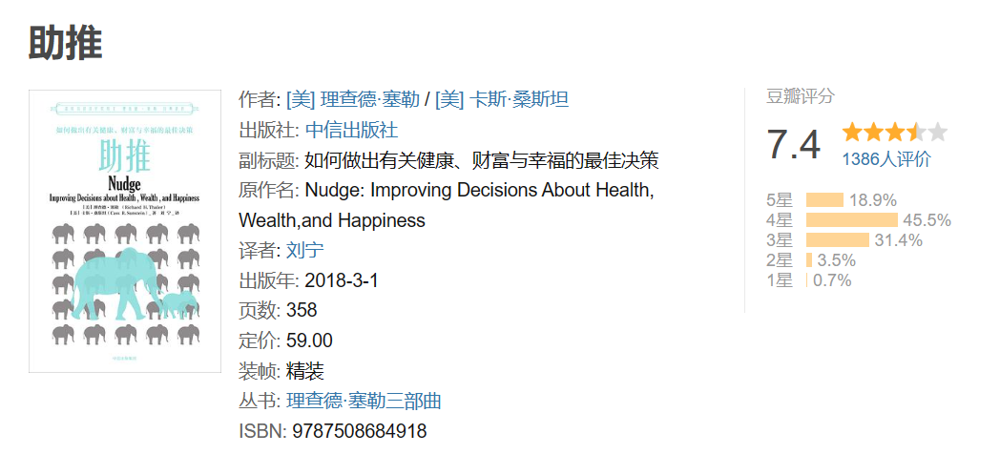

一个错误假设：几乎所有人在任何时候都会做出对自己最有利的选择，或者说做出至少比别人更好的选择。
第一个错误认知：我们可以避免对人们的选择造成影响。人们的选择会受到选择设计者设计的选定因素的极大影响。
第二个错误认知：自由主义的温和专制主义难免包含强制的因素。

# 第一部分 社会人和经济人

## 第1章 偏差和谬误如何欺骗我们的眼睛？

### 思维方式

两种思维方式之间的区别，一种是直觉和自动的，另外一种是思考和理性的。在本书中，我们将第一种思维方式称为“直觉思维系统”，将第二种思维方式称为“理性思维系统”（在一些心理学文献中，这两个系统有时候被分别称为“系统1”和“系统2”）。
- 我们在写这本书时，大部分时间使用的也是理性思维系统。
- 但是，在洗澡、谈话或走路时，我们时常也会灵机一动，想出写书的好点子，而这极有可能来自我们的直觉思维系统。


人们在讲母语时使用的是直觉思维系统，而在费力地讲外语时倾向于使用理性思维系统。真正意义上的双语使用者是指那些能够使用直觉思维系统讲两种语言的人。

### 经验法则

经验法则：我们之所以使用这一法则，是因为它在多数情况下既快速又有效。尽管经验法则有时候非常有用，但它可能会导致系统偏差。们最初的研究工作提出了三项经验法则——锚定法则、可得性法则和代表性法则，这三者之间相互联系。
1. 锚定和判断：你会在锚定一个已知数字的基础上沿着你认为正确的方向进行调整。然而，我们之所以会出现偏差，是因为**我们做出的调整往往是不够的**。
	- 慈善机构在请你捐款时，一般都会向你提供一系列的选择，比如100美元、250美元、5 000美元或者其他。实际上，这些慈善机构列出的数字并不是随手写的，这些数字的确会影响到人们最终捐款的金额。面对100美元、250美元、1000美元和5 000美元的选项，人们一定会比面对50美元、75美元、100美元和150美元的选项捐出更多的钱。
2. 他们会根据相关例子的情况对发生上述风险的可能性做出判断。如果人们能够轻而易举地回忆起有关的例子，他们便会对这种风险更为在意。
	- 人们是否会购买自然灾难保险在很大程度上取决于最近的经验。刚刚经历过大地震的人会突然购买大量的地震险，但是这一保险的购买数量会随着时间的推移而平稳下降，一如逐渐消退的记忆。
	- 风险评估中存在的偏差可能会对我们的风险观、商业选择观和政治观产生负面影响。互联网股票表现抢眼时，人们会疯狂地购买互联网股票，尽管他们会因此被套牢。
3. 所谓“代表性”，就是说当有人问你A属于B的可能性有多大时，你（或者说你的直觉思维系统）会首先问自己A与B有多少相似性（即A能在多大程度上“代表”B）
	- 对于一名身高近2米的非洲裔美国人和一名身高1.7米的犹太人，我们更倾向于将前者看作一名职业篮球运动员，因为篮球运动员大多身材高大，很少有矮个子参与（特别是在近几年）。
	- 在一项实验中，参与的实验者被告知：琳达今年31岁，未婚，性格开朗，聪明伶俐，她主修哲学专业。在学生时代，她十分关注男女不平等这一社会现象，还参加过反核能游行。然后，人们被要求按照发生的可能性对琳达未来可能会遇到的8种情况进行排序。其中两个关键选项是“银行出纳员”和“热衷于女权运动的银行出纳员”。大多数人认为，相对于“银行出纳员”，琳达更有可能是一名“热衷于女权运动的银行出纳员”
		- 琳达是一名“银行出纳员”的可能性要高于她是一名“热衷于女权运动的银行出纳员”的可能性，因为所有“热衷于女权运动的银行出纳员”都是“银行出纳员”。


### 过度自信

“中等水平以上”的心态具有普遍性。
- 90%的驾驶员都会认为自己的驾驶水平在一般人之上，
- 几乎每个人（甚至包括那些很少露出微笑的人）都认为自己比普通人更具幽默感（因为他们知道什么事情好笑）。
- 人们发现大约94%的大学教授都认为自己的水平比普通教授高。我想我们的确有足够的理由认为大学教授一般都过于自负。

### 得到和失去

人们憎恶失去属于自己的东西，他们的直觉思维系统对此会难以接受。大体上来讲，失去某件东西使你难过的程度比你得到这件东西使你快乐的程度要大一倍，我们将这一现象称为“**损失厌恶**”。
- 一所大学的某个班级里有一半学生都得到了一个印有其母校校徽的咖啡杯，实验要求那些没有得到杯子的学生仔细看一看其他人刚刚得到的杯子。接着，实验又要求拿到杯子的学生将杯子卖给那些没有拿到杯子的学生。
	- 杯子的主人愿意卖出杯子的价格大约是想买杯子的学生愿意支付的价格的两倍。
- 是否愿意打赌掷硬币，正面向上你会赢一些钱，反面向上你将输100美元。那么这“一些钱”是多少才能使你动心呢？对大多数人来讲，答案在200美元左右。
	- 这便意味着，赢得200美元的幸福刚好能够填补失去100美元的懊恼。

“损失厌恶”容易使人**产生惰性，即一种强烈的保持现状的欲望**。如果你因为不想招致损失而不愿意放弃某些事情，你便会拒绝因此发生的交易。

### 现状偏差

人们总体上更倾向于保持现有的状况，这一现象在很多情况下都会发生。

“现状偏差”很容易被利用。多年以前，美国运通公司给桑斯坦写了一封措辞友好的信，信中告诉桑斯坦，该公司能够连续3个月免费向他赠送他选中的5本杂志。免费赠送看上去是件不错的事情，不管这些杂志有没有阅读价值，因此桑斯坦欣然选出了5本杂志。但是，令他始料未及的是，他在3个月之后每月仍然会收到杂志，并且必须照价付款，直到最终他设法取消了订阅。就这样，在大约10年的时间里，桑斯坦不得不为那些自己几乎从来不看的杂志掏腰包（他很早便想取消预订，却没有成功。我们会在下一章谈到人们的拖延行为）。
```
苹果等的自动续费策略真实玩的花起
```

人类身上的“损失厌恶”和“选择盲目”暗示着，如果某项选择被设计为“默认”，那么它会吸引更多人的眼球。因此，默认选项便起到了强力助推的作用。在很多情况下，默认选项的助推极为强大，因为消费者会感觉（无论对错）默认选项是被默认选项设计者所认可的选择，不管这些设计者是企业老板、政府工作人员还是电视节目策划者。因此，我们在写作本书的过程中力求将默认选项设定到最好。

### 更聪明的措辞

即便是专家，他们也会受到措辞的影响。如果医生们被告知“这一手术的成功率为90%”，会比他们听到“这一手术的失败率为10%”时更愿意推荐病人做手术。

第一，如果你采取节能措施，你每年将节约350美元；第二，如果你不采取节能措施，你每年将浪费350美元。结果证明，第二条宣传语取得的效果远远好于第一条，原因是它是以损失为基本出发点的。如果政府要建设一个节能社会，那么第二种说法会起到一个不错的助推效果。

措辞之所以会有效，是因为人们在做出决策时通常会怀有一种盲目和被动的心态，他们的理性思维系统往往懒得将看到的信息变换一种说法，看看是否会得出一个不同的结论。

## 第2章 如何抵制诱惑？

## 第3章 如何控制社会对我们的影响？

## 第4章 我们何时需要助推？

## 第5章 如何优化选择体系？  

# 第二部分 钱 

## 第6章 “明天储蓄更多”计划 

## 第7章 幼稚的投资

## 第8章 信用市场 

## 第9章 社会保障私有化

# 第三部分 医疗健康

## 第10章 “处方药”

## 第11章 如何促进器官捐献？

## 第12章 如何拯救我们的星球？

# 第四部分 自由选择 

## 第13章 我们该如何为孩子挑选学校？

## 第14章 如何改善现有医疗体系？ 

## 第15章 婚姻有没有可能私人化？

# 第五部分 支持还是反对？ 

## 第16章 欢迎来到助推的世界！

## 第17章 谁会反对助推？

## 第18章 助推：真正的第三条道路

