# Introduction + Frequentist Statistics

Statistical inference is a process where you use data from a sample to describe properties of the distribution of data in the population. When you test a hypothesis, calculate a confidence interval, or estimate an effect size, you are making statistical inferences.

三种统计检验方法
1. Neyman-Pearson:通过显著性水平接受虚无假设还是对立假设
2. Bayesian Statistics: 计算对假设的信念
3. Likelihood：支持不同假设的似然性

## p value
p值是在虚无假设为真的前提下，观察值属于次分配的概率
The formal definition of a p-value is the probability of getting the observed, or more extreme data, assuming the null hypothesis is true.

解释p值

当两组的均值差异为0.11时，如何解释？
- 可能是随机的噪音
- 可能是真实的差异

From the data that we have, we can calculate means, standard deviations, and we know the sample size that we have. We can use these parameters to calculate a test statistic, and compare this test statistic against a distribution.
通过均值、标准差以及样本量来计算分布差异（通常使用正态分布）

如果零假设为真，就有95%的资料属于蓝色区域，如果资料算出的统计值在两个临界值之内，就没有效果


如果资料落入量表，代表有效果


p值是你观察到的数据的概率，不是一个理论的概率

p值不是支持虚无假设为真的真实概率
$P\left(D^* \mid H\right) \neq P(H \mid D)$（D= data, H = hypothesis）
左边：the probability of the data assuming the null hypothesis is true. 假设零假设为真的数据概率。
右边：the probability of an hypothesis given some data that you have observed. 在观察到一些数据的情况下，假设成立的概率。

同时，p>.05不代表没有效果，你可能需要更大的样本去检测小效应，是这个问题还没有结果

Using p-values correctly:
p < alpha: Act as if data is not noise.  
p > alpha: Remain uncertain or act as if data is noise.

错误的解释p值：We found a p-value smaller than 0.05, so our theory...
正确的解释p值：We found the p-value smaller than 0.05, so our data...


贝叶斯是能够计算理论为真的记录的方法，

## I类错误与II类错误

I类错误：你以为是其实不是，误认
II类错误：你以为不是其实是，漏认

H0：虚无假设 H1：备择假设

α是指我们接受H0为真时候结果显著的犯错几率（I类错误。不应该显著），常见设定为5%
β是指我们接受H1为真时候结果不显著的的犯错几率（II类错误。应该显著），
1-β便指结果显著同时H1为真的可能性（统计检验力）。

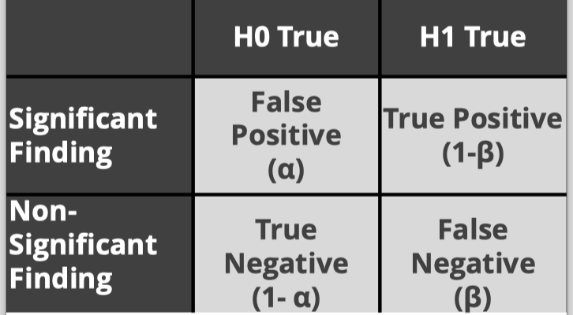


假设研究：H0与H1的概率都为50%，α=5%，1-β=80%。
真阴性的可能性最大

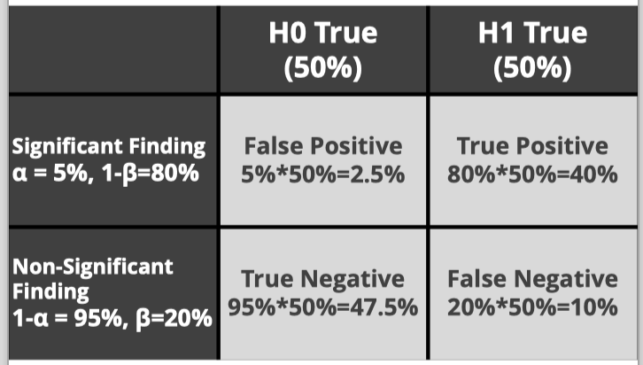

提高统计检验力来增加真阳性概率：H0与H1的概率都为50%，α=5%，1-β=99%。
真阳性的可能性最大
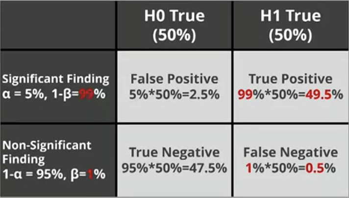

另一个思路，改变假设先验：H0与H1的概率为10%与90%，α=5%，1-β=80%。
真阳性的可能性最大。
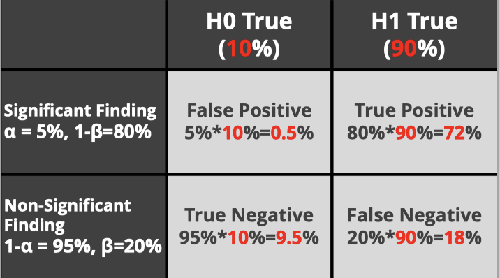

结果的可视化
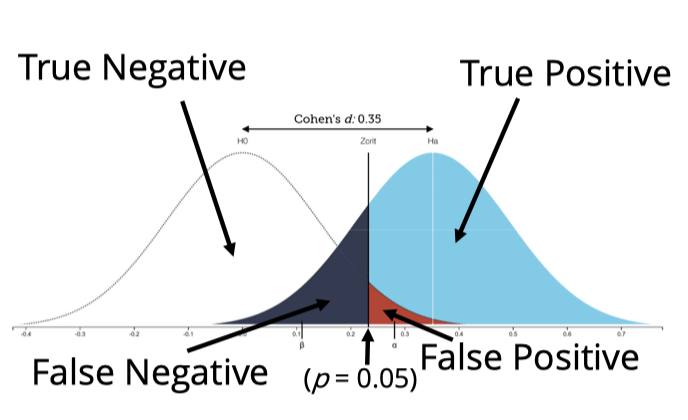

# Likelihoods & Bayesian Statistics

## Likelihoods

Likelihoods are a way to express the relative evidence for one hypothesis over another hypothesis.

二项式最大似然比函数：

$L(\theta)=\frac{n !}{x !(n-x) !} \times \theta^x \times(1-\theta)^{n-x}$

投八次硬币十次朝上，$\theta$ =0.8 的 L=0.30，通过函数可以发现$\theta$ =0.8似然比最大

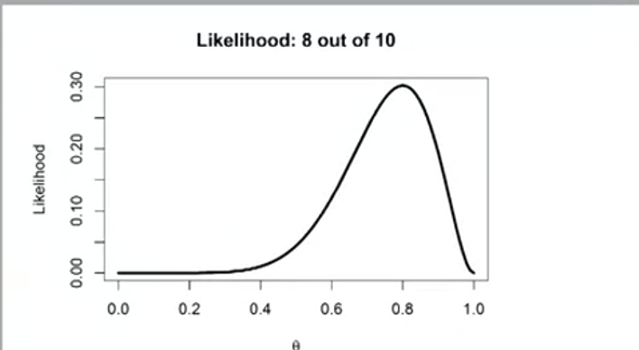

likehood ratio 似然比：虚无假设成立对比备择假设成立的比例（相对证据强度）。最大似比中的8和32为中等强度与大强度的临界值。

例：虚无假设（$\theta$ =0.5 ）对比备择假设（$\theta$ =0.8）。将0.8的似然值除以0.5的似然值（6.87），得出（$\theta$ =0.8）的可能性是（$\theta$ =0.5）的六倍
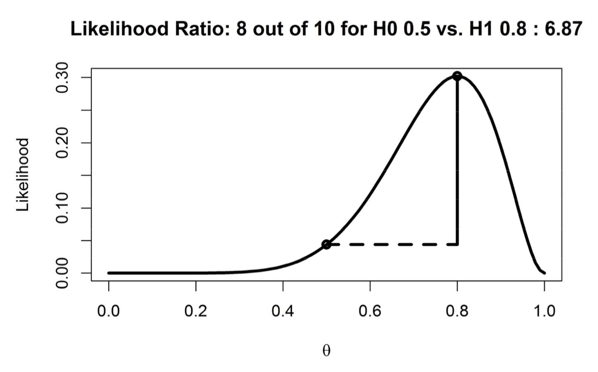
错误现象，虽然最大似然比很大，但是两个假设都是错误的

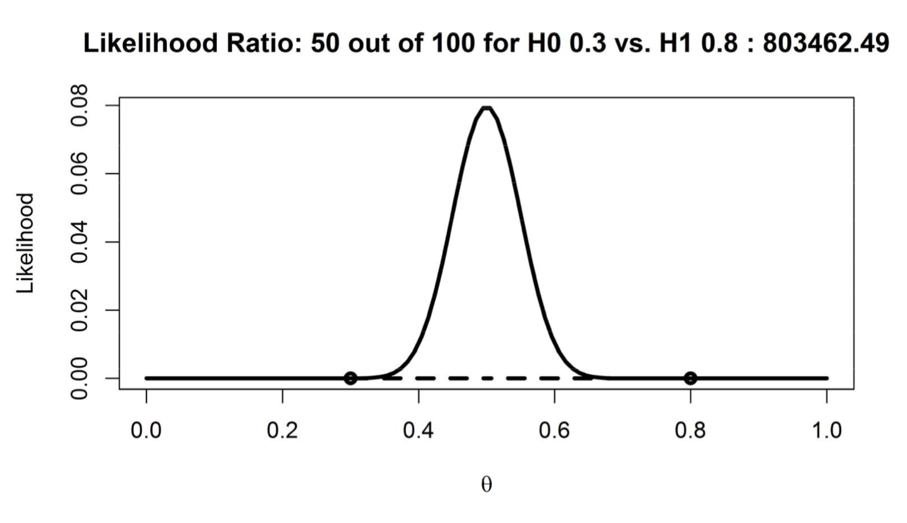
例：当三次实验，两次实验显著（α=.05）
H0为真的似然值 = 0.05 x 0.05 x 0.95 = 0.0024
H1为真的似然值 = 0.8 x 0.8 x 0.2 = 0.128 （power =0.8）
likehood ratio：0.128/0.0024 = 54 (strong)
H1 is 54 times more likely than H0
```
图是怎么形成的？按我的理解，这是2/3的似然值图，最开始的事8/10的似然值图
```
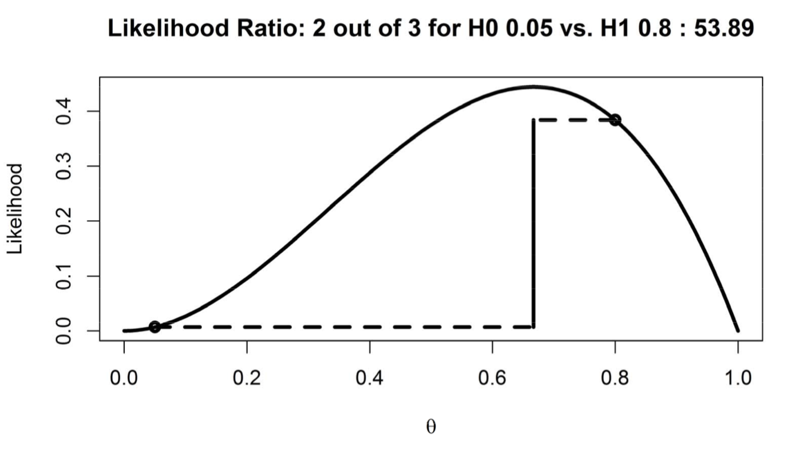

不同情况下的似然值图
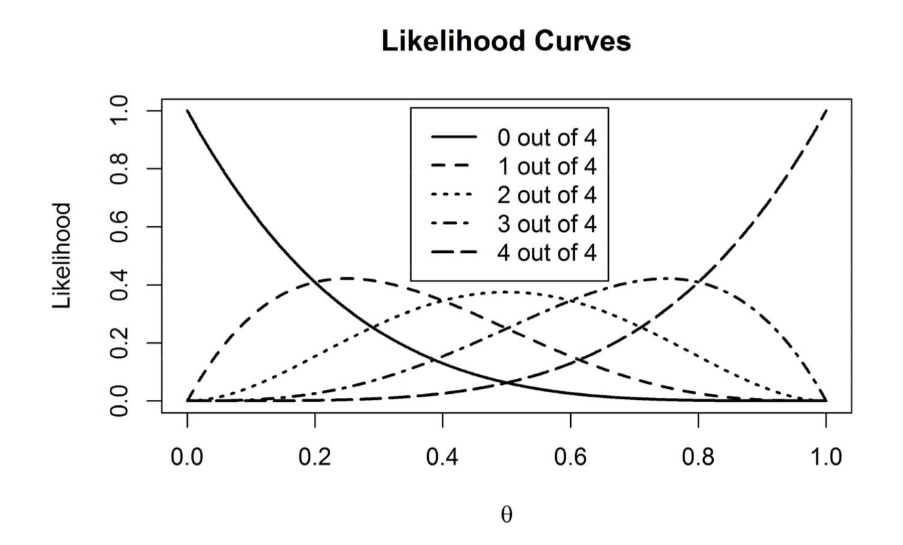```
```
绘制似然曲线代码
#plot likelihood curve----
n<-10 #set total trials
x<-8 #set successes
theta<- seq(0,1,len=100) #create theta variable, from 0 to 1
like <- dbinom(x,n,theta) #create likelihood function
plot(theta,like,type='l',xlab=expression(theta), ylab='Likelihood', main="Likelihood Curve")
```


```
计算似然比代码
#Calculate the likelihood ratio----
n<-10 #set total trials
x<-5 #set successes
H0 <- .5 #specify one hypothesis you want to compare with the likihood ratio
H1 <- .4 #specify another hypothesis you want to compare with the likihood ratio (you can use 1/20, or 0.05)
dbinom(x,n,H0)/dbinom(x,n,H1) #Returns the likelihood ratio of H0 over H1
dbinom(x,n,H1)/dbinom(x,n,H0) #Returns the likelihood ratio of H1 over H0

theta<- seq(0,1,len=100) #create theta variable, from 0 to 1
like <- dbinom(x,n,theta)
#png(file="LikRatio.png",width=4000,height=3000, , units = "px", res = 900)
plot(theta,like,type='l',xlab=expression(theta), ylab='Likelihood', lwd=2)
points(H0,dbinom(x,n,H0))
points(H1,dbinom(x,n,H1))
segments(H0, dbinom(x,n,H0), x/n, dbinom(x,n,H0), lty=2, lwd=2)
segments(H1, dbinom(x,n,H1), x/n, dbinom(x,n,H1), lty=2, lwd=2)
segments(x/n, dbinom(x,n,H0), x/n, dbinom(x,n,H1), lwd=2)
title(paste('Likelihood Ratio H0/H1:',round(dbinom(x,n,H0)/dbinom(x,n,H1),digits=2)," Likelihood Ratio H1/H0:",round(dbinom(x,n,H1)/dbinom(x,n,H0),digits=2)))
#dev.off()
```

## Binomial Bayesian Inference

p值代表以虚无假设为真的前提下，不论手上资料是否极端，其符合虚无假设的程度
$P\left(D_{(o r>D)} \mid H 0\right)$
我们想要的是根据手上资料，虚无假设存在的程度，即后验概率
$\mathrm{P}(\mathrm{H0} \mid \mathrm{D})$

后验概率是指根据手上资料，加上已存在研究者脑中的信念，能不能活动虚无假设或备择假设为真的几率。也就是先验乘以似然比的乘积[[Improving your statistical inferences#Likelihoods|Likelihoods)
$Prior Belief + Data = Posterior Belief$

$\frac{P(\mathrm{H} 1 \mid \mathrm{D})}{P(\mathrm{H} 0 \mid \mathrm{D})}=\frac{P(\mathrm{D} \mid \mathrm{H} 1)}{P(\mathrm{D} \mid \mathrm{H} 0)} \times \frac{P(\mathrm{H} 1)}{P(\mathrm{H} 0)}$

$Posterior = Likelihood Ratio \times Prior$

对于先验，使用beta分布，beta分布由α和β决定（和I类II类错误中的不一样）

$f(x ; \alpha, \beta)=\frac{1}{B(\alpha, \beta)} x^{\alpha-1}(1-x)^{\beta-1}$

例：α=1和β=1，范围内任一$\theta$的几率相同，任何结果都可能发生（设定这种先验等于没有先验）


后验是一个新的beta分布

𝛼* = 𝛼prior + 𝛼likelihood – 1

𝛽* = 𝛽prior + 𝛽likelihood – 1

数据结果（蓝色虚线）
后验（黑线）= 数据结果（蓝色虚线，似然性函数） x 先验（灰线）


The Bayes factor is the relative evidence for one model compared to another model.
贝叶斯因子是手上证据支持两种模型的相对程度


```
计算贝叶斯因子代码
H0<-0.5 #Set the point null hypothesis you want to calculate the Bayes Factor for
n<-20 #set total trials
x<-10 #set successes
aprior<-1 #Set the alpha for the Beta distribution for the prior
bprior<-1 #Set the beta for the Beta distribution for the prior

alikelihood<-x+1 #Calculate the alpha for the Beta distribution for the likelihood
blikelihood<-n-x+1 #Calculate the beta for the Beta distribution for the likelihood
aposterior<-aprior+alikelihood-1 #Calculate the alpha for the Beta distribution for the posterior
bposterior<-bprior+blikelihood-1 #Calculate the beta for the Beta distribution for the posterior

theta<-seq(0,1,0.001) #create theta range from 0 to 1
#png(file="PriorLikelihoodPosterior.png",width=3000,height=3000, res = 500)
prior <- dbeta(theta, aprior, bprior)
likelihood <- dbeta(theta, alikelihood, blikelihood)
posterior <- dbeta(theta, aposterior, bposterior)
plot(theta, posterior, ylim=c(0, 15), type = "l", lwd = 3, xlab = bquote(theta), ylab = "Density", las = 1)
lines(theta, prior, col="grey", lwd = 3)
lines(theta, likelihood, lty = 2, lwd = 3, col="dodgerblue")
BF10<-dbeta(H0, aposterior, bposterior)/dbeta(H0, aprior, bprior)
points(H0,dbeta(H0, aposterior, bposterior), pch = 19)
points(H0,dbeta(H0, aprior, bprior), pch = 19, col="grey")
segments(H0, dbeta(H0, aposterior, bposterior), H0, dbeta(H0, aprior, bprior), lty=2)
title(paste('Bayes Factor:',round(BF10,digits=2)))
```

## Bayesian Thinking


结合了p Value与先验的双线图


例：虚无假设为真的事前概率为50%，收集资料得到刚好显著的p Value（0.05），会得到币先验更低估的事后概率


# Multiple Comparisons, Statistical Power, Pre-Registration

## Type 1 error control

I型错误，虚无假设为真但是结果显著的情况

I型错误增加的一个主要问题是进行多重比较，从而导致犯下结论有效果实际却没有效果的次数增加。

In a 2x2x2 ANOVA, there are 7 tests. Type 1 error rate: 1-(0.95)$^7$=30%

比较次数与I类错误之间的关系

比较常见的校正方式（Bonferroni Correction, or Dunn Correction）

$\frac{\alpha}{\text { number of tests }}$ 或( $p \times$ number of tests)

当你只关注一种比较，例如之前的 2x2x2 ANOVA，只关注 2x2x2的结果，那么可以不做校正。但是需要在分析前表明预测。

Optional stopping: Collecting data until p < 0.05 inflates the Type 1 error.

序列分析（Sequential analysis）可以控制补充研究增加I类错误的风险


## Type 2 error control

I型错误，虚无假设为假但是结果显著的情况

不同效应量发现显著性结果的相对检验力
With n = 100, you had 95% power to observe a d=0.5


I类错误 可以被纠正，II类错误可能会更严重

## Pre-registration

预注册是控制I类错误的良好方式。

报告作者要在开始收集资料前写出报告，之后按照报告分析资料。

报告的重点是陈列验证主要假设的所有分析计划细节。

也可以继续实施验证性分析，这是介于预注册的验证性研究与探索行研究之间。

探索性分析会增加未知的II类错误，可以通过以下方法：
- 事前宣告样本量
- 对于每一项检验定义自变量与因变量
- 描述分析计划，与统计检验方法
# Effect Sizes

## Effect Sizes

效应量的意义：
- 作者可以传递结果的实际显著性 practical significance
- 效应量可以帮助作者实现元分析方法的结论
- 效应量可以允许研究者去呈现统计检验力分析


效应量分为标准化效应量与非标准化效应量，非标准化效应量没有单位。

结果显著但是效应量很小，实际意义也会很小。但是也要强调小效应对大群体的重要性。

效应量的分类：
- d family 标准化的均值差异
- r family 变量见的关联强度


## Cohen's d

Cohen's d is the difference divided by the standard deviation

被试间d相比被试内d需要考虑变量间的相关性


通过平均值和标准差，可以计算效应量。

Cohen d 是 0 到无穷的数值

Cohen d的可视化，即使是大效应，也有重叠的部分。


Hedges' g is a unbiased version of Cohen's d

小样本量下Cohen's d会高估真实效果

$g=d \times\left(1-\frac{3}{4\left(n_1+n_2\right)-9}\right)$

## Correlation

相关是-1到1的连续数据

通过游戏了解相关可视化的网站[Guess the Correlation](https://www.guessthecorrelation.com/)

r与d的转换

$r=\frac{d_s}{\sqrt{d_S^2+\frac{N^2-2 N}{n_1 n_2}}}$

在方差分析或回归分析中，通常不会报告r，而是报告$R^2, \eta^2, \omega^2, \varepsilon^2$
这些代表测到的真实效果变异：Proportion of total variance explained by an effect
$R^2, \eta^2$ 是真实效应量的有偏估计（单因素方差分析中$\eta^2 = \eta^2_{p}$）
$\omega^2, \varepsilon^2$ 是真实效应量的无偏估计（是接近无偏）

这些都表示变量x与y的关系需要多高，才能减除数据中的误差


左边代表总平方和$S S_{tot}$，右边代表残差平方和$S S_{res}$
$R^2=\frac{S S_{\text {res }}}{S S_{\text {tot }}}$

Cohen’s f 可以通过$\eta^2$得出

Cohen (1988) has provided benchmarks to define small ( f = 0.10), medium (f = 0.25), and large (f = 0.50) effects.

To translate: Cohen (1988) has provided benchmarks to define small ( $\eta^2$= 0.0099), medium ( $\eta^2$= 0.0588), and large ( $\eta^2$= 0.1379) effects.

$f=\sqrt{\frac{\eta^2}{1-\eta^2}}$


# Confidence Intervals, Sample Size Justification, p-Curve analysis

## Confidence Intervals

Confidence intervals are a statement about the percentage of confidence intervals that contain the true parameter value.

置信区间是一段数值区间，宣告真实参数存在于区间之内的百分比

即一项研究重复执行之后，这些结果中有95%包含真实参数值

一项均值为0的研究，95%的置信区间都包括这个结果，黑线代表的为另外5%


数据分析通常通过样本Sample预测总体Population，会存在不确定性

例：一个计算好的相关系数，其中的蓝色区域代表不确定性（95%置信区间）


对于正态分布，95%置信区间为：
$\mathrm{M} \pm 1.96 \times \mathrm{SE}$
Standard Error $(\mathrm{SE})=\mathrm{SD} / \sqrt{ } \mathrm{N}$

随着样本量的增加，置信区间越短

置信区间与p直接相关，如果95%置信区间包含0，那么p一定<.05

Highest density intervals (credible interval)
A 95% credible interval contains the values you find most plausible.
可信区间（贝叶斯统计中）代表有95%的信心总体参数落在样本参数中

有时，研究人员希望预测单个值所在的区间。这就是所谓的预测区间prediction interval。它总是比置信区间宽得多。原因是单个观测值的变化可能很大，但未来样本的平均值（95% 的时间都在正常置信区间内）的变化会小得多。

## Sample Size Justification

小样本存在较大的变异，以及更多的II类错误，即更多的不准确评估


方法1：根据置信区间的宽度决定样本量


方法2：根据指定的统计检验力

果效应量不确定，使用序列分析是一种不错的方法

贝叶斯统计不需要关系需要收集的样本数，收集到你认为结果适当时就好

## P Curve Analysis

P curve 可以评估文件抽屉效应，即使分析的只有p<.05的值

用于回答真实效果与没有真实效果的p值分布看起来会不会不一样
绿线是有效果的p curve 蓝线是无效果的 p curve


当 p curve 接近无效时，暗示数据无法支持研究者的假设

# Philosophy of Science & Theory

## Philosophy of Science

做有效推论的一种逻辑方法：否定条件 Modus Tollens， 即可证伪性


理论的内核与缓冲带，缓冲带可以部分调整，但是要保留内核


## The Null is Always False

Cohen: 零假设检验字面上说就是现实中不可能存在的事

Crud Factor: 研究中的无关因子
只要资料够多，这些因素都会呈现显著结果

Crud is systematic noise (there are true effects that you are not interested in), Type 1 errors are variable noise (no true effects).

因此，随机化在证明显著有效性有很重要的意义

NHST rejects the null compared to any alternative. Point predictions are rare.

Strong Inference: Crucial experiments that exclude one alternative hypothesis。关键实验通常可以排除最不可能的假设。

## Theory Construction

理论与统计假设与数据的关系


如何建构理论：
- 思想实验：如果我自己在这个理论中，我会怎么做，会符合理论吗？
```
反过来也可以我这么做了，是因为什么？去发现理论
```
- 行为预测：可以从周边人物的行为发现可行的预测
- 理解他人行为背后的想法
```
访谈可以实现
```

对生活中的一些事件发现 why 和 how
# Open Science 

## Replications

世界上没有百分百的复制（即验证初试发现的可靠性），因此目的成了理论复制（验证理论的可靠性）

目标1：定义I类错误
目标2：控制人为因素
目标3：推广到新的人口中
目标4：验证潜在假设

潜在的不可复制研究：低的统计检验力，高的p value，令人惊讶的结果
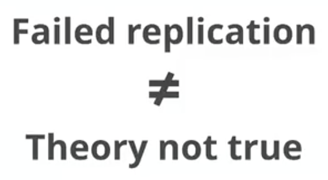

## Publication Bias

出版偏倚最大的原因是科学界以p = 0.05作为标准

这也导致看到的文献几乎都支持某种假设

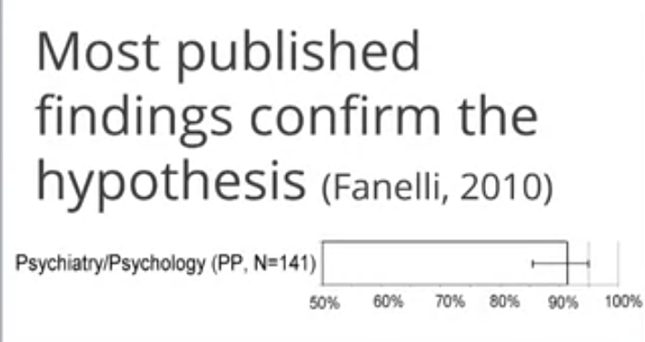
常见的出版偏倚校正方法：
- 剪补法
- 失安全系数（不推荐用，发明者承认存在计算问题）
- Egger 回顾
- P curve
## Open Science

开放科学包括：数据、材料、出版

查询你可以如何分享你发表的论文


数据共享：

最好提供分析脚本与原始数据，最好加上注释


储存资料的云端服务器


OSF平台

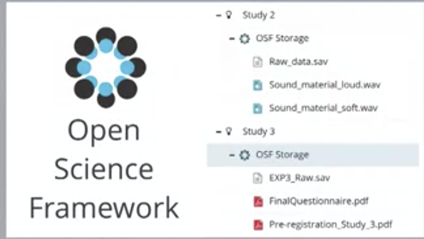